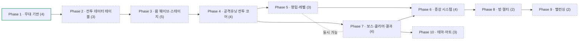

# Roadmap — 메이플 증강 디펜스 (8인 동시 진행 · 결과는 각자 · 직업 유닛 레벨 육성 · 증강 랜덤 · 구역 웨이브)

> 2026-09-09 컨셉 전환: **랜덤 디펜스 → 증강 디펜스**. 유닛 획득이 랜덤 뽑기에서 **메소 영입 + 레벨 육성**으로 바뀌고, 랜덤성은 **증강**으로 이동. 무대·트랙·카메라(Phase 1)는 그대로 유지.
> 이전 트랙: `maple-luck-defense-roadmap.md`(이 파일로 개명) · 그 이전: `wall-survival-roadmap.md`(superseded)
> **진행 방식(2026-09-13 사용자 지시)**: ① 로드맵·spec·plan은 코드 없이 **방향·동작 설명**으로만 쓴다(사용자는 코드를 보지 않고 전부 위임). ② **페이즈 완료 = 사용자가 만족할 때까지 수정·검증을 반복하는 루프**. ship 한 번으로 done 처리하지 않고, 피드백은 같은 페이즈 report에 Change 항목으로 누적한다. 상세: `.beaver/memory/workflow.md`

## Direction
최대 8인이 한 방에서 **같은 시간표로 같은 스테이지를 함께 진행**하되, 각자 자기 구역에서 자기 유닛으로 막는다. **승패 개념은 없다** — 결과는 각자 검은 마법사를 깼느냐, 중간에 죽었느냐뿐. 자기 구역에 모험가 직업 타워를 세우고, 경로를 따라 오는 몹 웨이브를 막는다. 유닛은 **메소로 영입해 레벨(1~50)을 올린다**(4차 직업 고정, 전직 없음, **같은 직업 중복 영입 가능, 최대 6기**). 레벨이 오르면 능력치가 오르고 스킬이 해금된다. 처리하지 못한 몹이 **누적 110마리**가 되면 내 유닛 전멸 + 비석과 함께 개인 탈락한다. 판을 가르는 랜덤 요소는 **증강**이다(구체 안은 사용자가 새로 낼 예정). 속성·내성 같은 상성 체계는 **없다** — 데미지는 공격력 그대로. 판단 축은 어떤 직업 조합을 몇 기 세우고 어디에 레벨을 투자하느냐다. 메소는 **몹을 잡을 때만** 들어오고(시간 수입·보스 메소 없음), 다 모아도 **만렙 2기가 한계**라 만렙 1기 + 나머지 분배가 자연스러운 정답이 되게 곡선을 짠다. 만렙(Lv50)에는 특수 효과가 붙는다. 특수 행동(영입·레벨업·증강)은 **화면 옆 버튼 또는 유닛 클릭 → 팝업**으로 처리해 플레이 화면을 넓게 쓴다. **난이도는 의도적으로 매우 높게** 잡아, 검은 마법사 격파 자체가 도전 과제가 되도록 한다. (방향은 느슨하게 유지 — 언제든 바뀔 수 있음)

### 용어 (2026-09-09 확정)
- **스테이지** = 진행의 최소 단위 하나. 세 종류.
  - **몬스터 스테이지** — **20초**, 초당 2마리 → **40마리**
  - **보스 스테이지** — **60초**. 보스가 2체 이상일 수 있음(아이온·얄다바오트)
  - **쉬는 스테이지** — 스폰 없음([115] 거인의 심장 "쉬는타임"). 남은 메소를 다 쓰고 증강·배치를 다시 잡는 시간. 최종 보스 전 숨고르기 목적. 지속 시간 미정
- **계층** = 월드지역 > 지역 > 맵 > 젠 몬스터. 스테이지는 맵 단위로 붙는다.
- 한 판 = **방 전체가 같은 스테이지 순서를 시간순으로 함께 진행**. 마지막은 검은 마법사 **3연전** 보스 스테이지. 스테이지 번호·타이머는 방 전역이고, 그 안에서 막는 건 각자.
- **편성 원본**: `.info/monster-wave.md` (로컬 전용, gitignored — 커밋되는 형태는 Phase 2의 스테이지 테이블)

## 한눈에 보는 흐름

- Phase 1 — 무대 기반 · 유닛 4개 · 의존: — · 푼다: Phase 2 · 파일 집합: RtsMap, RtsConfigLogic, RtsHudLogic, RtsCameraAnchorComponent, RtsZoneLogic · **done**
- Phase 2 — 전투 데이터 테이블 · 유닛 3개 · 의존: Phase 1 · 푼다: Phase 3~6 전부 · 파일 집합: `RootDesk/MyDesk/Rts*TableLogic.mlua` · todo
- Phase 3 — 몹 웨이브·스테이지 · 유닛 5개 · 의존: Phase 2 · 푼다: Phase 4, Phase 7 · 파일 집합: RtsWaveLogic, RtsStageLogic, RtsMobComponent · todo
- Phase 4 — 공격유닛 전투 코어 · 유닛 4개 · 의존: Phase 3 · 푼다: Phase 5, Phase 7 · 파일 집합: RtsTowerComponent, RtsCombatLogic · todo
- Phase 5 — 영입·레벨 · 유닛 3개 · 의존: Phase 4 · 푼다: Phase 6 · 파일 집합: RtsPopupLogic(공통 셸), RtsRecruitLogic, RtsUnitPopupLogic, RtsTowerComponent(레벨) · todo
- Phase 6 — 증강 시스템 · 유닛 4개 · 의존: Phase 5, Phase 7 · 푼다: Phase 8 · 파일 집합: RtsAugmentLogic, RtsAugmentPopupLogic · todo (**사용자 새 안 대기** + 스테이지·보스 정리 뒤 착수)
- Phase 7 — 보스·클리어·결과 · 유닛 4개 · 의존: Phase 4 · 푼다: Phase 6, Phase 10 · 파일 집합: RtsBossComponent, RtsBossLogic, RtsRunResultLogic · todo
- Phase 8 — 방·멀티 동기화 · 유닛 2개 · 의존: Phase 6 · 푼다: Phase 9 · 파일 집합: RtsRoomLogic, RtsBootstrapLogic · todo
- Phase 9 — 밸런싱 · 유닛 2개 · 의존: Phase 8 · 푼다: — · 파일 집합: `Rts*TableLogic.mlua`(수치 튜닝) · todo
- Phase 10 — 테마·아트 · 유닛 3개 · 의존: Phase 7 · 푼다: — · 파일 집합: assets/textures, tools/gen-*.js, RtsHudLogic(프레임), RtsStageTableLogic(BGM·스킨 컬럼) · todo

동시 가능: Phase 5·Phase 7

지금: 진행 중 없음 (Phase 1 화면 v2 완료 2026-09-14 — 이후 화면 요소는 이 위에 추가) · Next up: Phase 2

## Scope & Actors
- **플레이어(1~8)** — 자기 구역에서 유닛 영입·배치·레벨업, 증강 선택(전부 팝업). F1~F8로 다른 유저 구역 관전. **탈락 후에는 관전을 계속하거나 방을 나가 새 판을 시작할 수 있다.**
- **방장** — 방 생성·난이도 선택·시작.
- **시스템(서버)** — 방 전역: 스테이지 타이머·전환. 유저별: 웨이브 스폰·순환, 누적/탈락 판정, 메소 지급, 영입가·레벨업가 산정, 증강 결정, 보스 생성, 클리어/탈락 판정.
- **커스터마이즈 축** — 난이도(몹 HP·속도 %), 방 인원(1~8).

## Non-Goals / External Boundaries
- 자유 카메라(엣지/방향키 스크롤, 마우스 가두기) **금지** — F1~F8 시점 전환 + 미니맵 클릭 스냅만.
- 길찾기 없음 — 몹은 트랙 둘레 파라미터 `t`를 따라 반시계 순환.
- **PvP·승패 없음** — 유저 간 경쟁 요소 없음. 같은 방은 서로 구경하는 관계일 뿐, 결과는 각자 클리어/탈락.
- **1차 직업군 = 모험가 10직업(4차)** — 해적·듀얼블레이드 제외. 전직 없음. 직업군(시그너스·레지스탕스 등)은 나중에 추가 가능하도록 영입 팝업에 탭 자리를 둔다.
- **유닛 랜덤 뽑기 없음** — 유닛은 전부 결정적 영입. 랜덤은 증강에만.
- **상성 체계 없음** — 속성도, 물리/마법 내성·약점도 두지 않는다(2026-09-14, "유닛을 정리하기 너무 어렵다").
- 전장의 안개 없음. 모바일 최적화 1차 제외(PC 중심).

## Phases & Units

### Phase 1 — 무대 기반 (탑다운 무대·HUD·구역 트랙까지 완성) · depends: —
| # | Unit | Goal | Key decision | Depends | Status |
|---|------|------|--------------|---------|--------|
| 1 | 탑다운 맵·타일 기반 | RectTile 탑다운 + 커스텀 바닥 타일 파이프라인 | — | — | done |
| 2 | HUD v2 (구 스타식 HUD 셸) | ~~미니맵·초상화·유닛정보·스킬칸 3×3·툴팁·부대탭~~ → **하단 전부 제거**, 좌상단 시간·메소 칩, 좌측 플레이어 목록(n/8·생존/탈락·나 표시·클릭→그 구역), 우측 영입 버튼 + 유닛 슬롯 6, 좌하단 증강 버튼. 팝업 공통 셸(#18)도 여기서 선행. 목업: `.info/artifacts/hud-layout.html` v16 | — | 1 | **done**(2026-09-14 화면 v2 — 사용자 확인 "프로토타입 완료". report: `.beaver/output/report/rts-base/screen-v2-report.md`. 이후 요소는 이 화면 위에 추가) |
| 3 | 구역 카메라(F1~F8) | 구역 시점 전환 전용 카메라, 자유 카메라 제거, 미니맵 2×4 | — | 1, 2 | done |
| 4 | 구역 시스템 | 8구역 구획·배정(서버 권위) 유지. ~~스타디움 트랙~~ → **그리드 트랙 18×12**(칸 1.78유닛, 목업 경로 그대로 — 트랙 65칸·발판 81칸·교차 2, S→E 후 S로 순간이동, t=0~1 구간 정규화), 발판 = 트랙 4방향 면접 칸, 8방향 칸 거리, 보스 자리 = 구역 중앙. 구역 = 화면(42.66×24), 경계선 제거 | — | 3 | **done**(2026-09-14 화면 v2 — 그리드 트랙 + **트랙/타일 테마 프리셋**(`RtsThemeLogic`, 기본 헤네시스·보관 엘나스). 같은 report) |

**Expected scenes/systems**:

| Unit | Scene·System | Trigger | Purpose |
|------|--------------|---------|---------|
| #1 | `RtsMap` + `CaveFloorTileSet` + `RtsBootstrapLogic` | 입장 | 탑다운 무대·바닥 |
| #2 | `RtsHudLogic` (`SetTime`/`SetMeso`/`RefreshPlayerList`/`SetPlayerAlive`/`SetWatchedZone`/`SetUnitSlot`) + `RtsPopupLogic` (`Open`/`Close`) | 입장 · 버튼 | HUD 전체 + 팝업 셸 |
| #3 | `RtsCameraAnchorComponent` + `RtsConfigLogic` | F1~F8 / 미니맵 클릭 | 구역 시점 전환 |
| #4 | `RtsZoneLogic` (`GetTrackPoint(zone,t)`/`GetSpawnPoint`/`GetPlacementSlot`/`CellDistance`/`AssignZone`) + `RtsThemeLogic` (`GetPresets`/`ApplyPreset`) | 입장 · 테마 전환 | 구역·트랙 좌표계 · 트랙/타일 테마 프리셋 |

> 근거: `.beaver/output/report/rts-base/{topdown-camera-rig,hud-shell,zone-camera,zone-system}-report.md`

### Phase 2 — 전투 데이터 테이블 (모든 수치·정의의 단일 소스. 값은 임시라도 **형태**를 먼저 고정) · depends: Phase 1
| # | Unit | Goal | Key decision | Depends | Status |
|---|------|------|--------------|---------|--------|
| 5 | ~~내성·약점 테이블~~ | — | — | — | dropped(2026-09-14 — 속성에 이어 물리/마법 내성·약점도 폐기. 상성 체계 없음) |
| 6 | 직업 테이블 | **직업군(모험가) → 직업 10종**(전사3·궁수2·마법사3·도적2) — 4차 고정, 전직 없음. **레벨 1~50 능력치 곡선**, **레벨별 스킬 해금표**(액티브·패시브), **만렙(Lv50) 효과**(예: 내 다른 유닛 공/마 버프). 직업군을 나중에 더 붙일 수 있는 구조 | 스킬 해금 레벨 간격 · 만렙 효과가 직업별인지 공통인지 | — | todo |
| 7 | 스테이지·보스 편성 테이블 | `.info/monster-wave.md`의 **132 스테이지**(몬스터 115 + 보스 17)를 테이블화. 월드지역>지역>맵>몹 계층 보존, 스테이지 종류 3종(몬스터/보스/쉬는), 몹 풀 참조형([73] "59~65 균등 혼합"), 다중 보스. **몹은 HP와 드랍 메소만 다르고 이동 속도는 전부 동일**. 보스는 메소 없음 | 쉬는 스테이지 지속 시간 | — | todo |
| 8 | 경제·증강 테이블 | **경제 초안 확정(2026-09-14, 아래 표)** — 드랍·영입가·레벨업가 3개 수식. 값을 바꾸면 총합 검산이 같이 도는 구조. 증강은 **사용자 새 안 대기** | — | 6 | todo |

**Expected data contract**:

| Unit | 테이블 | 내용 |
|------|--------|------|
| #6 | `RtsJobTableLogic` | `GetJobGroups()`(모험가 …), `GetJobIds(group)`(10), `GetStats(jobId, level)`(1~50), `GetSkillsUnlockedAt(jobId, level)`, 스킬별 `kind`(액티브·패시브), `GetMaxLevelEffect(jobId)` |
| #7 | `RtsStageTableLogic` | `GetStageCount()`(132), `GetStage(n)`(월드·지역·맵·몹풀·종류·지속시간), 몹별 `GetMobHp`/`GetMobDrop`, `GetStageKind(n)`(몬스터/보스/쉬는), `GetMobPool(n)`(참조형 해석 포함), `GetSpawnPerSecond()` |
| #8 | `RtsEconomyTableLogic` | `GetMobDrop(stage)`, `GetRecruitPrice(ownedCount)`, `GetLevelPrice(level)`, 검산용 `GetTotalIncome()`/`GetMaxOutCost()` |

**경제 초안 (2026-09-14 — 원칙 3개 + 수식 3개)**

원칙: ① 총수입으로 **만렙 2기가 한계**(만렙 1 + 나머지 분배 유도, 만렙엔 특수 효과) ② **처치 시에만 메소** — 시간 수입 없음, 보스는 메소 대신 증강 ③ 영입은 단기 비효율·장기 필수.

| 항목 | 수식 | 예시 |
|---|---|---|
| 몹 1마리 드랍 | **4 + 스테이지 번호** | 1스테이지 5 · 50스테이지 54 · 114스테이지 118 |
| 스테이지 수입 | 드랍 × 40 | 200 · 2,160 · 4,720 |
| 총수입 (114 몬스터 스테이지) | | **280,440** — 보스 17개는 0 |
| 영입 | 1기 무료 → **500 · 2,000 · 5,000 · 10,000 · 30,000** | 6기 합 47,500 (총수입의 17%) |
| 레벨업 Lv L→L+1 | **50 + 3L²** | Lv10 350 · Lv30 2,750 · Lv49→50 7,253 |
| Lv50까지 누적 | | **123,725** (이 중 Lv40→50이 60,155 = 49%) |

검산: 6기 영입 + Lv50×2 = 294,950 → 총수입의 **95%**. 6기 다 사면 만렙 2가 안 되고 5기면 된다. "6기 Lv30"(200k)은 여유, "3기 Lv40 + 1기 Lv50"(318k)은 불가 — 만렙 1 + Lv30대 분배가 정답 근처. 몹 HP 곡선은 이 예산으로 살 수 있는 전력이 20초에 40마리를 딱 잡는 수준으로 Phase 9에서 역산.

**직업군 · 직업 (2026-09-14 확정 — 4차 고정, 전직 없음, 중복 영입 가능, 최대 6기)**

| 직업군 | 계열 | 직업 |
|---|---|---|
| 모험가 | 전사 | 히어로 · 팔라딘 · 다크나이트 |
| 모험가 | 궁수 | 보우마스터 · 신궁 |
| 모험가 | 마법사 | 아크메이지(썬·콜) · 아크메이지(불·독) · 비숍 |
| 모험가 | 도적 | 나이트로드 · 섀도어 |

> 직업군은 지금 **모험가** 하나. 영입 팝업에 직업군 탭을 두어 나중에 다른 직업군을 붙일 수 있게 한다. 속성·내성 체계는 전부 **폐기** — 직업 차이는 능력치 곡선과 스킬로만 난다.

**스테이지 편성 (사용자 확정 2026-09-13 — `.info/monster-wave.md`)**

| 월드지역 | 몬스터 | 보스 | 보스 |
|---|---|---|---|
| 메이플 아일랜드 | 1 | 0 | — |
| 빅토리아 아일랜드 | 12 | 1 | 주니어 발록 |
| 오시리아 대륙 | 11 | 1 | 자쿰 |
| 아쿠아로드 | 2 | 1 | 피아누스 |
| 니할 사막 | 5 | 0 | — |
| 리프레 | 8 | 1 | 혼테일 |
| 시간의 신전 | 3 | 1 | 핑크빈 |
| 미래의 문 | 8 | 1 | 시그너스 |
| 에델슈타인 | 3 | 1 | 스우 |
| 타락한 세계수 | 3 | 1 | 데미안 |
| 아케인 리버 | 59 | 9 | 루시드 · 윌 · 더스크 · 진 힐라 · 듄켈 · 아이온+얄다바오트 · 검은마법사 ×3 |
| **합계** | **115** | **17** | **132 스테이지** |

완주 시 `114×20초 + 17×60초` ≈ **55분**(+ 쉬는 스테이지 1개). 5차전직 해금 구간(아카이럼·매그너스)은 2026-09-14 삭제. 난이도를 높게 잡아 대부분 그 전에 전원 탈락으로 끝나는 것이 의도.

### Phase 3 — 몹 웨이브·스테이지 진행·탈락 (혼자서도 "스테이지가 굴러가고 죽는다"까지) · depends: Phase 2
| # | Unit | Goal | Key decision | Depends | Status |
|---|------|------|--------------|---------|--------|
| 9 | 스테이지 진행·타이머(**방 전역**) | 방 하나에 타이머 하나 — 전원이 같은 스테이지 번호로 시간순 진행. 몬스터 20초 / 보스 60초 / 쉬는 스테이지, 스테이지 번호·지역명·남은 시간 HUD 표시, 다음 스테이지 전환. **스테이지 전환 이벤트 발행**(#36 BGM 전환이 여기에 붙음) | 스테이지 간 준비시간 유무 · 시작 시점(전원 준비 vs 방장 시작) | 7 | todo |
| 10 | 몹 스폰·트랙 순환(**구역별**) | 스테이지가 바뀌면 모든 살아 있는 구역에 동시에 초당 2마리(스테이지당 40) 스폰 → 각 구역 경로를 등속 순환. **이동 속도는 모든 몹 동일**(스테이지·종류 무관) | 1바퀴 소요 시간(한 값) | 4, 9 | todo |
| 11 | 몹 개체 | 몹 HP·드랍 메소 보유(속도는 공통), 피격 인터페이스(데미지 계산은 #16). **처치 시 드랍 100% 지급** | 몹 상태 동기화 범위 | 10 | todo |
| 12 | 몹 비주얼 파이프라인 | **해결(2026-09-14 실측)**: 애니메이션 클립 RUID를 `SpriteRendererComponent.SpriteRUID`에 넣으면 그대로 재생. 몬스터별 이동 클립 + 사망 클립 2개를 테이블(#36)에서 받아 스폰 시 이동 클립, 처치 시 사망 클립으로 교체 후 제거 | 사망 클립 길이만큼 대기 후 제거 | 11 | todo |
| 13 | 누적·탈락 판정 | 처리 못 한 몹 누적 카운트 표시, **110마리 도달 시** 내 구역 유닛 전멸 + 비석 + **관전 전환(F1~F8 유지) 또는 방 나가기 선택** | 탈락 직후 선택 UI 형태 | 11 | todo |

**Expected scenes/systems**:

| Unit | Scene·System | Trigger | Purpose |
|------|--------------|---------|---------|
| #9 | `RtsStageLogic` (방 전역) | 방 시작 | 스테이지 타이머·전환, 전원 공통 |
| #10 | `RtsWaveLogic` | 스테이지 시작 | 스폰·순환 이동 |
| #11 | `RtsMobComponent` | 스폰 | 몹 HP·피격 |
| #13 | `RtsEliminationLogic` | 누적 임계 도달 | 탈락 연출·관전 전환 |

### Phase 4 — 공격유닛 전투 코어 (타워 1기로 몹을 잡는 데까지) · depends: Phase 3
| # | Unit | Goal | Key decision | Depends | Status |
|---|------|------|--------------|---------|--------|
| 14 | 유닛 엔티티·배치·재배치 | 기본 1기 지급, 트랙 안쪽 배치 슬롯에 세우기, 유닛 비주얼. **위치 이동 및 유닛 간 위치 교환 허용 — 유닛당 2분 쿨다운**(쿨다운 표시 포함) | 쿨다운 UI 표기 위치 | 4, 6 | todo |
| 15 | 자동 공격 | 사거리·공격속도·타겟팅(트랙 위 몹 대상) | 타겟 우선순위(선두/근접/최저HP) | 14 | todo |
| 16 | 데미지 계산·표시 | 유닛 공격력(레벨 기반) → 몹 HP 차감, 데미지 숫자 표시. 상성 없음 — 증강 modifier가 끼어들 자리만 둔다 | 데미지 표시 방식 | 15 | todo |
| 17 | 유닛 선택·HUD 연동 | 유닛 클릭 선택 → 초상화·유닛정보 패널 갱신, 부대지정 실바인딩 | 부대지정 사양 범위 | 2, 14 | todo |

**Expected scenes/systems**:

| Unit | Scene·System | Trigger | Purpose |
|------|--------------|---------|---------|
| #14 | `RtsTowerComponent` | 지급·구매 | 유닛 상태·배치 |
| #14 | `RtsTowerComponent:Relocate/Swap` | 이동·교환 명령 | 재배치(유닛당 2분 쿨다운, 서버 검증) |
| #15 | `RtsTowerComponent:Attack` | 공격 주기 | 타겟팅·발사 |
| #16 | `RtsCombatLogic:ResolveDamage` | 피격 | 공격력 + 증강 modifier |
| #17 | `RtsHudLogic:SetSelectedUnit` | 유닛 클릭 | 초상화·유닛정보 |

### Phase 5 — 영입·레벨 (메소 경제와 육성 축 — 팝업 UI의 첫 사례) · depends: Phase 4
| # | Unit | Goal | Key decision | Depends | Status |
|---|------|------|--------------|---------|--------|
| 18 | 영입 팝업 | 화면 우측 **영입** 버튼 → 팝업. 상단에 **직업군 탭**(지금은 모험가), 그 아래 계열별 직업 10종. 메소로 영입, **영입할 때마다 가격 상승**, **같은 직업 중복 가능**, **보유 상한 6기**. **공통 셸·팝업 껍데기는 화면 v2(#2)에서 선행** — 여기서는 가격·영입·지급 로직만 | 영입 직후 배치 방식(자동 슬롯 vs 위치 선택) | 8, 14 | todo |
| 19 | 레벨 구매(1~50) | 배치된 **유닛을 클릭하면 팝업** → 메소로 레벨 구매. 레벨마다 능력치 상승, 레벨 50 상한 | 레벨업 단위(1씩 vs 여러 단계 한 번에) | 18 | todo |
| 20 | 레벨 스킬 해금·표시 | 특정 레벨 도달 시 스킬 해금(액티브·패시브). 유닛 팝업에 보유/미해금 스킬 표시, 툴팁 | 액티브 스킬 발동 방식(자동 vs 수동 쿨다운) | 2, 19 | todo |

**Expected scenes/systems**:

| Unit | Scene·System | Trigger | Purpose |
|------|--------------|---------|---------|
| #18 | `RtsPopupLogic` + `RtsRecruitLogic:Recruit` | 영입 버튼 | 팝업 셸·가격 산정·중복 검사·지급 |
| #19 | `RtsRecruitLogic:BuyLevel` | 유닛 클릭 팝업 | 레벨 상승 |
| #20 | `RtsUnitPopupLogic` | 유닛 클릭 | 능력치·스킬 표시 |

### Phase 6 — 증강 시스템 (판을 가르는 랜덤 축 — **사용자 새 안 대기**) · depends: Phase 5, Phase 7
> 기존 안(브론즈~프리즘 4등급, 70/20/9/1, 보스 클리어마다 카드 지급)은 **사용자가 새 아이디어를 낼 예정**이라 보류. 아래 유닛은 자리만 잡아둔 것.

| # | Unit | Goal | Key decision | Depends | Status |
|---|------|------|--------------|---------|--------|
| 21 | 증강 지급 트리거 | **보스 스테이지에서 자기 보스를 처치한 유저에게 지급**(2026-09-14 확정 — 보스는 메소 대신 증강). 처치 즉시 **3택1 팝업**이 뜬다(닫기 없음 — 하나는 받아야 진행). 못 잡은 유저는 못 받음 | 중간 지급 추가 여부 | 9, 25 | todo |
| 22 | 증강 결정(서버 권위) | 서버가 **후보 3개**를 뽑아 제시(등급 브론즈/실버/골드/프리즘 4단계 유지, 확률·풀은 미정). 선택 1개를 그 유저 보유에 추가. 랜덤 요소는 여기에만 | 등급별 확률 · 후보 중복 허용 여부 | 8, 21 | todo |
| 23 | 증강 팝업 | **(a) 3택1 팝업**: 카드 3장, 카드마다 대상 유닛 칩(선택 가능) + `대상 없이 수령`. **(b) 좌하단 증강 버튼 → 보유 목록 팝업**: 전체/브론즈/실버/골드/프리즘 탭, 스크롤 목록, 상세(등급·효과·적용 유닛). **대상 미지정 = 등급 뒤 빨간 !** → 상세에서 유닛을 골라 **1번만 지정**, 지정 후 변경 불가(🔒). 껍데기는 화면 v2(#2)에서 선행 | 대상 없는 증강의 효과 적용 시점(지정 전엔 무효?) | 22 | todo |
| 24 | 증강 효과 적용 훅 | 효과가 능력치·데미지·경제에 꽂히는 지점 확보 | 효과 표현 방식(modifier 체인) | 16, 23 | todo |

**Expected scenes/systems**:

| Unit | Scene·System | Trigger | Purpose |
|------|--------------|---------|---------|
| #21 | `RtsAugmentLogic:Grant` | 보스 처치 | 그 유저에게 지급 |
| #22 | `RtsAugmentLogic:Roll` | 지급 시 | 결정(서버) |
| #23 | `RtsAugmentPopupLogic` | 증강 버튼 | 제시·선택 |
| #24 | `RtsAugmentLogic:GetModifiers` | 데미지·경제 계산 | 효과 반영 |

### Phase 7 — 보스·클리어·결과 (한 런의 끝) · depends: Phase 4
| # | Unit | Goal | Key decision | Depends | Status |
|---|------|------|--------------|---------|--------|
| 25 | 보스 개체·보스 스테이지 | 60초 보스 스테이지, 보스 전용 HP·패턴(최소). **메소 없음, 처치 시 증강 지급**(#21). **한 스테이지 다중 보스**(아이온+얄다바오트)·**연속 보스 스테이지**(검은마법사 3연전) 지원 | 보스 패턴 범위(단순 고HP vs 행동 패턴) | 7, 11 | todo |
| 26 | 보스 등장·타격(**구역 내**) | 별도 맵 없음(2026-09-14). 보스 스테이지가 되면 **각 유저 구역의 화면 중앙에 그 유저의 보스**가 트랙과 무관하게 생성되고, 배치된 유닛 전원이 타격. 60초 뒤 사라짐. 유닛 이동·카메라 전환 없음 | **보스전에서 사거리를 무시하는지**(전원 타격 vs 사거리 안 유닛만) | 14, 25 | todo |
| 27 | 클리어·탈락 판정(**유저별**) | 검은 마법사 3연전 격파 = 클리어, 누적 110 = 탈락. **승패·순위 없음.** 방은 마지막 스테이지가 끝나거나 전원이 탈락/퇴장할 때까지 유지 | **보스를 60초 안에 못 잡았을 때**(그냥 넘어가는지, 탈락인지) | 13, 25 | todo |
| 28 | 결과 화면·기록 | 도달 스테이지·처치 수·클리어 여부 표시(유저별) | 기록 저장 범위(로컬 vs DataStorage) | 27 | todo |

**Expected scenes/systems**:

| Unit | Scene·System | Trigger | Purpose |
|------|--------------|---------|---------|
| #25 | `RtsBossComponent` | 보스 스테이지 시작 | 보스 개체 |
| #26 | `RtsBossLogic:Spawn/Despawn` | 보스 스테이지 시작/종료 | 구역 중앙 보스 생성·제거 |
| #27 | `RtsRunResultLogic:Judge` | 검은 마법사 격파 / 누적 110 | 유저별 클리어·탈락 판정 |
| #28 | `RtsResultUiLogic` | 런 종료 | 결과 화면 |

### Phase 8 — 방·멀티 동기화 (여럿이 실제로 돌린다) · depends: Phase 6
| # | Unit | Goal | Key decision | Depends | Status |
|---|------|------|--------------|---------|--------|
| 29 | 방 시스템 | 방 생성/입장/시작(1~8인), 세션 격리. 방 전원이 **같이 시작해 같은 스테이지를 시간순으로 진행**. **탈락한 유저는 남아서 구경하거나 방을 나가 새 방을 만들 수 있음**(진행 중인 방은 그대로) | 인스턴스 맵 구조 · 난이도는 방 단위 | 27 | todo |
| 30 | 멀티 동기화·권위 재점검 | 방 전역(스테이지·타이머)과 유저별(메소/유닛/증강/누적/탈락) 상태 분리, 서버 권위 전수 점검, 8구역 동시 웨이브 검증 | 동기화 범위(SyncTable vs 개별 전송) | 29 | todo |

### Phase 9 — 밸런싱 (수치 튜닝 패스) · depends: Phase 8
| # | Unit | Goal | Key decision | Depends | Status |
|---|------|------|--------------|---------|--------|
| 31 | 난이도 스케일 | 난이도 %로 몹 HP·속도 일괄 배율 | 난이도 단계 | 30 | todo |
| 32 | 테이블 튜닝 패스 | 영입가·레벨업가·메소 보상·몹 HP 곡선·**증강 효과 확정** 실측 튜닝 | — | 31 | todo |

### Phase 10 — 테마·아트 (보는 맛) · depends: Phase 7
| # | Unit | Goal | Key decision | Depends | Status |
|---|------|------|--------------|---------|--------|
| 33 | 유닛·보스 비주얼 정리 | 10직업 비주얼(4차 고정이라 직업당 1종), 보스 스프라이트 | 소싱 방식(공식 리소스 vs 자체 생성) | 25 | todo |
| 34 | HUD 테마 재조정 | 눈 테마에 맞춘 프레임 톤, **티어별(브론즈~챌린저) 프레임** | 랭크 시스템 도입 여부 | 2 | todo |
| 35 | ~~지역별 풍경 전환~~ | — | — | — | dropped(2026-09-14 — 스테이지에 따른 트랙/맵 컨셉 변경 없음. **맵 컨셉은 나중에 과금 요소**로 검토 — 그때 `RtsThemeLogic` 프리셋에 테마를 추가하고 선택 UI만 붙이면 됨) |
| 36 | 스테이지별 BGM·몬스터 스킨 | 스테이지(맵)마다 BGM 1곡 + 몬스터별 이동/사망 스킨(애니메이션 클립 RUID 2개)을 테이블에 연결. 원본 목록은 사용자가 정리 중 | 스테이지 전환 시 BGM 크로스페이드 여부 | 7, 9 | todo |

### Dropped (이전 컨셉 잔재 — 기록용)
| # | Unit | 사유 |
|---|------|------|
| — | 뽑기 시스템(순수 랜덤 유닛 소환) | dropped(2026-09-09 증강 디펜스 전환 — 유닛은 결정적 구매, 랜덤은 증강으로 이동) |
| — | 조합/합성 | dropped(2026-08-07 합성 없음 확정) |
| — | 밭(수익건물) 경제 | dropped(2026-09-09 — 메소는 몬스터 스테이지·보스 보상으로 확정) |

**Progress**: 4/34 units done (1/10 phases, dropped 제외) — Phase 1은 화면 v2로 재작업 후 2026-09-14 재확인
**Next up**: Phase 2 전투 데이터 테이블 — Phase 1 완료로 의존 충족. 속성·직업·스테이지·경제 네 테이블이 Phase 3~6 전부의 선행 조건이라 여기부터 열어야 뒤가 병렬로 풀린다. 시작: `/beaver:direct 전투 데이터 테이블`

## 결정 대기 → 확정 (2026-09-14, 아티팩트 v16으로 #1~#3 확정 → 화면 v2 착수)

> #1~#3은 **아티팩트 v16**(`.info/artifacts/hud-layout.html`, claude.ai/code/artifact/dfb49cfc-c83f-485c-b0b5-b91fc04cd701)으로 확정. 구현 = `.beaver/output/plan/rts-base/screen-v2-plan.md`(Phase 1 #2·#4 재작업). #4 증강은 흐름만 확정(3택1·대상 1회 지정), 효과·확률은 미정. 아래 표는 기록용.

| # | 예고 | 영향 받는 기존 자산 | 확정 전 정해야 할 것 |
|---|---|---|---|
| 1 | **UI 배치 변경** — **아티팩트로 진행 중** (v12: 하단 전부 제거, 시간·메소 좌상단, 좌측 플레이어 목록(생존/탈락), 우측 영입 버튼 + **유닛 슬롯 6칸**(클릭 선택), 영입 팝업, 보스 스테이지 보기). 목업: claude.ai/code/artifact/dfb49cfc-c83f-485c-b0b5-b91fc04cd701 | `RtsHudLogic` 전반. HUD 가림 31.5%→0%라 **구역 크기(40×16)·카메라 오프셋 재산정** | 플레이어 목록 위치 · 유닛 클릭 팝업 내용 · 다음 우측 버튼들 |
| 2 | **맵 = 그리드 트랙** — **목업 v9**: 18×12칸, 칸 = 발판 = 유닛 1기, 트랙 칸 배치 불가. 허브(세 면이 각각 다른 트랙 = 전사), 상단 12칸 직선(궁수), 좌하단 한 칸 간격 3줄(마법사). 트랙은 3~14열 중앙 배치. S(3열 6행)→E(좌하)→S 순간이동. **사거리 8방향**: 전사1·마법사2(광역6)·도적2·궁수4. **보스는 별도 맵 없이 이 화면 중앙에 등장** | `RtsZoneLogic`의 **스타디움 트랙 폐기** → 경로 파라미터 `t` 개념은 유지, 형상만 교체. 배치 슬롯 "링 안쪽" → **경로 양옆**으로 재설계. 트랙 텍스처(ZoneTrackHenesysStone) 폐기. 보스 전용 맵 + 유닛 이동·복귀 + 카메라 전환은 **Phase 7에 신규 유닛** | ① 경로 형상(스케치) — 구역 40×16에 몇 번 꺾이는지 ② 도착→출발은 순간이동인지(누적 110 카운트는 그대로 "경로 위 생존 몹"으로 유지 가능) ③ ~~보스 맵 개별/협동~~ → **유저별 개별로 확정(2026-09-13)** → Phase 7 #27로 승격 ④ "보스 전체 타격"이 유닛 전원이 보스를 치는 것인지, 보스가 전체를 치는 것인지 |
| 3 | **미니맵 삭제** → 좌측 **플레이어 목록** — **목업 v9 확정**: 아이디 + **생존/탈락만**(탈락 = 회색 테두리 + 비석), 나 표시, 클릭 시 그 구역으로 카메라. 스테이지는 전원 동일하니 목록에 안 씀 | `RtsHudLogic` 미니맵 폐기 → 플레이어 목록 UI. 클릭→`JumpToZone` 재활용 | F1~F8 단축키 유지 여부 · 현재 스테이지 표시 위치(시간 옆?) |
| 4 | **증강** — 기존 안 보류, **사용자가 새 아이디어 낼 예정**. 상성은 **전부 폐기 확정**(2026-09-14) | Phase 2 #8 증강 부분은 자리만. #5 dropped | (증강 새 안 대기) |

구조를 가르던 두 질문(개별 진행·보스 맵 개별)은 확정됐다. 경로 형상·UI 배치도 v16으로 확정 → 화면 v2 빌드 중. 남은 미결: 증강 효과·확률, 유닛 클릭 팝업 내용, 시간 칩의 스테이지 표기.

## Cross-Cutting Rules
- **스테이지는 방 전역, 나머지는 유저(구역) 단위** — 스테이지 번호·타이머·전환 이벤트는 방 하나에 하나(전원 동기). 누적·메소·유닛·증강·보스·클리어/탈락은 유저별. 유저 간 경쟁 판정은 없다.
- **모든 판정은 서버** — 메소, 영입가·레벨업가, 증강 결정, 몹 스폰·누적, 탈락, 클리어는 `@ExecSpace("Server")`. 클라는 입력·표시만.
- **밸런스 수치는 Phase 2 테이블 일원화** — 어떤 Phase도 스탯·가격·확률·배율을 코드에 하드코딩하지 않는다. 난이도 %는 테이블 위에 곱한다.
- **메소는 처치에서만** — 시간 경과·스테이지 클리어·보스로는 메소가 들어오지 않는다. 드랍은 100%.
- **구역 좌표는 `RtsZoneLogic` 경유** — 구역 인덱스↔월드 좌표, 트랙 위치(`t`), 발판(배치 슬롯)은 단일 소스.
- **트랙/타일은 테마 프리셋** — 바닥 타일 + 그리드 트랙 텍스처 묶음을 `RtsThemeLogic` 프리셋 표에서만 정의·전환한다(기본 헤네시스, 보관 엘나스). 코드 어디에도 타일 이름·트랙 RUID를 직접 쓰지 않는다. 프리셋 선택 UI·과금은 나중(맵 컨셉 과금 검토와 함께).
- **HUD 갱신은 `RtsHudLogic` API 경유** — 스킬칸/초상화/유닛정보/골드·시간 직접 UI 조작 금지.
- **데미지는 단일 경로** — 모든 피해는 `RtsCombatLogic:ResolveDamage`를 통과(공격력 → 증강 modifier). 상성 계산 없음. 우회 계산 금지.
- **특수 행동은 전부 팝업** — 영입·레벨업·증강 등은 화면 옆 버튼 또는 유닛 클릭으로 여는 팝업에서 처리. 상시 노출 패널을 늘리지 않는다(#18의 공통 셸 재사용).
- **키보드는 PC 전용**, 바닥은 반드시 RectTileMap(SpriteRenderer 타일드 금지).

## Open Decisions (roadmap-level)
- [x] **탈락 임계값(2026-09-09 확정)** — **누적 110마리 유지**. 몬스터 스테이지당 40마리 체제에서도 그대로 간다(약 3스테이지분 여유).
- [x] **스테이지 편성(2026-09-13 확정, 09-14 갱신)** — `.info/monster-wave.md`. 몬스터 115 + 보스 17 = **132 스테이지**, 월드지역>지역>맵>몹 계층. 검은 마법사 3연전으로 마무리. (정정 반영: 모라스 아카이럼 제거, 핑크빈 보스 전환·이후 번호 −1, 5차전직 해금 구간 삭제)
- [x] ~~테마당 몬스터 스테이지 수 m=2~~ → **monster-wave.md로 대체(2026-09-13)**. 완주 약 57분. **난이도를 매우 높게 잡아 대부분 그 전에 전원 탈락으로 종료**시키는 것이 의도. 검은 마법사 클리어 자체가 도전 과제.
- [~] **쉬는 스테이지** — 목적 확정(2026-09-13): 남은 메소 소진 + 증강·배치 재정비, 최종 보스 전 숨고르기. **지속 시간만 미정**. (Phase 2 #7 전)
- [x] **몹 풀 참조형 스테이지(2026-09-13 확정)** — [73] 무토가 잠긴 곳 = 59~65 몹 **균등 혼합**.
- [x] ~~속성 8종·상성~~ → ~~물리/마법 내성·약점~~ → **상성 체계 전부 폐기(2026-09-14)**. "유닛을 정리하기 너무 어렵다". 데미지는 공격력 그대로.
- [x] ~~전직 단계~~ → **전직 폐기(2026-09-14)**. 4차 직업 10종 고정, 영입 후 **레벨 1~50** 육성. 레벨이 오르면 능력치 상승 + 스킬 해금(액티브·패시브). **5차전직 해금 구간(아카이럼·매그너스)도 삭제** → 132 스테이지.
- [x] **특수 행동 UI(2026-09-14 확정)** — 영입·레벨업·증강 등은 **화면 옆 버튼 또는 유닛 클릭 → 팝업**. 플레이 화면을 넓게 쓴다.
- [~] **증강(2026-09-14 흐름 확정)** — 보스 처치 시 **3택1 팝업**(닫기 없음) → 카드에서 대상 유닛을 고르거나 **대상 없이 수령** → 증강창에서 미지정(!) 항목은 **1번만 대상 지정**, 지정 후 변경 불가. 등급 4단계(브론즈/실버/골드/프리즘) 유지. **효과 목록·등급 확률은 미정**(Phase 6 전).
- [x] **진행 방식(2026-09-13, 09-14 정정)** — **스테이지는 전원 같은 시간표로 동기 진행**, 막는 건 각자 구역. 승패·순위 없음, 결과는 각자 클리어/탈락. **보스는 별도 맵 없이 각자 구역 화면 중앙에 등장**(09-14). (09-13에 "타이머까지 유저별"로 적었던 것은 오독 — 정정)
- [ ] **보스 스테이지 60초 내 미처치** — 다음 스테이지로 그냥 넘어가는지(증강만 못 받음), 탈락인지. (Phase 7 전)
- [ ] **보스전 사거리** — 화면 중앙 보스를 배치 유닛 전원이 때리는지(사거리 무시), 사거리 안에 든 유닛만 때리는지. 후자면 중앙 근처 발판이 보스전 가치를 갖게 됨. (Phase 7 전)
- [x] **탈락자 처리(2026-09-13 확정)** — 관전 계속 또는 방 나가기. 나간 뒤 새 방 생성·다른 방 입장 가능. 진행 중인 방은 영향 없음.
- [x] **유닛 재배치(2026-09-09 확정)** — **위치 이동·유닛 간 위치 교환 허용, 유닛당 2분 쿨다운**. 쿨다운은 서버 권위로 검증한다. (배치 슬롯 30칸은 최대 **6기** 대비 크게 과잉 — 꼬인 경로 맵으로 바꿀 때 슬롯 수도 같이 재설계)
- [x] **미니맵 클릭(2026-08-02)** — 유지, 클릭한 구역으로 스냅 이동. 구역 배열 2열×4행.
- [x] **합성 여부(2026-08-07)** — 합성 없음.
- [x] **경제 원칙(2026-09-14 확정)** — 만렙 2기 한계 / 처치 시에만 메소, 보스는 증강 / 영입 500·2,000·5,000·10,000·30,000. 수식은 Phase 2 "경제 초안" 표. 몹 속도는 전부 동일, HP·드랍만 다름.
- [ ] **만렙(Lv50) 효과** — 직업마다 다른 효과인지, 공통 하나(예: 내 유닛 전체 공/마 버프)인지. (Phase 2 #6 전)
- [x] **유닛 획득 방식(2026-09-09, 09-14 갱신)** — 랜덤 뽑기 폐기, **메소 영입 + 레벨 1~50 육성**. **같은 직업 중복 영입 가능, 보유 상한 6기.** 직업군은 모험가부터, 탭으로 확장. 랜덤은 증강 전용.

## Notes / Risks
- **직업 확정**(2026-09-14): 직업군 **모험가** — 전사 히어로/팔라딘/다크나이트, 궁수 보우마스터/신궁, 마법사 아크메이지(썬·콜)/아크메이지(불·독)/비숍, 도적 나이트로드/섀도어. 4차 고정, 전직 없음, 레벨 1~50, 중복 영입 가능, 최대 6기. 상성 없음.
- **몹 비주얼 — 해결(2026-09-14)**: 초록달팽이 이동 클립 `e7d919d7b4724c65b2f53164c2873ae0` / 사망 클립 `a25ed762135448ccb2307604f3179565`를 `SpriteRUID`에 넣어 트랙 순환 → 3초 후 사망 전환까지 실측 성공. 예전 실패는 RUID 문제였음. 스케일 2.5에서 줌 30% 화면에 적당한 크기.
- **Phase 1 자산은 전량 유효** — 트랙 좌표계(`GetTrackPoint(zone,t)`)·구역 배정·HUD 스킬칸 3×3(전직 스킬용으로 딱 맞음)·미니맵이 새 컨셉에서도 그대로 쓰인다. 피벗 손실 없음.
- **배치 슬롯 30 → 최대 10기**로 수요가 줄어 여유가 생김(문제 아님, 슬롯 조정은 #14 판단).
- **탈락자 대기 시간 — 해소(2026-09-13)**: 탈락자는 관전을 계속하거나 방을 나가 새 방을 만들 수 있다. 완주 약 55분은 방 하나의 길이(전원 동기). 구현은 #13(탈락 직후 선택)과 #30(방 나가기·재생성)에서.
- **monster-wave.md 검토 메모** — 편성 확정. 사용자 정정 반영: 모라스 아카이럼 제거, 핑크빈 [보스] 전환 + 이후 번호 −1, [73] 참조 59~65(2026-09-13) / **5차전직 해금 구간(아카이럼·매그너스) 삭제**(2026-09-14) → 몬스터 115 + 보스 17 = 132.
  - 월드지역 번호가 3 누락·11 중복 — 표기만의 문제, 순서는 명확.
  - 니할 사막·메이플 아일랜드는 보스 없음.
  - `.info/`는 gitignored — 원본은 로컬에만 있고 커밋되는 것은 Phase 2 테이블. 원본이 바뀌면 테이블도 갱신해야 한다.
- 이전 트랙 문서: `pivot-luck-defense.md`(벽짓살→운빨 피벗 근거), `wall-survival-roadmap.md`(superseded).
