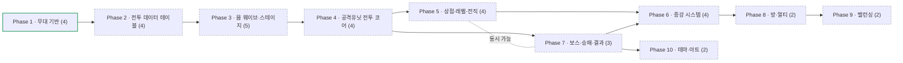

# Roadmap — 메이플 증강 디펜스 (8인 개인전 · 직업 타워 육성 · 증강 랜덤 · 구역 웨이브)

> 2026-09-09 컨셉 전환: **랜덤 디펜스 → 증강 디펜스**. 유닛 획득이 랜덤 뽑기에서 **메소 상점 + 전직 육성**으로 바뀌고, 랜덤성은 **증강(브론즈~프리즘)** 으로 이동. 무대·트랙·카메라(Phase 1)는 그대로 유지.
> 이전 트랙: `maple-luck-defense-roadmap.md`(이 파일로 개명) · 그 이전: `wall-survival-roadmap.md`(superseded)

## Direction
최대 8인이 **각자 자기 구역**에서 모험가 직업 타워를 세우고, 스타디움 트랙을 도는 몹 웨이브를 막는다. 유닛은 **메소로 사서 레벨을 올리고 전직**시키며(직업 중복 불가, 최대 10기), 전직할 때마다 스킬이 늘어난다. 처리하지 못한 몹이 **누적 110마리**가 되면 내 유닛 전멸 + 비석과 함께 개인 탈락한다. 판을 가르는 랜덤 요소는 **일정 스테이지마다 전원에게 굴러오는 증강 카드**다. 공격은 **속성(불/물/번개/땅/바람/빛/어둠/독)** 을 갖고 몹은 **방어 타입·물리/마법 내성**을 가져, 어떤 직업을 언제 세우느냐가 판단 축이 된다. **난이도는 의도적으로 매우 높게** 잡아, 검은 마법사 격파 자체가 도전 과제가 되도록 한다. (방향은 느슨하게 유지 — 언제든 바뀔 수 있음)

### 용어 (2026-09-09 확정)
- **스테이지** = 진행의 최소 단위 하나. 두 종류뿐이다.
  - **몬스터 스테이지** — **20초**, 초당 2마리 → **40마리**
  - **보스 스테이지** — **60초**
- **테마(지역)** = 스테이지를 묶는 상위 구분(빅토리아, 엘나스, 레헬른 …). 한 테마는 몬스터 스테이지 1개 이상 + 보스가 있으면 보스 스테이지 1개를 갖는다.
- 한 판 = 스테이지를 스토리 순서로 나열한 것. 마지막은 검은 마법사 보스 스테이지.

## 한눈에 보는 흐름

- Phase 1 — 무대 기반 · 유닛 4개 · 의존: — · 푼다: Phase 2 · 파일 집합: RtsMap, RtsConfigLogic, RtsHudLogic, RtsCameraAnchorComponent, RtsZoneLogic · **done**
- Phase 2 — 전투 데이터 테이블 · 유닛 4개 · 의존: Phase 1 · 푼다: Phase 3~6 전부 · 파일 집합: `RootDesk/MyDesk/Rts*TableLogic.mlua` · todo
- Phase 3 — 몹 웨이브·스테이지 · 유닛 5개 · 의존: Phase 2 · 푼다: Phase 4, Phase 7 · 파일 집합: RtsWaveLogic, RtsStageLogic, RtsMobComponent · todo
- Phase 4 — 공격유닛 전투 코어 · 유닛 4개 · 의존: Phase 3 · 푼다: Phase 5, Phase 7 · 파일 집합: RtsTowerComponent, RtsCombatLogic · todo
- Phase 5 — 상점·레벨·전직 · 유닛 4개 · 의존: Phase 4 · 푼다: Phase 6 · 파일 집합: RtsShopLogic, RtsTowerComponent(성장), RtsHudLogic(스킬칸) · todo
- Phase 6 — 증강 시스템 · 유닛 4개 · 의존: Phase 5, Phase 7 · 푼다: Phase 8 · 파일 집합: RtsAugmentLogic, RtsAugmentCardUiLogic · todo (**스테이지·몬스터/보스 정리가 끝난 뒤 착수** — 사용자 지시)
- Phase 7 — 보스·승패·결과 · 유닛 3개 · 의존: Phase 4 · 푼다: Phase 6, Phase 10 · 파일 집합: RtsBossComponent, RtsMatchResultLogic · todo
- Phase 8 — 방·멀티 동기화 · 유닛 2개 · 의존: Phase 6 · 푼다: Phase 9 · 파일 집합: RtsRoomLogic, RtsBootstrapLogic · todo
- Phase 9 — 밸런싱 · 유닛 2개 · 의존: Phase 8 · 푼다: — · 파일 집합: `Rts*TableLogic.mlua`(수치 튜닝) · todo
- Phase 10 — 테마·아트 · 유닛 2개 · 의존: Phase 7 · 푼다: — · 파일 집합: assets/textures, tools/gen-*.js, RtsHudLogic(프레임) · todo

동시 가능: Phase 5·Phase 7

지금: 진행 중 없음 · Next up: Phase 2

## Scope & Actors
- **플레이어(1~8)** — 자기 구역에서 타워 구매·배치·레벨업·전직, 증강 선택. F1~F8로 다른 유저 구역 관전.
- **방장** — 방 생성·난이도 선택·시작.
- **시스템(서버)** — 웨이브 스폰·순환, 누적/탈락 판정, 메소 지급, 상점가 산정, 전직 승인, 증강 등급 롤, 보스·승패.
- **커스터마이즈 축** — 난이도(몹 스탯·내성 %), 방 인원(1~8).

## Non-Goals / External Boundaries
- 자유 카메라(엣지/방향키 스크롤, 마우스 가두기) **금지** — F1~F8 시점 전환 + 미니맵 클릭 스냅만.
- 길찾기 없음 — 몹은 트랙 둘레 파라미터 `t`를 따라 반시계 순환.
- PvP 직접 전투 없음 (간접 경쟁: 생존·기록).
- **해적·듀얼블레이드·전사 외 신규 직업군 제외** — 모험가 근본 10직업만.
- **유닛 랜덤 뽑기 없음** — 유닛은 전부 결정적 구매. 랜덤은 증강에만.
- 전장의 안개 없음. 모바일 최적화 1차 제외(PC 중심).

## Phases & Units

### Phase 1 — 무대 기반 (탑다운 무대·HUD·구역 트랙까지 완성) · depends: —
| # | Unit | Goal | Key decision | Depends | Status |
|---|------|------|--------------|---------|--------|
| 1 | 탑다운 맵·타일 기반 | RectTile 탑다운 + 커스텀 바닥 타일 파이프라인 | — | — | done |
| 2 | 스타식 HUD 셸 | 미니맵·초상화·유닛정보·스킬칸 3×3·툴팁·부대탭·골드/시간·프레임 | — | 1 | done |
| 3 | 구역 카메라(F1~F8) | 구역 시점 전환 전용 카메라, 자유 카메라 제거, 미니맵 2×4 | — | 1, 2 | done |
| 4 | 구역 시스템 | 8구역 구획·배정(서버 권위), 스타디움 트랙 좌표계(11시 스폰·반시계), 배치 슬롯 | — | 3 | done |

**Expected scenes/systems**:

| Unit | Scene·System | Trigger | Purpose |
|------|--------------|---------|---------|
| #1 | `RtsMap` + `CaveFloorTileSet` + `RtsBootstrapLogic` | 입장 | 탑다운 무대·바닥 |
| #2 | `RtsHudLogic` (`SetSkillSlot`/`ClearSkillSlots`/`UpdateMinimapZone`) | 입장 | HUD 전체 |
| #3 | `RtsCameraAnchorComponent` + `RtsConfigLogic` | F1~F8 / 미니맵 클릭 | 구역 시점 전환 |
| #4 | `RtsZoneLogic` (`GetTrackPoint(zone,t)`/`GetSpawnPoint`/`GetPlacementSlot`/`AssignZone`) | 입장 | 구역·트랙 좌표계 |

> 근거: `.beaver/output/report/rts-base/{topdown-camera-rig,hud-shell,zone-camera,zone-system}-report.md`

### Phase 2 — 전투 데이터 테이블 (모든 수치·정의의 단일 소스. 값은 임시라도 **형태**를 먼저 고정) · depends: Phase 1
| # | Unit | Goal | Key decision | Depends | Status |
|---|------|------|--------------|---------|--------|
| 5 | 속성·내성 테이블 | **8속성**(불/물/번개/땅/바람/빛/어둠/독)과 물리/마법을 **독립 축**으로 정의(보우마스터=물리+바람 사례), 몹 방어 타입 ↔ 공격 속성 상성 배율 + 물리/마법 내성 | 상성 배율 구조(고정 배율표 vs 속성별 계수) | — | todo |
| 6 | 직업 10종 테이블 | 전사3·마법사3·궁수2·도적2. **1차로 시작 → 총 3회 전직(2·3·4차)**, 기본 스탯·전직별 스킬 목록(**전직당 1개 이상, 패시브 포함**). **속성은 스킬 단위**로 부여(아래 매핑표) | 액티브/패시브 구분 표현 | 5 | todo |
| 7 | 스테이지·보스 편성 테이블 | 몬스터 스테이지 20초(40마리) / 보스 스테이지 60초, 테마별 몹 구성·보스·메소 보상. 스테이지 나열 = 한 판 진행 | 테마당 몬스터 스테이지 수(한 판 길이 직결) | 5 | todo |
| 8 | 경제·증강 테이블 | 유닛 구매가 곡선(구매마다 상승)·레벨업가·전직가, 증강 등급 확률(브론즈70/실버20/골드9/프리즘1)·카드 목록 스텁 | 가격 곡선 형태(등비 vs 계단) | 6 | todo |

**Expected data contract**:

| Unit | 테이블 | 내용 |
|------|--------|------|
| #5 | `RtsElementTableLogic` | `Element` enum(8), `DamageKind`(물리/마법), `GetMultiplier(attackElement, mobDefenseType)`, `GetResist(mobId, damageKind)` |
| #6 | `RtsJobTableLogic` | `GetJobIds()`(10), `GetChain(jobId)`(1→4차), `GetBaseStats(jobId, tier)`, `GetSkillsOfTier(jobId, tier)`(**복수 반환**), 스킬별 `element`/`damageKind`/`kind`(액티브·패시브) |
| #7 | `RtsStageTableLogic` | `GetStageCount()`, `GetStage(n)`(테마·몹구성·보스여부·지속시간·메소보상), `GetSpawnPerSecond()`, `IsBossStage(n)` |
| #8 | `RtsEconomyTableLogic` | `GetUnitPrice(ownedCount)`, `GetLevelPrice(level)`, `GetAdvancePrice(tier)`, `RollAugmentGrade()`, `GetAugmentPool(grade)` |

**직업 ↔ 속성 매핑 (2026-09-09 확정분)** — 속성과 물리/마법은 별개 축이다. 물리 직업도 속성을 가질 수 있다:

| 직업 | 물리/마법 | 속성 | 근거 |
|---|---|---|---|
| 아크메이지(불,독) | 마법 | 불 · 독 | 스킬별로 두 속성 |
| 아크메이지(썬,콜) | 마법 | 번개 · 물(얼음) | 스킬별로 두 속성 |
| 비숍 | 마법 | 빛 | — |
| 다크나이트 | 물리 | 어둠 | — |
| **보우마스터** | **물리** | **바람** | **사용자 지정: 폭풍의 시** |
| 히어로 · 팔라딘 · 신궁 · 나이트로드 · 섀도어 | 물리 | 무속성 | 팔라딘은 차지 계열로 속성 부여 여지 있음(미확정) |

> **땅 속성은 사용 유닛 없음** → 몹 방어 타입 전용으로 존재(속성 저항을 요구하는 몹 설계용). 유닛 쪽 커버가 필요해지면 증강으로 부여하는 안이 남아 있다.

**확정된 상성 규칙 (2026-09-09)** — 나머지 조합의 배율은 Phase 2에서 채운다:

| 공격 속성 | 몹 방어 타입 | 결과 |
|---|---|---|
| 독 | 불 | 추가 데미지 |
| 독 | 물 | 반감 |

**테마·보스 편성 (작업용 초안 — 테마는 나중에 별도 상의)**

확정된 것은 세 가지뿐이다: ① **검은 마법사가 최종 보스**, ② **보스 스테이지 + 몬스터 스테이지 혼합 구성**, ③ **스토리 진행 순서를 따른다**. 아래 표는 그 세 조건을 만족하는 초안이며, 테마·지역·보스 배치는 추후 상의해서 확정한다:

| # | 테마(무대) | 보스 |
|---|---|---|
| 1 | 빅토리아 아일랜드 — 개미굴·던전 | 주니어 발록 |
| 2 | 루디브리엄 — 시계탑 | 파풀라투스 |
| 3 | 엘나스 — 화산 | 자쿰 |
| 4 | 아쿠아리움 — 심해 | 피아누스 |
| 5 | 리프레 — 용의 안식처 | 혼테일 |
| 6 | 시간의 신전 | 아카이럼 |
| 7 | 기사의 전당 | 반 레온 |
| 8 | 에레브 | 시그너스 |
| 9 | 전율하는 폐허 | 힐라 |
| 10 | 헤네시스 폐허 | 매그너스 |
| 11 | 검은 마법사 진영 | 스우 |
| 12 | 헤이븐 | 데미안 |
| 13 | 아케인리버 — 소멸의 여로 | — |
| 14 | 아케인리버 — 츄츄 아일랜드 | — |
| 15 | 아케인리버 — 레헬른 | 루시드 |
| 16 | 아케인리버 — 아르카나 | — |
| 17 | 아케인리버 — 모라스 | — |
| 18 | 아케인리버 — 에스페라 | 윌 |
| 19 | 아케인리버 — 문브릿지 | 더스크 |
| 20 | 아케인리버 — 고통의 미궁 | 진 힐라 |
| 21 | 아케인리버 — 리멘 | 듄켈 |
| 22 | 검은 마법사의 성 | 검은 마법사 |

**22 테마 / 보스 18 / 보스 없는 아케인 지역 4.** 아케인리버 9개 지역(소멸의 여로~리멘)은 전부 몬스터 스테이지를 1개 이상 갖는다(사용자 지시). 아케인 보스 5종의 지역 매핑(레헬른=루시드, 에스페라=윌, 문브릿지=더스크, 고통의 미궁=진 힐라, 리멘=듄켈)은 미검증 — 테마 확정 때 함께 정리.
**m=2 확정** → 총 스테이지 = 몬스터 44 + 보스 18 = 62개. 완주 시 `44×20초 + 18×60초` = **약 33분**(이론상 최대).
실제로는 난이도를 높게 잡아 대부분 그 전에 전원 탈락으로 끝나는 것을 의도한다.

### Phase 3 — 몹 웨이브·스테이지 진행·탈락 (혼자서도 "스테이지가 굴러가고 죽는다"까지) · depends: Phase 2
| # | Unit | Goal | Key decision | Depends | Status |
|---|------|------|--------------|---------|--------|
| 9 | 스테이지 진행·타이머 | 몬스터 20초 / 보스 60초 진행, 스테이지 번호·남은 시간 HUD 표시, 다음 스테이지 전환 | 스테이지 간 준비시간 유무 | 7 | todo |
| 10 | 몹 스폰·트랙 순환 | 초당 2마리(몬스터 스테이지당 40) 11시 스폰 → `GetTrackPoint(zone,t)` 반시계 등속 순환 | 순환 속도(1바퀴 소요 시간) | 4, 9 | todo |
| 11 | 몹 개체·방어 타입 | 몹 HP/방어 타입/물리·마법 내성 보유, 피격 인터페이스(데미지 계산은 #15) | 몹 상태 동기화 범위 | 5, 10 | todo |
| 12 | 몹 비주얼 파이프라인 | 몬스터 스프라이트 렌더 확립 — **기존 미해결**(sprite RUID 렌더 실패 → animationclip 카테고리 검증 필요) | 스프라이트 vs 애니메이션클립 | 11 | todo |
| 13 | 누적·탈락 판정 | 처리 못 한 몹 누적 카운트 표시, **110마리 도달 시** 내 구역 유닛 전멸 + 비석 + 관전 전환, 스테이지 클리어 메소 지급 | 관전 전환 방식 | 11 | todo |

**Expected scenes/systems**:

| Unit | Scene·System | Trigger | Purpose |
|------|--------------|---------|---------|
| #9 | `RtsStageLogic` | 매치 시작 | 스테이지 타이머·전환 |
| #10 | `RtsWaveLogic` | 스테이지 시작 | 스폰·순환 이동 |
| #11 | `RtsMobComponent` | 스폰 | 몹 스탯·방어 타입·피격 |
| #13 | `RtsEliminationLogic` | 누적 임계 도달 | 탈락 연출·관전 전환 |

### Phase 4 — 공격유닛 전투 코어 (타워 1기로 몹을 잡는 데까지) · depends: Phase 3
| # | Unit | Goal | Key decision | Depends | Status |
|---|------|------|--------------|---------|--------|
| 14 | 유닛 엔티티·배치·재배치 | 기본 1기 지급, 트랙 안쪽 배치 슬롯에 세우기, 유닛 비주얼. **위치 이동 및 유닛 간 위치 교환 허용 — 유닛당 2분 쿨다운**(쿨다운 표시 포함) | 쿨다운 UI 표기 위치 | 4, 6 | todo |
| 15 | 자동 공격 | 사거리·공격속도·타겟팅(트랙 위 몹 대상) | 타겟 우선순위(선두/근접/최저HP) | 14 | todo |
| 16 | 속성·내성 데미지 계산 | 공격 속성 × 몹 방어 타입 상성 + 물리/마법 내성 적용, 데미지 표시 | 상성 배율 적용 순서(내성 선/후) | 5, 15 | todo |
| 17 | 유닛 선택·HUD 연동 | 유닛 클릭 선택 → 초상화·유닛정보 패널 갱신, 부대지정 실바인딩 | 부대지정 사양 범위 | 2, 14 | todo |

**Expected scenes/systems**:

| Unit | Scene·System | Trigger | Purpose |
|------|--------------|---------|---------|
| #14 | `RtsTowerComponent` | 지급·구매 | 유닛 상태·배치 |
| #14 | `RtsTowerComponent:Relocate/Swap` | 이동·교환 명령 | 재배치(유닛당 2분 쿨다운, 서버 검증) |
| #15 | `RtsTowerComponent:Attack` | 공격 주기 | 타겟팅·발사 |
| #16 | `RtsCombatLogic:ResolveDamage` | 피격 | 속성·내성 데미지 산출 |
| #17 | `RtsHudLogic:SetSelectedUnit` | 유닛 클릭 | 초상화·유닛정보 |

### Phase 5 — 상점·레벨·전직 (메소 경제와 육성 축) · depends: Phase 4
| # | Unit | Goal | Key decision | Depends | Status |
|---|------|------|--------------|---------|--------|
| 18 | 유닛 상점 | 메소로 유닛 구매, **구매할 때마다 가격 상승**, **동일 직업 중복 불가**(10종 전부 보유 시 구매 마감) | 상점 UI 위치(스킬칸 vs 별도 패널) | 8, 14 | todo |
| 19 | 레벨 구매 강화 | 유닛별 레벨 구매 → 스탯 상승 | 레벨 상한 | 18 | todo |
| 20 | 전직 | 일정 레벨 도달 시 추가 메소로 전직(1→2→3→4차), 스탯·비주얼 갱신 | 전직 가능 레벨 기준 | 19 | todo |
| 21 | 전직 스킬 생성·HUD 연동 | 전직마다 스킬 **1개 이상** 획득(**패시브 포함**) → 액티브는 스킬칸 3×3에 배치, 패시브는 유닛정보에 표기, 툴팁 연동 | 스킬 발동 방식(자동 vs 수동 쿨다운) | 2, 20 | todo |

**Expected scenes/systems**:

| Unit | Scene·System | Trigger | Purpose |
|------|--------------|---------|---------|
| #18 | `RtsShopLogic:BuyUnit` | 상점 클릭 | 가격 산정·중복 검사·지급 |
| #19 | `RtsShopLogic:BuyLevel` | 레벨업 클릭 | 스탯 상승 |
| #20 | `RtsShopLogic:Advance` | 전직 클릭 | 전직 승인·체인 진행 |
| #21 | `RtsHudLogic:SetSkillSlot` | 전직 완료 | 스킬칸 갱신 |

### Phase 6 — 증강 시스템 (판을 가르는 랜덤 축) · depends: Phase 5, Phase 7
| # | Unit | Goal | Key decision | Depends | Status |
|---|------|------|--------------|---------|--------|
| 22 | 증강 지급 트리거 | 일정 스테이지마다 전 유저 동시 증강 획득 | **지급 주기**(Open Decisions 참조) | 9 | todo |
| 23 | 등급 롤(서버 권위) | 브론즈70/실버20/골드9/프리즘1 확률로 등급 결정 → 등급 풀에서 카드 추첨 | 유저별 독립 롤 vs 공용 롤 | 8, 22 | todo |
| 24 | 증강 카드 UI | **아이템 카드 형태** 제시·선택, 보유 증강 목록 표시 | 제시 장수(1장 확정 지급 vs N장 중 택1) | 23 | todo |
| 25 | 증강 효과 적용 훅 | 효과가 스탯·데미지·경제에 꽂히는 지점 확보(효과 내용은 스텁 — 나중에 확정) | 효과 표현 방식(수식 modifier 체인) | 16, 24 | todo |

**Expected scenes/systems**:

| Unit | Scene·System | Trigger | Purpose |
|------|--------------|---------|---------|
| #22 | `RtsAugmentLogic:GrantStage` | 지정 스테이지 종료 | 전 유저 지급 개시 |
| #23 | `RtsAugmentLogic:Roll` | 지급 시 | 등급·카드 결정(서버) |
| #24 | `RtsAugmentCardUiLogic` | 지급 시 | 카드 제시·선택 |
| #25 | `RtsAugmentLogic:GetModifiers` | 데미지·경제 계산 | 효과 반영 |

### Phase 7 — 보스·승패·결과 (한 판의 끝) · depends: Phase 4
| # | Unit | Goal | Key decision | Depends | Status |
|---|------|------|--------------|---------|--------|
| 26 | 보스 개체·보스 스테이지 | 60초 보스 스테이지, 보스 전용 스탯·방어 타입·패턴(최소) | 보스 패턴 범위(단순 고HP vs 행동 패턴) | 7, 11 | todo |
| 27 | 승패 판정 | 최종 보스(검은 마법사) 처치 = 클리어, 전원 탈락 = 패배, 개인 탈락 순위 | 클리어 조건(전원 생존 vs 1인 이상) | 13, 26 | todo |
| 28 | 결과 화면·기록 | 도달 스테이지·처치 수·순위 표시 | 기록 저장 범위(로컬 vs DataStorage) | 27 | todo |

**Expected scenes/systems**:

| Unit | Scene·System | Trigger | Purpose |
|------|--------------|---------|---------|
| #26 | `RtsBossComponent` | 보스 스테이지 시작 | 보스 개체 |
| #27 | `RtsMatchResultLogic:Judge` | 보스 처치/전원 탈락 | 승패 판정 |
| #28 | `RtsResultUiLogic` | 매치 종료 | 결과 화면 |

### Phase 8 — 방·멀티 동기화 (여럿이 실제로 돌린다) · depends: Phase 6
| # | Unit | Goal | Key decision | Depends | Status |
|---|------|------|--------------|---------|--------|
| 29 | 방 시스템 | 방 생성/입장/시작(1~8인), 세션 격리 | 인스턴스 맵 구조 | 27 | todo |
| 30 | 멀티 동기화·권위 재점검 | 유저별 메소/유닛/증강/탈락 상태 분리, 서버 권위 전수 점검, 동시 플레이 검증 | 동기화 범위(SyncTable vs 개별 전송) | 29 | todo |

### Phase 9 — 밸런싱 (수치 튜닝 패스) · depends: Phase 8
| # | Unit | Goal | Key decision | Depends | Status |
|---|------|------|--------------|---------|--------|
| 31 | 난이도 스케일 | 난이도 %로 몹 스탯·내성 일괄 배율 | 난이도 단계 | 30 | todo |
| 32 | 테이블 튜닝 패스 | 가격 곡선·메소 보상·상성 배율·**증강 효과 확정** 실측 튜닝 | — | 31 | todo |

### Phase 10 — 테마·아트 (보는 맛) · depends: Phase 7
| # | Unit | Goal | Key decision | Depends | Status |
|---|------|------|--------------|---------|--------|
| 33 | 유닛·보스 비주얼 정리 | 10직업 전직 단계별 비주얼, 보스 스프라이트 | 소싱 방식(공식 리소스 vs 자체 생성) | 26 | todo |
| 34 | HUD 테마 재조정 | 눈 테마에 맞춘 프레임 톤, **티어별(브론즈~챌린저) 프레임** | 랭크 시스템 도입 여부 | 2 | todo |

### Dropped (이전 컨셉 잔재 — 기록용)
| # | Unit | 사유 |
|---|------|------|
| — | 뽑기 시스템(순수 랜덤 유닛 소환) | dropped(2026-09-09 증강 디펜스 전환 — 유닛은 결정적 구매, 랜덤은 증강으로 이동) |
| — | 조합/합성 | dropped(2026-08-07 합성 없음 확정) |
| — | 밭(수익건물) 경제 | dropped(2026-09-09 — 메소는 몬스터 스테이지·보스 보상으로 확정) |

**Progress**: 4/34 units done (1/10 phases)
**Next up**: Phase 2 전투 데이터 테이블 — Phase 1 완료로 의존 충족. 속성·직업·스테이지·경제 네 테이블이 Phase 3~6 전부의 선행 조건이라 여기부터 열어야 뒤가 병렬로 풀린다. 시작: `/beaver:direct 전투 데이터 테이블`

## Cross-Cutting Rules
- **모든 판정은 서버** — 메소, 상점가, 전직 승인, 증강 등급 롤, 몹 스폰·누적, 탈락, 승패는 `@ExecSpace("Server")`. 클라는 입력·표시만.
- **밸런스 수치는 Phase 2 테이블 일원화** — 어떤 Phase도 스탯·가격·확률·배율을 코드에 하드코딩하지 않는다. 난이도 %는 테이블 위에 곱한다.
- **구역 좌표는 `RtsZoneLogic` 경유** — 구역 인덱스↔월드 좌표, 트랙 위치(`t`), 배치 슬롯은 단일 소스.
- **HUD 갱신은 `RtsHudLogic` API 경유** — 스킬칸/초상화/유닛정보/골드·시간 직접 UI 조작 금지.
- **데미지는 단일 경로** — 모든 피해는 `RtsCombatLogic:ResolveDamage`를 통과(속성 상성 → 내성 → 증강 modifier 순). 우회 계산 금지.
- **키보드는 PC 전용**, 바닥은 반드시 RectTileMap(SpriteRenderer 타일드 금지).

## Open Decisions (roadmap-level)
- [x] **탈락 임계값(2026-09-09 확정)** — **누적 110마리 유지**. 몬스터 스테이지당 40마리 체제에서도 그대로 간다(약 3스테이지분 여유).
- [~] **테마·보스 목록** — **확정: 검은 마법사가 최종 보스 / 보스 스테이지+몬스터 스테이지 혼합 / 스토리 진행 순서.** 구체적 테마·지역·보스 배치는 **나중에 별도 상의**(사용자 지시 2026-09-09). Phase 2의 22 테마 표는 그때까지 쓰는 작업용 초안.
- [x] **테마당 몬스터 스테이지 수(2026-09-09 확정)** — **m=2**. 완주 시 이론상 약 33분이지만, **난이도를 매우 높게 잡아 대부분 그 전에 전원 탈락으로 종료**시키는 것이 의도. 검은 마법사 클리어 자체가 도전 과제.
- [~] **증강 지급 주기** — **보스 스테이지 클리어마다는 확정**, 중간 지급 추가 여부는 **Phase 6 착수 때 확정**(사용자 지시). Phase 6은 스테이지·몬스터/보스 정리가 끝난 뒤 시작한다.
- [x] **속성 구성(2026-09-09 확정)** — 기존 7속성 + **독** = **8속성**. **바람 = 보우마스터(폭풍의 시)**, **독 = 아크메이지(불,독)**. 물리 직업도 속성을 갖게 되므로 속성과 물리/마법은 독립 축으로 설계. **땅은 사용 유닛 없이 몹 방어 타입 전용**. 상성은 **독>불(추가), 독<물(반감)** 만 확정, 나머지 배율은 Phase 2에서 채움.
- [x] **전직 단계(2026-09-09 확정)** — **1차 전직 상태로 시작, 총 3회 전직(2·3·4차)**. 전직마다 스킬 **1개 이상**(2개 이상일 수 있고 **패시브도 포함**).
- [x] **유닛 재배치(2026-09-09 확정)** — **위치 이동·유닛 간 위치 교환 허용, 유닛당 2분 쿨다운**. 쿨다운은 서버 권위로 검증한다. (배치 슬롯 30칸은 최대 10기 대비 과잉이라 #14에서 조정 여지)
- [x] **미니맵 클릭(2026-08-02)** — 유지, 클릭한 구역으로 스냅 이동. 구역 배열 2열×4행.
- [x] **합성 여부(2026-08-07)** — 합성 없음.
- [x] **유닛 획득 방식(2026-09-09)** — 랜덤 뽑기 폐기, **메소 상점 + 전직 육성**으로 확정. 랜덤은 증강 전용.

## Notes / Risks
- **직업 10종 확정안**(사용자 사양 4번 해석): 전사 = 히어로/팔라딘/다크나이트, 마법사 = 아크메이지(불,독)/아크메이지(썬,콜)/비숍, 궁수 = 보우마스터/신궁, 도적 = 나이트로드/섀도어. 각각 1→4차 전직 체인 보유. 속성 매핑은 Phase 2의 "직업 ↔ 속성 매핑" 표 참조(보우마스터=바람 확정). 직업 구성이 다르면 Phase 2 전에 정정 필요.
- **몹 비주얼이 Phase 3의 실질 블로커** — 주황버섯 스프라이트 3종이 렌더되지 않던 미해결 건이 그대로 남아 있음(몬스터는 `sprite`가 아닌 **`animationclip`** 카테고리일 가능성). #12에서 반드시 확립해야 웨이브가 보인다.
- **Phase 1 자산은 전량 유효** — 트랙 좌표계(`GetTrackPoint(zone,t)`)·구역 배정·HUD 스킬칸 3×3(전직 스킬용으로 딱 맞음)·미니맵이 새 컨셉에서도 그대로 쓰인다. 피벗 손실 없음.
- **배치 슬롯 30 → 최대 10기**로 수요가 줄어 여유가 생김(문제 아님, 슬롯 조정은 #14 판단).
- **탈락자 대기 시간**이 남은 리스크 — 완주 33분은 높은 난이도로 대부분 조기 종료되어 실질적으로 짧아지지만, **초반에 탈락한 사람은 마지막 생존자가 죽을 때까지 기다린다**. 관전 전환(#13)만으로 부족하면 조기 탈락자 재입장/새 판 같은 설계가 별도로 필요할 수 있음(#27 승패 판정과 함께 검토).
- 이전 트랙 문서: `pivot-luck-defense.md`(벽짓살→운빨 피벗 근거), `wall-survival-roadmap.md`(superseded).
