# Roadmap — 메이플 증강 디펜스 (8인 동시 진행 · 결과는 각자 · 직업 유닛 레벨 육성 · 증강 랜덤 · 구역 웨이브)

> 2026-09-09 컨셉 전환: **랜덤 디펜스 → 증강 디펜스**. 유닛 획득이 랜덤 뽑기에서 **영입 + 레벨 육성**으로 바뀌고, 랜덤성은 **증강**으로 이동. 무대·트랙·카메라(Phase 1)는 그대로 유지.
> 2026-09-20 재정리: 로드맵 밖에서 선행한 작업(직업 표·외형·연출·전투 코어)을 done 페이즈로 편입.
> **2026-09-24 재정리(사용자 "증강/밸런스쪽 다 끝났고, 이제 아이콘·테마·이용자 목록 UI·매칭만 손보면 된다")**: 한 판(스테이지·웨이브·보스·결과)·영입·증강·밸런스(티어 재설계·난이도 6단계)를 done 처리. 남은 일 = **매칭·방 + 순위(검은 마법사 4페이즈 클리어 횟수)** · **아이콘·테마·플레이어 목록** · **디자인 인계(ChatGPT)**. 근거 report: `.beaver/output/report/rts-stage/stage-wave-boss-report.md`, 커밋 a75a69f.
> **2026-09-24 출시 방향(사용자 "일단은 솔로 모드로 출시하고, 멀티로 업데이트")**: Phase 12 솔로 출시(월드 출시 설정 '최대 인원 1' = 접속자마다 따로 떨어진 월드 인스턴스 — 격리용 코드 불필요)를 먼저 하고, Phase 8은 **멀티 업데이트**로 뒤에 붙인다.
> **v260924-1 (2026-09-24) 솔로 출시** — 게임 버전 = `v` + YYMMDD + `-` + 그날 커밋 순번(사용자 "이제부터 버전에 날짜 + 커밋 횟수가 붙어, 이게 게임 버전"). 출시 노트의 '개발 예정 로드맵' 1~5 = 아래 Phase 8 → 13 → 10 → 14 → 11 순서.
> 문서 원본은 `.info/`(gitignored, 로컬 전용): character.md(직업·스킬·프리즘) · skill.md · balance-detail.md · damage.md · weapon.md · augmentation.md · attack.md · monster-wave.md · monster.md · level.md · tier.md.
> **진행 방식(2026-09-13 사용자 지시)**: ① 로드맵·spec·plan은 코드 없이 **방향·동작 설명**으로. ② **페이즈 완료 = 사용자가 만족할 때까지 수정·검증을 반복하는 루프**(사용자 확인이 있을 때만 done). ③ 커밋·푸시는 매번 명시 승인. 상세: `.beaver/memory/workflow.md`
> 이전 트랙: `pivot-luck-defense.md` · `wall-survival-roadmap.md`(superseded)

## Direction
최대 8인이 한 방에서 **같은 시간표로 같은 스테이지(132개)를 함께 진행**하되, 각자 자기 구역에서 자기 유닛으로 막는다. **승패 개념은 없다** — 결과는 각자 검은 마법사(4페이즈)를 깼느냐, 중간에 죽었느냐뿐. 자기 구역의 그리드 트랙(16×13) 발판에 직업 유닛을 세우고, 경로를 따라 도는 몹 웨이브를 막는다. 유닛은 **라운드마다 열리는 칸에 무료로 영입(Lv1)하고 메소로 레벨(1~50)을 올린다**(동일 직업 중복 불가, 슬롯 6). 직업은 모험가 10 + 프리즘으로 해금되는 **영웅 팬텀** = 11, **1티어(히어로·나이트로드·썬콜·보우마스터) 1기가 반드시 필요**하고 2티어·서포터(비숍·팔라딘)로 받친다. 처리하지 못한 몹이 **필드에 110마리**가 되거나 **보스를 60초 안에 못 잡으면** 내 유닛 전멸 + 비석과 함께 개인 탈락. 판을 가르는 랜덤은 **증강**(라운드 지급 3택1 + 메소로 사는 증강 뽑기, 프리즘은 판당 뽑기 최대 2개·천장). 메소는 **몹을 잡을 때만**(총 768,000). 난이도는 **6단계**(매우쉬움 0.2 ~ 극악 1.0 × 극악 곡선) — 극악은 검은 마법사 클리어 약 3~4%의 도전 과제. **순위 = 어려움 이상(어려움·매우어려움·극악)에서 검은 마법사 4페이즈를 깬 횟수**(2026-09-24 사용자 — 옛 최종 메소·최대 라운드 기준 폐기). **v260924-1로 솔로 모드 출시**(월드 인스턴스당 1명), 이후 업데이트 순서 = 멀티플레이 → 순위표 → 개인 테마 프리셋 → 아이콘 프리셋 → 전체 UI 개선(출시 노트). 화면 디자인은 **ChatGPT에 인계**한다(`docs/ui-screens.md`, `AGENT.md`). (방향은 느슨하게 유지 — 언제든 바뀔 수 있음)

### 용어 (2026-09-09 확정)
- **스테이지(라운드)** = 진행의 최소 단위. 몬스터 20초 · 보스 60초 · 쉬는 30초.
- **계층** = 월드지역 > 지역 > 맵 > 젠 몬스터. 스테이지는 맵 단위.
- 한 판 = **방 전체가 같은 스테이지 순서를 시간순으로 함께 진행**. 마지막은 검은 마법사 **3연전(2~4페이즈)**. 스테이지 번호·타이머는 방 전역, 막는 건 각자.

## 한눈에 보는 흐름

```mermaid
flowchart LR
  P1["Phase 1 · 무대 기반 (4)"]:::done --> P2["Phase 2 · 직업·스킬 표 + 연출 (4)"]:::done
  P2 --> P3["Phase 3 · 유닛 전투 코어 (5)"]:::done
  P3 --> P6["Phase 6 · 스테이지·몬스터 웨이브 (5)"]:::done
  P6 --> P7["Phase 7 · 보스·클리어·결과 (4)"]:::done
  P7 --> P5["Phase 5 · 유닛 관리 — 영입·레벨 (3)"]:::done
  P5 --> P4["Phase 4 · 증강·프리즘 (6)"]:::done
  P4 --> P9["Phase 9 · 밸런싱·난이도 (2)"]:::done
  P9 --> P12["Phase 12 · 솔로 출시 v260924-1 (3)"]:::done
  P12 --> P8["① Phase 8 · 멀티플레이 (2)"]:::todo
  P8 --> P13["② Phase 13 · 순위표 (1)"]:::todo
  P12 --> P10["③ Phase 10 · 개인 테마 프리셋 (3)"]:::inprogress
  P12 --> P14["④ Phase 14 · 아이콘 프리셋 (1)"]:::todo
  P10 -. 동시 가능 .- P14
  P13 --> P11["⑤ Phase 11 · 전체 UI 개선 (3)"]:::inprogress
  P10 --> P11
  P14 --> P11
  classDef done stroke:#3fa46f,stroke-width:2px
  classDef inprogress stroke:#d9a300,stroke-width:3px
  classDef todo stroke:#8a949c,stroke-width:1px,stroke-dasharray:4 3
```

- Phase 1 — 무대 기반 · 유닛 4개 · 의존: — · 푼다: Phase 2 · 파일 집합: RtsMap, RtsConfigLogic, RtsHudLogic, RtsCameraAnchorComponent, RtsZoneLogic, RtsThemeLogic · **done**
- Phase 2 — 직업·스킬 표 + 연출 · 유닛 4개 · 의존: Phase 1 · 푼다: Phase 3 · 파일 집합: RtsJobTableLogic, RtsSkillFxLogic, RtsUnitBuffLogic · **done**
- Phase 3 — 유닛 전투 코어 · 유닛 5개 · 의존: Phase 2 · 푼다: Phase 6 · 파일 집합: RtsUnitLogic, RtsUnitComponent, RtsUnitSelectLogic, RtsUnitPopupLogic, RtsUnitAttackComponent, RtsCombatLogic, RtsMonsterComponent, RtsTrackWalkerComponent · **done**
- Phase 6 — 스테이지·몬스터 웨이브 · 유닛 5개 · 의존: Phase 3 · 푼다: Phase 7 · 파일 집합: RtsStageTableLogic, RtsStageLogic, RtsWaveLogic, RtsMonsterComponent, RtsTrackWalkerComponent · **done**(2026-09-24)
- Phase 7 — 보스·클리어·결과 · 유닛 4개 · 의존: Phase 6 · 푼다: Phase 5 · 파일 집합: RtsBossLogic, RtsRunResultLogic, RtsStageLogic, RtsPopupLogic(결과) · **done**(2026-09-24)
- Phase 5 — 유닛 관리(영입·레벨) · 유닛 3개(1 dropped) · 의존: Phase 7 · 푼다: Phase 4 · 파일 집합: RtsUnitLogic, RtsPopupLogic(영입), RtsUnitPopupLogic(레벨업) · **done**(2026-09-24)
- Phase 4 — 증강·프리즘 · 유닛 6개 · 의존: Phase 5 · 푼다: Phase 9 · 파일 집합: RtsAugmentTableLogic, RtsAugmentLogic, RtsJobTableLogic, RtsPopupLogic(3택1·도감), RtsHudLogic(뽑기) · **done**(2026-09-24)
- Phase 9 — 밸런싱·난이도 · 유닛 2개 · 의존: Phase 4 · 푼다: Phase 12 · 파일 집합: RtsDifficultyLogic, RtsJobTableLogic, RtsCombatLogic, tools/clear-sim.py · **done**(2026-09-24)
- Phase 12 — 솔로 출시 · 유닛 3개 · 의존: Phase 9 · 푼다: Phase 8, 10, 14 · 파일 집합: RtsRunResultLogic, RtsPopupLogic, RtsHudLogic, RtsStageLogic · **done**(2026-09-24, **v260924-1**)
- ① Phase 8 — 멀티플레이(대기방·매칭·방 생성/참가) · 유닛 2개 · 의존: Phase 12 · 푼다: Phase 13 · 파일 집합: RtsRoomLogic(신규 — 대기방·매칭·방), RtsBootstrapLogic, RtsStageLogic(방 인원·레디), RtsPopupLogic(대기방 화면) · todo
- ② Phase 13 — 순위표 · 유닛 1개 · 의존: Phase 8(대기방에 붙음) · 푼다: Phase 11 · 파일 집합: RtsRunResultLogic(순위 조회), RtsLeaderboardLogic(신규 — 대기방 순위표), RtsPopupLogic(순위 창) · todo
- ③ Phase 10 — 유저 개인 테마(트랙+배경) 프리셋 · 유닛 3개(2 done — 기록) · 의존: Phase 12 · 푼다: Phase 11 · 파일 집합: RtsThemeLogic(프리셋 확장·유저별 적용), RtsZoneLogic(구역 시각화), RtsPopupLogic(테마 선택), 월드 상품(유료면) · in-progress(#35·#37 done)
- ④ Phase 14 — 유저 아이콘 프리셋 · 유닛 1개 · 의존: Phase 12 · 푼다: Phase 11 · 파일 집합: RtsIconCollectionLogic(신규 — 컬렉션·선택·저장), RtsCombatLogic·RtsMonsterComponent(처치 드랍 훅), RtsPopupLogic(컬렉션 화면) · todo
- ⑤ Phase 11 — 전체적인 UI 개선 · 유닛 3개 · 의존: Phase 13, 10, 14 · 푼다: — · 파일 집합: RtsHudLogic(좌측 플레이어 카드·HUD), RtsPopupLogic·RtsUnitPopupLogic·RtsDifficultyLogic·RtsMonsterInfoLogic(Client 메서드), `docs/ui-screens.md`, `AGENT.md` · in-progress(#45 UI 명세 done)

동시 가능: Phase 10 · Phase 14 (테마 = RtsThemeLogic·RtsZoneLogic, 아이콘 = 새 RtsIconCollectionLogic·처치 훅 — 둘 다 RtsPopupLogic에 팝업을 하나씩 더하므로 그 파일만 순서 조율). Phase 8 → 13은 순서대로.

지금: **v260924-1 솔로 출시** · Next up: **① Phase 8 — 멀티플레이**

### 출시 노트 v260924-1 — 개발 예정 로드맵 (사용자 원문)
1. 멀티플레이(매칭/방 생성 및 참가) → Phase 8
2. 순위표 (어려움/매우어려움/극악 난이도의 검은마법사 클리어 횟수) → Phase 13 (게임 안 '순위' 창은 v260924-1에 이미 들어감 — Phase 13은 대기방 순위표·다듬기)
3. 유저 개인 테마(트랙+배경) 프리셋 기능 → Phase 10
4. 유저 아이콘 프리셋 기능 → Phase 14
5. 전체적인 UI 개선 → Phase 11

## Scope & Actors
- **플레이어(1~8)** — 자기 구역에서 영입·배치·레벨업, 증강 선택·뽑기(전부 팝업). F1~F8·플레이어 목록 클릭으로 다른 구역 관전. **관전(타 구역 보기)은 읽기 전용** — 상세보기만, 조작은 전부 비활성(서버도 소유자 검증). 탈락 후엔 관전을 계속하거나 방을 나간다.
- **방(지금은 정적 방 1개)** — 입장 → 난이도 선택(각자) → 카운트다운 15초('바로 시작'으로 앞당김) → 진행 → 결과. 다시 하기 = 찬반 투표(과반·20초). 매칭·방 만들기는 Phase 8.
- **시스템(서버)** — 방 전역: 스테이지 타이머·전환. 유저별: 웨이브 스폰·순환, 누적/탈락, 메소, 증강 지급·뽑기, 보스, 클리어/탈락, 기록.
- **커스터마이즈 축** — 난이도(6단계, 유저별), 방 인원(1~8), 스킨(기본 직업 세트 / 월드 아바타), 앞으로 테마(유료)·아이콘(컬렉션).

## Non-Goals / External Boundaries
- 자유 카메라(엣지/방향키 스크롤) **금지** — F1~F8 + 플레이어 목록 클릭 스냅만.
- 길찾기 없음 — 몹은 트랙 파라미터 `t`를 따라 등속 순환.
- **PvP·승패 없음** — 유저 간 경쟁은 순위표뿐.
- **직업 = 모험가 10(4차) + 영웅 팬텀(프리즘 해금)** — 해적 제외, 듀얼블레이더는 섀도어 프리즘으로만, 전직 없음.
- **유닛 랜덤 뽑기 없음**, **상성 체계 없음**, 전장의 안개 없음, 모바일 최적화 1차 제외(PC 중심).
- **화면 디자인(색·배치·아트 톤)은 ChatGPT가 이어받는다**(Phase 11) — 게임 규칙·서버 로직은 이 트랙에서.

## Phases & Units

### Phase 1 — 무대 기반 · depends: — · **done**
| # | Unit | Goal | Key decision | Depends | Status |
|---|------|------|--------------|---------|--------|
| 1 | 탑다운 맵·타일 기반 | RectTile 탑다운 + 공식 헤네시스 바닥 타일 | — | — | done |
| 2 | HUD v2 | 좌상단 정보 카드, 좌측 플레이어 목록, 우측 유닛 슬롯 6, 좌하단 증강 버튼, 팝업 공통 셸 | — | 1 | done |
| 3 | 구역 카메라(F1~F8) | 구역 시점 전환 전용 카메라 | — | 1, 2 | done |
| 4 | 구역 시스템 | 8구역·그리드 트랙 16×13·발판 86칸·테마 프리셋(`RtsThemeLogic`) | — | 3 | done |

> 근거: `.beaver/output/report/rts-base/*-report.md`

### Phase 2 — 직업·스킬 표 + 스킬 연출 · depends: Phase 1 · **done**
| # | Unit | Goal | Key decision | Depends | Status |
|---|------|------|--------------|---------|--------|
| 5 | 직업 테이블 | 11직업 레벨 1~50 능력치·스킬·공격속도·무기 난수·데미지 8단계·레벨업 비용 | — | — | done |
| 6 | 11직업 외형·스킨 | MSW 아바타 세트, 스킨 = 기본 / 월드 아바타(상품 `QK03ZI15E`) | — | 5 | done |
| 7 | 스킬 연출 시스템 + 11직업 액티브 연출 | `RtsSkillFxLogic` — 모션·원작 클립·방향 플래그·사운드 | — | 5 | done |
| 8 | 파티 버프 | 샤프아이즈·프레이·조커 등 발 아래 아이콘 + 팝업 버프 탭 | — | 5 | done |

### Phase 3 — 유닛 전투 코어 · depends: Phase 2 · **done**
| # | Unit | Goal | Key decision | Depends | Status |
|---|------|------|--------------|---------|--------|
| 9 | 유닛 엔티티·배치·이동 | 발판 1기씩, 위치 이동(3분 쿨, 서버 검증) | — | 4, 5 | done |
| 10 | 자동 공격·타겟팅 | 유닛별 루프, 체비셰프 사거리, 메인 대상 고정, 광역·지대 예외 | — | 9 | done |
| 11 | 데미지 계산·표시 | 엔진 Attack/Hit + `RtsUnitAttackComponent`, 기본 데미지 스킨 | — | 10 | done |
| 12 | 유닛 클릭 메뉴·상세 팝업 | 캐릭터 메뉴·상세 팝업(스킬·증강·버프 탭, 스킬 잠금, 레벨업) | — | 9 | done |
| 13 | 몬스터 개체 + 시험대 | `RtsMonsterComponent`·트랙 순환·빙결, 개발모드(테스트 모드) | — | 10 | done |

### Phase 6 — 스테이지·몬스터 웨이브 · depends: Phase 3 · **done**(2026-09-24, report `rts-stage/stage-wave-boss-report.md`)
| # | Unit | Goal | Key decision | Depends | Status |
|---|------|------|--------------|---------|--------|
| 22 | 스테이지·몬스터 편성 테이블 + RUID 매칭 | 132 스테이지 `RtsStageTableLogic`(`tools/gen-stage-table.py` 생성) | — | — | done |
| 23 | 스테이지 진행·타이머(방 전역) | 카운트다운 15초 + '바로 시작', 몬스터 20 / 보스 60 / 쉬는 30초, 스테이지별 BGM | — | 22 | done |
| 24 | 몹 스폰·트랙 순환(구역별) | 구역마다 초당 2마리, 체력 × 난이도 | — | 4, 23 | done |
| 25 | 처치·드랍·정리 | 사망 클립·사망음, 드랍 100%(총 768,000) | — | 24 | done |
| 26 | 누적·탈락 판정 | 필드 110 → 전멸 + 비석 + 관전/나가기 | — | 25 | done |

### Phase 7 — 보스·클리어·결과 · depends: Phase 6 · **done**(2026-09-24)
| # | Unit | Goal | Key decision | Depends | Status |
|---|------|------|--------------|---------|--------|
| 27 | 보스 개체·보스 스테이지 | 60초, 보스 영역(4×5 고정·배치 불가), 다중 보스·검은 마법사 3연전 | — | 22, 23 | done |
| 28 | 보스 등장·타격 | 일반 몹 보관·복귀, 등장 전 초읽기, 보스전 사거리 16 | — | 9, 27 | done |
| 29 | 클리어·탈락 판정(유저별) | 검은 마법사 4페이즈 격파 = 클리어 | — | 26, 28 | done |
| 30 | 결과 화면·기록 | 결과 팝업(도달 라운드·처치·보스 HP%) + 나가기·다시 하기(찬반 투표). 기록은 난이도별 저장(테스트 모드 제외) — **순위 기준은 Phase 8 #44로 교체** | — | 29 | done |

### Phase 5 — 유닛 관리(영입·레벨) · depends: Phase 7 · **done**(2026-09-24)
| # | Unit | Goal | Key decision | Depends | Status |
|---|------|------|--------------|---------|--------|
| 19 | 영입가·레벨업가 표 | 영입가 5단계 | — | — | dropped(2026-09-23 — 영입은 무료 Lv1, 칸이 라운드 1·5·자쿰·혼테일·핑크빈·시그너스에서 열림) |
| 20 | 영입 팝업 | 직업군 탭·동일 직업 불가·상한 6, 직업 선택 → 빈 발판 클릭 배치(ESC 취소), 진행 중에만 영입 | — | 9 | done |
| 21 | 레벨 구매 + 슬롯 | 레벨업 가격·50 상한·메소 부족 비활성, 우측 슬롯 6 + 영입 버튼(가능할 때만) | — | 12 | done |

### Phase 4 — 증강·프리즘 · depends: Phase 5 · **done**(2026-09-24)
| # | Unit | Goal | Key decision | Depends | Status |
|---|------|------|--------------|---------|--------|
| 14 | 증강 테이블 | `RtsAugmentTableLogic` 브·실·골·프리즘 | — | — | done |
| 15 | 지급·결정(서버) | 라운드 지급 3택1, 대상 지정 | — | 14 | done |
| 16 | 효과 적용 + 프리즘 11종 | 합연산 적용 + 프리즘 스킬·연출, 티어 배율(1티어 프리즘 시 ×1→×3, 2티어 약점 ×2, 팬텀 ×1.75) | — | 7, 8, 15 | done |
| 17 | 증강 팝업 | 3택1·보유 목록·증강 도감(등급 탭·프리즘 직업 칩·펼치기) | — | 15 | done |
| 18 | 증강 밸런스 재계산 | 티어 재설계로 대체(`tools/balance-calc.py`·`.info/tier.md`) | — | 14 | done |
| 43 | 증강 구매 | 뽑기 3,000 + 40/회, 브 75.5·실 15·골 4.5·프리즘 5% + 천장 +2%p, 판당 프리즘 최대 2 | — | 15, 17 | done |

### Phase 9 — 밸런싱·난이도 · depends: Phase 4 · **done**(2026-09-24)
| # | Unit | Goal | Key decision | Depends | Status |
|---|------|------|--------------|---------|--------|
| 33 | 난이도 스케일 | 6단계(0.2·0.4·0.6·0.7·0.8·1.0 × 극악 곡선), 유저별 선택, 대기·카운트다운 난이도 막대 | — | — | done |
| 34 | 테이블 튜닝 패스 | 티어 재설계 + 보스 체력 재보정, 한 판 시뮬레이터(`tools/clear-sim.py`)로 극악 클리어 약 3.5% | — | 33 | done |

### Phase 12 — 솔로 출시 (혼자 하는 버전으로 먼저 공개) · depends: Phase 9 · **done**(2026-09-24, v260924-1 — 사용자 "이대로 출시")
> 격리는 출시 설정으로: Maker 월드 출시의 **최대 인원 = 1**(월드 인스턴스당 인원, 1~100) → 접속자마다 따로 떨어진 월드 인스턴스가 생긴다. 순위 저장소(DataStorage)는 인스턴스가 달라도 월드 전체가 공유.

| # | Unit | Goal | Key decision | Depends | Status |
|---|------|------|--------------|---------|--------|
| 44 (신규, 2026-09-24) | 순위 기준 교체 | **어려움·매우어려움·극악 난이도별 탭 3개, 각 탭 = 그 난이도에서 검은 마법사 4페이즈를 깬 횟수 순**(옛 최종 메소·최대 라운드 기준 폐기). 클리어마다 서버가 횟수 +1(테스트 모드·보통 이하 제외), 결과 창에 순위·횟수, 왼쪽 아래 '순위' 창 | 동점 = 그 횟수에 먼저 도달한 사람이 위 | 30 | done(2026-09-24 a9dcef9) |
| 46 (신규, 2026-09-24) | 솔로 전용 정리 | 방에 혼자면 결과 창 [닫기][다시 하기]·우측 '다시 하기'·위쪽 다시 하기 확인 없이 즉시·표 수 숨김(관전·F1~F8·목록은 그대로) | — | 44 | done(2026-09-24 a9dcef9) |
| 47 (신규, 2026-09-24) | 출시 점검 | Maker 빌드·Play, 테스트 모드 꺼짐, 월드 아바타 영구 이용권 전환(b396149), 출시 설정 최대 인원 1 — 월드 업로드·공개는 사용자가 Maker에서 | — | 44, 46 | done(2026-09-24 사용자 "이대로 출시" — v260924-1) |

### ① Phase 8 — 멀티플레이(대기방·매칭·방 생성/참가) · depends: Phase 12 · 출시 노트 1
| # | Unit | Goal | Key decision | Depends | Status |
|---|------|------|--------------|---------|--------|
| 31 | 대기방·매칭·방 | **대기방 → 솔로 / 매칭 / 방 만들기 / 방 목록**(2026-09-24 사용자): ① 솔로 = 바로 시작 ② 방 만들기 = 방 제목 + 비밀번호(선택 — 넣으면 비공개 방) → 만든 뒤 대기자 확인 → **모두 레디하면 방장이 시작** ③ 방 목록 = 목록에서 골라 입장, 비공개 방은 비밀번호 입력, **방 제목 검색** ④ 매칭 = 랜덤 유저끼리 묶어 바로 시작. 게임은 인스턴스 방(1~8인)에서, 결과 창 '나가기' = 대기방으로. 출시 설정 최대 인원을 다시 늘린다 | 매칭 인원(몇 명 모이면 시작 · 대기 시간 상한) · 방 목록 갱신 주기 · 진행 중 입장 처리(관전 대기 → 다음 판) | — | todo |
| 32 | 멀티 동기화·권위 재점검 | 8구역 동시 웨이브·연출 부하, 방 전역/유저별 상태 분리, 서버 권위 전수 점검, 9번째 입장 처리, 여럿일 때 투표·관전 흐름 | — | 31 | todo |

### ② Phase 13 — 순위표 · depends: Phase 8 · 출시 노트 2
| # | Unit | Goal | Key decision | Depends | Status |
|---|------|------|--------------|---------|--------|
| 42 | 순위표(대기방) | 대기방에 난이도별 순위표(#44와 같은 기준 — 어려움·매우어려움·극악 검은 마법사 4페이즈 클리어 횟수) Top 10(스크롤 100위), 내 순위 하단 고정, 칸 = 아이콘(#40)·닉네임·클리어 횟수. 게임 안 '순위' 창은 v260924-1에 이미 있음 | 시즌(무한 vs 월간 리셋) · 대기방·게임 안 창 공용 여부 | 44, 31 | todo |

### ③ Phase 10 — 유저 개인 테마(트랙+배경) 프리셋 · depends: Phase 12 · 출시 노트 3
| # | Unit | Goal | Key decision | Depends | Status |
|---|------|------|--------------|---------|--------|
| 35 | 유닛 비주얼 | 11직업 아바타 세트 | — | — | done(Phase 2 #6 — 기록) |
| 37 | 스테이지별 BGM·보스 비주얼 | 라운드별 BGM(`RtsStageLogic.RefreshBgm`) + 보스 17종 그림 | — | 22, 27 | done(2026-09-23 — 기록) |
| 38 | 개인 테마 프리셋 | 유저마다 자기 구역의 **트랙 + 배경** 테마를 고른다 — 헤네시스 외 시간의 신전·소멸의 여로·레헬른 등 프리셋(트랙·타일·장식), 선택은 계정 저장 | 유료 여부·가격 · 테마 목록 · 적용 범위(내 구역만) | — | todo |

### ④ Phase 14 — 유저 아이콘 프리셋 · depends: Phase 12 · 출시 노트 4
| # | Unit | Goal | Key decision | Depends | Status |
|---|------|------|--------------|---------|--------|
| 40 | 아이콘 프리셋·컬렉션 | 유저 아이콘 = 몬스터 얼굴, 기본 초록달팽이. 처치 시 **일반 1% · 보스 5%** 획득(중복 무효) → 계정 DataStorage 컬렉션, 컬렉션 화면(격자·미획득 실루엣)에서 골라 내 아이콘으로 | 획득 판정 주체(막타 vs 구역 주인) · 아이콘 자산(몬스터 1프레임 vs 얼굴 자산) | 22, 27 | todo |

### ⑤ Phase 11 — 전체적인 UI 개선 · depends: Phase 13, 10, 14 · 출시 노트 5
| # | Unit | Goal | Key decision | Depends | Status |
|---|------|------|--------------|---------|--------|
| 45 (신규, 2026-09-24) | 화면 UI 요소 명세 | 모든 화면 요소와 디자인 작업 규칙을 `docs/ui-screens.md`로 — ChatGPT가 이것만 보고 이어받게 | — | — | done(2026-09-24 bcd3498, 이후 UI 바뀔 때마다 갱신) |
| 41 | 좌측 플레이어 목록 카드 | 카드 = 원형 아이콘(#40) + 테마 이름(#38) + 닉네임 + **내 카드에만 수정 버튼**(아이콘·테마 선택 팝업), 카드 배경 = 그 유저 테마, 8명 세로 배치·관전 클릭 유지(스케치 `.info/artifacts/player-slot-sketch-260922.png`) | 카드 크기 · 테마 카드용 썸네일 | 38, 40 | todo |
| 36 | 화면 디자인 패스 | 프레임 톤·색 토큰·아이콘 아트·레이아웃 다듬기(ChatGPT 담당 가능, `AGENT.md`·`docs/ui-screens.md` 규칙 준수) | 인계 시점 · 아트 자산 범위 | 45 | todo |

### 후순위 (출시 노트 밖)
| # | Unit | Goal | Status |
|---|------|------|--------|
| 39 | 직업별 아바타 프리셋 | 직업마다 원하는 아바타(코디 + 직업 무기)를 프리셋으로 저장·선택 — 월드 아바타 **영구 이용권 전환은 2026-09-24 완료**(b396149, 상점 상품은 아이템 유지) | in-progress(영구 전환 done, 프리셋 todo) |

### Dropped (기록용)
| # | Unit | 사유 |
|---|------|------|
| 19 | 영입가·레벨업가 표 | dropped(2026-09-23 — 영입 무료, 라운드로 칸 개방) |
| 옛 5 | 내성·약점 테이블 | dropped(2026-09-14 — 상성 체계 없음) |
| 옛 35 | 지역별 풍경 전환 | dropped(2026-09-14 — 테마 프리셋으로) |
| — | 뽑기 시스템 · 조합/합성 · 밭 경제 | dropped(2026-08~09) |

**Progress**: 38/46 units done (9/14 phases) — 현재 버전 **v260924-1**(솔로 출시)
**Next up**: **① Phase 8 — 멀티플레이** — 출시 노트 1번. 대기방(솔로·매칭·방 만들기·방 목록) → 멀티 동기화 재점검. 그다음 ② 순위표(대기방) · ③ 개인 테마 · ④ 아이콘(③·④는 동시 가능) · ⑤ 전체 UI 개선.

## Cross-Cutting Rules
- **스테이지는 방 전역, 나머지는 유저(구역) 단위** — 스테이지 번호·타이머·전환은 방에 하나. 누적·메소·유닛·증강·보스·난이도·클리어/탈락은 유저별.
- **모든 판정은 서버** — 메소, 증강 지급·뽑기, 몹 스폰·누적, 탈락, 클리어, 기록·순위는 `@ExecSpace("Server")`. 조작 RPC는 `senderUserId`로 소유자 검증. 클라는 입력·표시·연출만.
- **수치는 테이블 일원화** — 직업 = `RtsJobTableLogic`, 증강 = `RtsAugmentTableLogic`, 스테이지·몹 = `RtsStageTableLogic`(생성기), 난이도 = `RtsDifficultyLogic`. 코드에 스탯·가격·확률 하드코딩 금지.
- **문서 형제 동기** — `.info/` character·skill·balance-detail·damage·augmentation·tier 문서는 한쪽이 바뀌면 같이 갱신.
- **메소는 처치에서만**, 드랍 100%.
- **구역 좌표는 `RtsZoneLogic` 경유**, 유닛 열거는 `RtsUnitLogic.ListZoneUnits`.
- **HUD 갱신은 `RtsHudLogic` API 경유**, **특수 행동은 팝업**(`RtsPopupLogic` 셸), 새 버튼은 `SpawnClick`(클릭음 자동), 팝업엔 내부 설계 수치 노출 금지.
- **계정 저장(아이콘·테마·순위)은 서버 DataStorage** — 테스트 모드 판은 저장하지 않는다.
- **UI 디자인 변경은 Client 메서드 안에서** — 서버 메서드·RPC 서명은 건드리지 않는다(인계 규칙은 `docs/ui-screens.md`).

## Open Decisions (roadmap-level)
- [x] **순위 표 형태** — 어려움·매우어려움·극악 **따로따로(탭 3개)**, 각 탭은 그 난이도 검은 마법사 4페이즈 클리어 횟수 순(2026-09-24 사용자). 동점 2차 기준은 #44 구현 때 결정.
- [x] **출시 순서** — 솔로 먼저(월드 인스턴스당 최대 인원 1), 멀티는 업데이트(2026-09-24 사용자)
- [x] **대기방 구조** — 솔로(바로 시작) / 매칭(랜덤 유저 → 바로 시작) / 방 만들기(제목·선택 비밀번호 → 대기자 확인 → 전원 레디 → 방장 시작) / 방 목록(골라 입장·비공개는 비밀번호·제목 검색)(2026-09-24 사용자). 남은 것: 매칭 인원·대기 시간 상한, 진행 중 입장. (Phase 8 #31 전)
- [ ] **순위 시즌** — 무한 누적 vs 월간 리셋. (Phase 13 #42 전)
- [ ] **아이콘 획득 판정 주체·자산 형태** (Phase 14 #40 전), **테마 유료 여부·가격·목록** (Phase 10 #38 전)
- [ ] **디자인 인계 시점·범위** — ChatGPT가 맡을 것(색·배치·아트)과 이 트랙에 남길 것. (Phase 11 #36 전)
- [x] 탈락 = 필드 110 또는 보스 60초 미처치 · 132 스테이지 · 쉬는 30초 · 영입 무료(라운드로 칸) · 증강 라운드 지급 3택1 + 뽑기(3,000 + 40, 프리즘 5% + 천장 2%p, 판당 2) · 티어 재설계(1티어 1기 필수) · 난이도 6단계 · 보스 최종 데미지 없음(전부 스킬 데미지) — 2026-09-23~24 확정

## Notes / Risks
- **출시 뒤 확인(v260924-1)**: 효과음, 증강 도감 펼치기, 몬스터 초상 정중앙, 클리어 결과 창 순위 줄은 실제 플레이로 계속 확인. 여러 명 투표 패널은 멀티 업데이트(Phase 8)에서.
- **밸런스 잔여 위험**: 쉬운 난이도의 루시드 벽(1티어가 프리즘 없이 루시드에 도달하는 판), 후반 일반 몹 체력 ×10~30 체감 — 플레이로 보고 필요하면 `tools/clear-sim.py` 재보정.
- **솔로 출시의 한계**: 최대 인원 1이면 같은 월드 인스턴스에 둘이 들어올 수 없다 — 친구와 같이 하기는 멀티 업데이트(Phase 8)에서.
- **리더보드는 ReleaseOnly** — Maker 테스트는 로컬 SortableDataStorage 대체 경로로(#42).
- **디자인 인계** — ChatGPT는 `AGENT.md` → `.beaver/memory/` → `CLAUDE.md` → `docs/ui-screens.md` 순서로 읽는다. `.info/`는 로컬 전용이라 다른 기기에선 없을 수 있다.
- **엔진 관례**는 `docs/msw-engine.md`(2026-09-24 메모리에서 이관).
