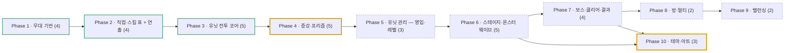

# Roadmap — 메이플 증강 디펜스 (8인 동시 진행 · 결과는 각자 · 직업 유닛 레벨 육성 · 증강 랜덤 · 구역 웨이브)

> 2026-09-09 컨셉 전환: **랜덤 디펜스 → 증강 디펜스**. 유닛 획득이 랜덤 뽑기에서 **메소 영입 + 레벨 육성**으로 바뀌고, 랜덤성은 **증강**으로 이동. 무대·트랙·카메라(Phase 1)는 그대로 유지.
> **2026-09-20 재정리**: 9-15~9-20에 로드맵 밖에서 선행한 작업(직업 표·11직업 외형·스킬 연출·유닛 전투 코어·팝업·버프·시험대)을 done 페이즈로 편입. 남은 일은 사용자 지시로 **"증강·프리즘 → 유닛 관리(영입·레벨) → 스테이지·몬스터 웨이브(라운드 진행·몬스터 RUID 매칭) → 보스 → 방 → 밸런싱 → 아트"** 순. 유닛 번호는 재부여(옛 번호는 괄호). 문서 원본은 `.info/`(gitignored): character.md(직업·스킬·프리즘) · balance-detail.md · damage.md · weapon.md · augmentation.md(증강 정의·확률) · attack.md(공격 룰) · monster-wave.md(편성).
> 이전 트랙: `maple-luck-defense-roadmap.md`(이 파일로 개명) · 그 이전: `wall-survival-roadmap.md`(superseded)
> **진행 방식(2026-09-13 사용자 지시)**: ① 로드맵·spec·plan은 코드 없이 **방향·동작 설명**으로만 쓴다(사용자는 코드를 보지 않고 전부 위임). ② **페이즈 완료 = 사용자가 만족할 때까지 수정·검증을 반복하는 루프**. ship 한 번으로 done 처리하지 않고, 피드백은 같은 페이즈 report에 Change 항목으로 누적한다. ③ 커밋·푸시는 매번 명시 승인. 상세: `.beaver/memory/workflow.md`

## Direction
최대 8인이 한 방에서 **같은 시간표로 같은 스테이지를 함께 진행**하되, 각자 자기 구역에서 자기 유닛으로 막는다. **승패 개념은 없다** — 결과는 각자 검은 마법사를 깼느냐, 중간에 죽었느냐뿐. 자기 구역의 그리드 트랙(16×13) 발판에 직업 유닛을 세우고, 경로를 따라 도는 몹 웨이브를 막는다. 유닛은 **메소로 영입해 레벨(1~50)을 올린다**(4차 직업 고정, 전직 없음, **동일 직업 중복 영입 불가 — 슬롯 6개 = 서로 다른 직업 6개**). 직업은 모험가 10 + 프리즘 증강으로 해금되는 **영웅 팬텀** = 11. 레벨이 오르면 능력치가 오르고 스킬이 해금된다(각 직업 1·10·20·30·40·50). 처리하지 못한 몹이 **누적 110마리**가 되거나 **보스를 60초 안에 못 잡으면** 내 유닛 전멸 + 비석과 함께 개인 탈락한다. 판을 가르는 랜덤 요소는 **증강**(한 판 32개: 브론즈 10·실버 10·골드 7·프리즘 5 — 라운드별 등급 지급, 3택1; 2026-09-22 20개에서 확대)이다. 속성·내성 같은 상성 체계는 **없다** — 데미지는 damage.md 8단계 수식 그대로. 판단 축은 어떤 직업 조합을 세우고 어디에 레벨을 투자하느냐 + 증강 운. 메소는 **몹을 잡을 때만** 들어오고(총 30만 예산, 시간 수입·보스 메소 없음), 다 모아도 **만렙 1기 + 40레벨대 5기** 또는 **만렙 2기 + 30레벨대 4기**가 한계가 되게 곡선을 짠다. 특수 행동(영입·레벨업·증강)은 **화면 옆 버튼 또는 유닛 클릭 → 팝업**으로 처리해 플레이 화면을 넓게 쓴다. **난이도는 의도적으로 매우 높게** 잡아, 검은 마법사 격파 자체가 도전 과제가 되도록 한다. (방향은 느슨하게 유지 — 언제든 바뀔 수 있음)

### 용어 (2026-09-09 확정)
- **스테이지** = 진행의 최소 단위 하나. 세 종류.
  - **몬스터 스테이지** — **20초**, 초당 2마리 → **40마리**
  - **보스 스테이지** — **60초**. 보스가 2체 이상일 수 있음(아이온·얄다바오트). 제한 시간 안에 못 잡으면 탈락
  - **쉬는 스테이지** — 스폰 없음([115] 거인의 심장 "쉬는타임"). 남은 메소를 다 쓰고 증강·배치를 다시 잡는 시간. 지속 시간 미정
- **계층** = 월드지역 > 지역 > 맵 > 젠 몬스터. 스테이지는 맵 단위로 붙는다.
- 한 판 = **방 전체가 같은 스테이지 순서를 시간순으로 함께 진행**. 마지막은 검은 마법사 **3연전**. 스테이지 번호·타이머는 방 전역이고, 그 안에서 막는 건 각자.
- **편성 원본**: `.info/monster-wave.md` (로컬 전용 — 커밋되는 형태는 Phase 6의 스테이지 테이블)

## 한눈에 보는 흐름

- Phase 1 — 무대 기반 · 유닛 4개 · 의존: — · 푼다: Phase 2 · 파일 집합: RtsMap, RtsConfigLogic, RtsHudLogic, RtsCameraAnchorComponent, RtsZoneLogic, RtsThemeLogic · **done**
- Phase 2 — 직업·스킬 표 + 연출 · 유닛 4개 · 의존: Phase 1 · 푼다: Phase 3 · 파일 집합: RtsJobTableLogic, RtsSkillFxLogic, RtsUnitBuffLogic, `.info/character·balance-detail·damage·weapon.md` · **done**(프리즘 스킬 정의만 사용자가 09-21 마무리 → Phase 4에서 구현)
- Phase 3 — 유닛 전투 코어 · 유닛 5개 · 의존: Phase 2 · 푼다: Phase 4 · 파일 집합: RtsUnitLogic, RtsUnitComponent, RtsUnitSelectLogic, RtsUnitPopupLogic, RtsUnitAttackComponent, RtsCombatLogic, RtsMonsterComponent, RtsTrackWalkerComponent · **done**(시험대 위에서 검증 — 실제 웨이브는 Phase 6)
- Phase 4 — 증강·프리즘 · 유닛 5개 · 의존: Phase 3 · 푼다: Phase 5 · 파일 집합: RtsAugmentTableLogic(신규), RtsAugmentLogic(신규), RtsAugmentPopupLogic(신규), RtsUnitBuffLogic(효과·증강 탭), RtsJobTableLogic(프리즘 증강 11종 → 스킬 12종), RtsSkillFxLogic(프리즘 연출), RtsHudLogic(증강 버튼) · in-progress(#16 프리즘 효과만 개발모드로 선행 구현 2026-09-22; 나머지는 자산 선별 뒤 `/beaver:direct`부터 — 규칙은 `.beaver/memory/balance.md` '증강 3택1·대상 지정 규칙')
- Phase 5 — 유닛 관리(영입·레벨) · 유닛 3개 · 의존: Phase 4 · 푼다: Phase 6 · 파일 집합: RtsRecruitLogic(신규)·영입 팝업, RtsUnitLogic(메소·영입·레벨업가), RtsUnitPopupLogic(레벨업 가격), RtsHudLogic(영입 패널·슬롯), RtsJobTableLogic(영입가) · todo
- Phase 6 — 스테이지·몬스터 웨이브 · 유닛 5개 · 의존: Phase 5 · 푼다: Phase 7, Phase 10 · 파일 집합: RtsStageTableLogic(신규 — 몬스터 RUID 매칭 포함), RtsStageLogic(신규), RtsWaveLogic(신규), RtsMonsterComponent, RtsTrackWalkerComponent, RtsAugmentLogic(라운드 트리거 연결), RtsCombatLogic(시험대 제거), RtsDemoLogic(제거), RtsHudLogic(시간 칩) · todo
- Phase 7 — 보스·클리어·결과 · 유닛 4개 · 의존: Phase 6 · 푼다: Phase 8, Phase 10 · 파일 집합: RtsBossComponent(신규), RtsBossLogic(신규), RtsRunResultLogic(신규), RtsStageLogic(보스 스테이지) · todo
- Phase 8 — 방·멀티 동기화 · 유닛 2개 · 의존: Phase 7 · 푼다: Phase 9 · 파일 집합: RtsRoomLogic(신규), RtsBootstrapLogic · todo
- Phase 9 — 밸런싱 · 유닛 2개 · 의존: Phase 8 · 푼다: — · 파일 집합: `Rts*TableLogic.mlua`(수치 튜닝), `.info/balance-detail.md` · todo
- Phase 10 — 테마·아트 · 유닛 3개 · 의존: Phase 6, Phase 7 · 푼다: — · 파일 집합: assets/, tools/gen-*.js, RtsHudLogic(프레임), RtsStageTableLogic(BGM 컬럼) · in-progress(유닛 비주얼만 done)

동시 가능: 없음 (Phase 4·5는 RtsUnitPopupLogic·RtsHudLogic을 같이 건드려 순서대로)

지금: **개발모드로 프리즘 자산 선별 중**(Phase 4 #16 효과는 구현됨 — 직업·프리즘을 개발 팝업에서 골라 보스 상대 확인, 사용자가 스킨·애니메이션을 하나씩 정하면 `GetSkillsFor` 오버레이의 fx만 교체. **통과(2026-09-22): 전사 3(인레이지·홀리 유니티·거대화)·보우마스터(애로우 레인)·신궁(트루 스나이핑)·썬콜(엘릭서+블리자드 템페스트)** / 남음: 엘릭서+템페스트·불독 초월·비숍 디바인 퍼니시먼트·나로 풍마수리검·섀도어 듀얼블레이더·팬텀) · Next up: **Phase 4 나머지(#14·#15·#17·#18)** — 자산이 모이면 `/beaver:direct 증강·프리즘`

## Scope & Actors
- **플레이어(1~8)** — 자기 구역에서 유닛 영입·배치·레벨업, 증강 선택(전부 팝업). F1~F8로 다른 유저 구역 관전. **탈락 후에는 관전을 계속하거나 방을 나가 새 판을 시작할 수 있다.** **관전(타 유저 구역 보기)은 읽기 전용(2026-09-19)**: 우측 영입 패널이 그 유저 유닛의 직업·레벨 목록으로 바뀌고, 유닛 클릭 → 상세정보 팝업(증강·버프 보기 포함)만 가능. 증강·영입·위치 이동·스킬 잠금·레벨업 등 조작은 전부 비활성(서버도 소유자 검증).
- **방장** — 방 생성·난이도 선택·시작.
- **시스템(서버)** — 방 전역: 스테이지 타이머·전환. 유저별: 웨이브 스폰·순환, 누적/탈락 판정, 메소 지급, 영입가·레벨업가 산정, 증강 결정, 보스 생성, 클리어/탈락 판정.
- **커스터마이즈 축** — 난이도(몹 HP·속도 %), 방 인원(1~8), 스킨(기본 직업 세트 / 월드 아바타 30일 1,600코인).

## Non-Goals / External Boundaries
- 자유 카메라(엣지/방향키 스크롤, 마우스 가두기) **금지** — F1~F8 시점 전환 + 플레이어 목록 클릭 스냅만.
- 길찾기 없음 — 몹은 트랙 경로 파라미터 `t`를 따라 등속 순환(S→E 후 S로 순간이동).
- **PvP·승패 없음** — 유저 간 경쟁 요소 없음. 같은 방은 서로 구경하는 관계일 뿐, 결과는 각자 클리어/탈락.
- **직업 = 모험가 10(4차) + 영웅 팬텀(프리즘 해금)** — 해적 제외. 듀얼블레이더는 별도 직업이 아니라 섀도어 프리즘 '자유전직 - 듀얼블레이더'(직업명 변경 + 스킬 교체)로만. 전직 없음. 직업군(시그너스·레지스탕스 등)은 나중에 붙일 수 있도록 영입 팝업에 탭 자리를 둔다.
- **유닛 랜덤 뽑기 없음** — 유닛은 전부 결정적 영입. 랜덤은 증강에만.
- **상성 체계 없음** — 속성도, 물리/마법 내성·약점도 두지 않는다(2026-09-14).
- 전장의 안개 없음. 모바일 최적화 1차 제외(PC 중심).

## Phases & Units

### Phase 1 — 무대 기반 (탑다운 무대·HUD·구역 트랙까지 완성) · depends: —
| # | Unit | Goal | Key decision | Depends | Status |
|---|------|------|--------------|---------|--------|
| 1 | 탑다운 맵·타일 기반 | RectTile 탑다운 + 공식 헤네시스 바닥 타일 | — | — | done |
| 2 | HUD v2 | 하단 패널 없음. 좌상단 시간·메소 칩, 좌측 플레이어 목록(n/8·생존/탈락·나 표시·클릭→그 구역), 우측 영입 버튼 + 유닛 슬롯 6, 좌하단 증강 버튼, 팝업 공통 셸. 목업: `.info/artifacts/hud-layout.html` v16 | — | 1 | done(2026-09-14 화면 v2, report `screen-v2-report.md`) |
| 3 | 구역 카메라(F1~F8) | 구역 시점 전환 전용 카메라, 자유 카메라 제거 | — | 1, 2 | done |
| 4 | 구역 시스템 | 8구역 구획·배정(서버 권위). **그리드 트랙 16×13**(칸 1.78유닛; 2026-09-20 18×12에서 우측 2열 삭제·아래 1행 추가 → 좌우 대칭), 트랙 67칸·발판 86칸, S→E 후 S로 순간이동, t=0~1. 트랙/타일 **테마 프리셋**(`RtsThemeLogic` 헤네시스·엘나스) + 장식물은 트랙 바깥 여백에만 | — | 3 | done(260914-2, 260920-14) |

**Scenes/systems**: `RtsMap` + `RtsBootstrapLogic` / `RtsHudLogic` + `RtsPopupLogic` / `RtsCameraAnchorComponent` + `RtsConfigLogic` / `RtsZoneLogic`(`GetTrackPoint(zone,t)`·`GetCellCenter`·`IsPadCell`·`CellDistance`·`AssignZone`) + `RtsThemeLogic`

> 근거: `.beaver/output/report/rts-base/{topdown-camera-rig,hud-shell,zone-camera,zone-system,screen-v2}-report.md`

### Phase 2 — 직업·스킬 표 + 스킬 연출 (모든 직업 수치·스킬·연출의 단일 소스) · depends: Phase 1
| # | Unit | Goal | Key decision | Depends | Status |
|---|------|------|--------------|---------|--------|
| 5 (옛 6) | 직업 테이블 | **11직업**(모험가 10 + 팬텀) 레벨 1~50 능력치 곡선, 레벨별 스킬(1·10·20·30·40·50: 액티브·패시브), 공격속도 5단계, 무기 데미지 난수(weapon.md), 데미지 8단계 수식(damage.md), 킷 보스 티어, 레벨업 비용 곡선(30만 예산). 원본 = character.md ↔ `RtsJobTableLogic` 동기 | 만렙 효과 → **직업별 50레벨 패시브**로 확정 | — | done(`RtsJobTableLogic.GetSkills/GetStat/CalcStat/GetLevelCost`, 밸런스 패치 260919-6~11, 260920-3) |
| 6 (옛 33) | 11직업 외형·스킨 | MSW 아바타 세트(리버스/타임리스 무기·모자·성별), 팬텀 원작 외형. 스킨 = 기본 / **월드 아바타**(월드코인 1,600·30일, 상품 `QK03ZI15E`, `ProcessPurchase`) | — | 5 | done(260915-2, 260917-1~4) |
| 7 (신규) | 스킬 연출 시스템 + 11직업 액티브 연출 | `RtsSkillFxLogic`: 아바타 모션(단발·연결·루프·순환), 원작 클립(시전·몸 덧그림·등 뒤·루프·대상 표식·빔·투사체·구체·지대·타격), 요소별 좌우 방향 플래그, 무기 숨김, 사운드. 11직업 액티브 전부 등록(레이징 블로우·디바인 차지·생츄어리·스피어 버스터·드래곤 로어·폭풍의 시·피어싱·스나이핑·체인 라이트닝·블리자드·포이즌 리전·미스트 이럽션·도트 퍼니셔·제네시스·쿼드러플 스로우·새비지 블로우·메소 익스플로전·조커 …). 빙결 = 머리 위 결정체 + 이동 50% | 연출은 사용자 확인 루프로 확정(원작 자산 우선) | 5 | done(260916-2 ~ 260920-18) |
| 8 (신규) | 파티 버프 | 샤프아이즈·프레이·조커: 날카로운 검·홀리 유니티(프리즘) = 발 아래 아이콘 + 팝업 "적용 중인 버프", 서버 전투에 `ApplyToStat` 반영. 대상 지정 = 팝업 셀렉트 박스, 변경 쿨 3분 | — | 5 | done(260916-1, 260919-11, 260920-4 상한 해제) |

**Data contract**: `RtsJobTableLogic` — `GetJobIds()`(11), `GetJobGroup`, `GetSkills(jobId)`(lv·kind·desc·fx·cd·range·targets·…), `GetStat(jobId, L)`/`CalcStat`, `GetLevelCost(L)`, `RollWeapon(jobId)`, `GetCostume(jobId)`. `RtsUnitBuffLogic` — `GetDefs`/`GetBuffsFor`/`ApplyToStat`. 프리즘 스킬 정의(character.md '종류: 프리즘' 11종 + 자유전직이 주는 액티브 2종)는 사용자가 09-22 마무리 → 구현은 Phase 4 #16.

### Phase 3 — 유닛 전투 코어 (배치된 유닛이 트랙 위 몬스터를 스스로 잡는다) · depends: Phase 2
| # | Unit | Goal | Key decision | Depends | Status |
|---|------|------|--------------|---------|--------|
| 9 (옛 14) | 유닛 엔티티·배치·이동 | 발판에 1기씩(아바타 스케일 2), 위치 이동·교환(유닛당 3분 쿨, 서버 검증), 이동 = 캐릭터 메뉴 → 발판 틀 강조 → 클릭. 구역 유닛 열거는 실제 엔티티 기준(상한 6은 영입 쪽만) | — | 4, 5 | done(260915-1, 260920-4) |
| 10 (옛 15) | 자동 공격·타겟팅 | 유닛마다 자기 공격 루프(주기 = 공격속도 또는 스킬 period), 사거리 = 체비셰프 칸, **메인 대상 = 가장 가까운 1마리, 죽거나 사거리 밖까지 고정**, 다수 타격 = 메인 곁 `aoe`칸, 전체 광역 랜덤, 지대·구체 예외, 쿨타임 스킬 우선, 후딜, 스킬 잠금 반영. 규칙 원문 = attack.md | — | 9 | done(260917-6, 260918-11, 260919-2·5, 260920-13) |
| 11 (옛 16) | 데미지 계산·표시 | 엔진 Attack/Hit 위에 `RtsUnitAttackComponent`(타격마다 크리·무기 난수 따로), damage.md 8단계, 메이플 기본 데미지 스킨(2.0), 피격 번쩍임·스킬 타격 클립·타격음 | — | 10 | done(260917-6, 260918-2, 260919-7) |
| 12 (옛 17·20) | 유닛 클릭 메뉴·상세 팝업 | 캐릭터 클릭 → 우측 작은 메뉴(위치 이동/상세정보), 우측 슬롯 클릭 → 상세정보. 팝업 = 능력치 총합·스킬 탭(획득/미획득·툴팁·**액티브 잠금 [사용/보스전 잠금/잠금]**)·증강 탭(스텁)·버프 탭·하단 레벨업 버튼(`RequestLevelUp`, `GetLevelCost` 차감). 관전 시 읽기 전용 | 레벨업 단위 = 1씩 | 9 | done(260915-1, 260916-4·5, 260919-1) |
| 13 (신규) | 몬스터 개체 + 시험대 | `RtsMonsterComponent`(HP·피격 박스·체력바 1.4/보스 2.6·빙결 FrozenUntil·죽은 몬스터 제외) + 트랙 순환 `RtsTrackWalkerComponent`(속도 100 = 3.5u/s, 빙결 ×0.5). **개발모드**(`RtsCombatLogic.TestBench`, 2026-09-22 사용자 "한 직업씩 테스트": 주니어 발록 보스 1기(무적·IsBoss) + 유닛 1기 Lv50 + 메소 100만 + 개발 팝업(직업 교체·프리즘 적용))는 개발용 — Phase 6 웨이브·Phase 7 보스가 대체하면 코드째 삭제. 이전: 무적 순회 100기 + 시연 유닛 8기 | — | 10 | done(260918-11, 260920-15·17) |

**Scenes/systems**: `RtsUnitLogic`(`SpawnUnit`·`RequestMove`·`RequestLevelUp`·`ListZoneUnits`) / `RtsUnitComponent`(FaceDir·SkillLocks·BondNo) / `RtsUnitSelectLogic` / `RtsUnitPopupLogic` / `RtsCombatLogic`(`StartLoop`·`DoAttack`·`PickTargets`·`CastFx`·`HitFx`) / `RtsUnitAttackComponent` / `RtsMonsterComponent` / `RtsTrackWalkerComponent`

### Phase 4 — 증강·프리즘 (판을 가르는 랜덤 축 — 사용자 지시로 최우선) · depends: Phase 3
> 정의는 `.info/augmentation.md`(2026-09-20 사용자 확정, 09-22 개수 확대): 한 판 **32개** = 브론즈 10 / 실버 10 / 골드 7 / 프리즘 5. 브론즈~골드 = **능력치만**(약점 찾기 = 크확, 급소 찌르기 = 크뎀, 무기 연마 = 공격력 +n, 전투 감각 = 공격력 %, 실버·골드는 보스 사냥꾼/거인 학살자) — 등급마다 I/II/III 3단계, 항목별 확률 [n/100] 기입 완료, **전부 합연산·중복 허용**. 프리즘 = 자쿰·핑크빈·시그너스·루시드·진 힐라 라운드, 후보 = 영웅 팬텀 영입 + 직업 전용 프리즘 증강 11종(썬콜 2개: 엘릭서·블리자드 템페스트 / 섀도어 '자유전직 - 듀얼블레이더' 1개가 블레이드 토네이도·카르마 퓨리 2스킬 + 직업명 변경·새비지·메익 영구 잠금), **한 번 고른 프리즘은 다시 안 나옴**. 프리즘 스킬 정의·수치·자산은 character.md '종류: 프리즘'(**사용자 09-21 마무리 — 이 페이즈 착수 조건**). 스테이지가 아직 없으므로 지급 트리거는 **개발용(증강 버튼에서 라운드 강제 지급)**으로 두고 Phase 6에서 스테이지 전환 이벤트에 연결한다.

| # | Unit | Goal | Key decision | Depends | Status |
|---|------|------|--------------|---------|--------|
| 14 (신규) | 증강 테이블 | augmentation.md → `RtsAugmentTableLogic`(등급·이름·효과·확률·프리즘 전용 직업·지급 라운드표 32개) | 라운드표(등간격·브실골 혼합) — 확정 | — | todo |
| 15 (옛 21·22) | 지급·결정(서버) | 라운드 등급 지급 → 서버가 확률대로 **후보 3개**(프리즘은 이미 고른 것 제외) → 선택 1개를 유저 보유에 추가. 지금은 개발용 트리거(시험대), Phase 6에서 스테이지 이벤트로 교체. 보스 라운드는 못 잡으면 탈락이라 분기 없음 | 후보 3개 안 중복 허용 여부 · 미보유 직업 전용 프리즘 노출 여부 | 14 | todo |
| 16 (옛 24 + 프리즘) | 효과 적용 + 프리즘 증강 11종(스킬 12종) | 능력치 4계열·보스% → `ApplyToStat` 합연산(스킬 공격력%·보스%와 합), 팬텀 영입 해금 플래그, 프리즘 스킬(인레이지·홀리 유니티 ×1.4·거대화·엘릭서·블리자드 템페스트(보스전 15타 집중·×0.9)·초월·디바인 퍼니시먼트·애로우 레인·트루 스나이핑·풍마수리검·자유전직-듀얼블레이더(블레이드 토네이도 + 카르마 퓨리, 직업명 변경, 새비지·메익 영구 잠금)) = 스킬 표 항목(영구 잠금 3) + 연출(Phase 2 장치 재사용, 자산은 사용자가 하나씩 지정) | 프리즘 스킬별 자산·연출 확정 루프 | 7, 8, 15 | **in-progress**(2026-09-22 개발모드 선행: 프리즘 12종 효과·영구 잠금·보스 15타·보스 배율 = `GetSkillsFor/GetStatFor`·`ApplyPrism` 구현, 연출 자산은 사용자 선별 대기 — 증강 능력치 합산은 미착수) |
| 17 (옛 23) | 증강 팝업 | (a) 3택1 팝업(닫기 없음, 카드마다 대상 유닛 칩 또는 대상 없이 수령) (b) 좌하단 버튼 → 보유 목록(등급 탭·상세·미지정 ! → 1회 지정·🔒). 유닛 팝업 증강 탭 채움. 관전 시 읽기 전용 | 대상 없는 증강의 적용 시점 | 15 | todo |
| 18 (신규) | 증강 밸런스 재계산 | I/II/III 값·**개수 10/10/7/5**·프리즘 5(썬콜 2개 = 나로 ×1.31 허용) 반영해 balance-detail '증강 반영' 절·augcalc 재생성, 최고점 순위 재확인 | — | 14 | todo |

**Expected scenes/systems**: `RtsAugmentTableLogic`(`GetGrade(round)`·`GetPool(grade)`·`Roll`) / `RtsAugmentLogic:Grant/Choose/GetModifiers` / `RtsAugmentPopupLogic` / `RtsUnitBuffLogic.GetAugmentsFor`(스텁 → 실제) / `RtsJobTableLogic`(프리즘 스킬 항목·`HasPrism`)

### Phase 5 — 유닛 관리(영입·레벨) (메소로 영입하고 레벨을 산다) · depends: Phase 4
| # | Unit | Goal | Key decision | Depends | Status |
|---|------|------|--------------|---------|--------|
| 19 (옛 8 일부) | 영입가·레벨업가 표 | 영입가(1기 무료 → 5단계 상승, 값 미정), 레벨업가 = `GetLevelCost`(10레벨 1,000 / 20 4,000 / 30 11,000 / 40 34,000 / 50 128,000 누적) — 30만 예산 안에서 목표 빌드 A) 50×1 + 40×5, B) 50×2 + 30×4 검산 | **영입가 5단계 값**(사용자) | — | todo |
| 20 (옛 18) | 영입 팝업 | 우측 **영입** 버튼 → 직업군 탭(모험가 / 팬텀은 프리즘 해금 시) + 계열별 직업. 메소로 영입, **동일 직업 불가**(보유 직업 비활성), 보유 상한 6, 영입 직후 발판 선택 배치(레벨 1). 시연 유닛 8기 자동 지급 제거 | 영입 직후 배치 방식(발판 선택 vs 자동) | 19, 9 | todo |
| 21 (옛 19) | 레벨 구매 마무리 + 슬롯 | 팝업 레벨업 버튼에 가격·잔액 표시, 50 상한, 메소 부족 비활성. 우측 슬롯 6 = 영입 순서, 빈 슬롯 표시. 시연 메소는 시험대에서만 | — | 19, 12 | todo |

**Expected scenes/systems**: `RtsRecruitLogic:Recruit`(가격·중복·상한·지급) + 영입 팝업(`RtsPopupLogic` 셸) / `RtsUnitLogic`(메소 차감·`SpawnUnit` 레벨 1) / `RtsHudLogic`(영입 패널·슬롯)

### Phase 6 — 스테이지·몬스터 웨이브 (라운드 진행 + 몬스터 RUID 매칭 — 시험대를 대체) · depends: Phase 5
| # | Unit | Goal | Key decision | Depends | Status |
|---|------|------|--------------|---------|--------|
| 22 (옛 7·36 일부) | 스테이지·몬스터 편성 테이블 + **몬스터 RUID 매칭** | `.info/monster-wave.md`의 **132 스테이지**(몬스터 115 + 보스 17)를 테이블화. 월드지역>지역>맵>몹 계층, 종류 3종, 몹 풀 참조형([73] 59~65 균등), 다중 보스. 몹마다 HP·드랍 메소·**자산 3개 RUID**(이동 클립·사망 클립·사망 효과음 — 공식 라이브러리에서 매칭) — 속도는 전부 동일 | 쉬는 스테이지 지속 시간 · 몹 HP 첫 값(임시) | — | todo |
| 23 (옛 9) | 스테이지 진행·타이머(**방 전역**) | 방 하나에 타이머 하나 — 전원 같은 스테이지 번호로 시간순 진행. 몬스터 20초 / 보스 60초 / 쉬는. 시간 칩에 스테이지 번호·지역명·남은 시간, 전환 이벤트 발행 → **증강 라운드 지급(#15)·BGM이 여기에 붙음** | 시작 시점(전원 준비 vs 방장 시작) · 준비시간 유무 | 22 | todo |
| 24 (옛 10·12) | 몹 스폰·트랙 순환(**구역별**) | 스테이지 시작 시 살아 있는 구역마다 초당 2마리(40) 스폰 → 이동 클립으로 등속 순환(`RtsTrackWalkerComponent` 재사용). 시연 몬스터·시험대 제거 | — | 4, 23 | todo |
| 25 (옛 11 + 경제 배분) | 처치·드랍·정리 | HP 0 → 사망 클립·사망음 → 제거, **드랍 100% 지급** — 총 30만을 지역별 분포(아케인리버 이전 20% … 리멘 20%)로 스테이지별 드랍에 배분·검산, 시체는 대상에서 제외 | 사망 클립 길이만큼 대기 | 24 | todo |
| 26 (옛 13) | 누적·탈락 판정 | 처리 못 한 몹 누적 카운트 표시, **110 도달 시** 내 구역 유닛 전멸 + 비석 + 관전 전환(F1~F8 유지) 또는 방 나가기 | 탈락 직후 선택 UI 형태 | 25 | todo |

**Expected scenes/systems**: `RtsStageTableLogic`(`GetStageCount`·`GetStage(n)`·`GetStageKind`·`GetMobPool(n)`·`GetMobHp/GetMobDrop/GetMobAssets`) / `RtsStageLogic`(방 전역 타이머·전환 이벤트) / `RtsWaveLogic` + `RtsTrackWalkerComponent` / `RtsMonsterComponent`(사망·드랍) / `RtsEliminationLogic`

### Phase 7 — 보스·클리어·결과 (한 런의 끝) · depends: Phase 6
| # | Unit | Goal | Key decision | Depends | Status |
|---|------|------|--------------|---------|--------|
| 27 (옛 25) | 보스 개체·보스 스테이지 | 60초, 보스 HP·긴 체력바(2.6), 메소 없음, **못 잡으면 탈락**. 다중 보스(아이온+얄다바오트)·연속 3연전 | 보스 패턴 범위(고HP만 vs 행동) | 22, 23 | todo |
| 28 (옛 26) | 보스 등장·타격(구역 내) | 보스 스테이지가 되면 **각 구역 중앙에 그 유저의 보스** 생성, 배치 유닛이 타격(보스전 잠금 스킬 제외), 종료 시 제거 | **보스전 사거리**(전원 vs 사거리 안) | 9, 27 | todo |
| 29 (옛 27) | 클리어·탈락 판정(유저별) | 검은 마법사 3연전 격파 = 클리어, 누적 110 또는 보스 시간 초과 = 탈락. 방은 마지막 스테이지 종료 또는 전원 탈락/퇴장까지 유지 | — | 26, 28 | todo |
| 30 (옛 28) | 결과 화면·기록 | 도달 스테이지·처치 수·클리어 여부(유저별) | 기록 저장 범위(로컬 vs DataStorage) | 29 | todo |

**Expected scenes/systems**: `RtsBossComponent` / `RtsBossLogic:Spawn/Despawn` / `RtsRunResultLogic:Judge` / `RtsResultUiLogic`

### Phase 8 — 방·멀티 동기화 (여럿이 실제로 돌린다) · depends: Phase 7
| # | Unit | Goal | Key decision | Depends | Status |
|---|------|------|--------------|---------|--------|
| 31 (옛 29) | 방 시스템 | 방 생성/입장/시작(1~8인), 세션 격리, 전원 동시 시작. 탈락자는 관전 또는 나가기 | 인스턴스 맵 구조 · 난이도는 방 단위 | 29 | todo |
| 32 (옛 30) | 멀티 동기화·권위 재점검 | 방 전역(스테이지)과 유저별 상태 분리, 서버 권위 전수 점검, 8구역 동시 웨이브·연출 키(구역×100+번호) 검증 | 동기화 범위 | 31 | todo |

### Phase 9 — 밸런싱 (수치 튜닝 패스) · depends: Phase 8
| # | Unit | Goal | Key decision | Depends | Status |
|---|------|------|--------------|---------|--------|
| 33 (옛 31) | 난이도 스케일 | 난이도 %로 몹 HP·속도 일괄 배율 | 난이도 단계 | 32 | todo |
| 34 (옛 32) | 테이블 튜닝 패스 | 몹 HP 곡선을 "예산으로 살 수 있는 전력이 20초에 40마리를 딱 잡는 수준"으로 역산, 영입가·드랍·증강 실측 튜닝 | — | 33 | todo |

### Phase 10 — 테마·아트 (보는 맛) · depends: Phase 6, Phase 7
| # | Unit | Goal | Key decision | Depends | Status |
|---|------|------|--------------|---------|--------|
| 35 (옛 33) | 유닛 비주얼 | 11직업 아바타 세트 | — | — | done(Phase 2 #6과 동일 — 여기선 기록) |
| 36 (옛 34) | HUD 테마 재조정 | 프레임 톤, 티어별 프레임 | 랭크 시스템 도입 여부 | 2 | todo |
| 37 (옛 36) | 스테이지별 BGM·보스 비주얼 | 스테이지(맵)마다 BGM 1곡 + 보스 17종 스프라이트·자산(몬스터 자산 3개 규칙 동일). 스테이지 전환 이벤트에 크로스페이드 | 크로스페이드 여부 | 22, 27 | todo |

### Dropped (기록용)
| # | Unit | 사유 |
|---|------|------|
| 옛 5 | 내성·약점 테이블 | dropped(2026-09-14 — 상성 체계 없음) |
| 옛 35 | 지역별 풍경 전환 | dropped(2026-09-14 — 맵 컨셉은 과금 요소로 나중에 `RtsThemeLogic` 프리셋 추가) |
| — | 뽑기 시스템 | dropped(2026-09-09 증강 디펜스 전환) |
| — | 조합/합성 | dropped(2026-08-07) |
| — | 밭(수익건물) 경제 | dropped(2026-09-09) |

**Progress**: 14/37 units done (3/10 phases; Phase 10은 1/3)
**Next up**: **Phase 4 증강·프리즘** — 사용자 지시(2026-09-20)로 최우선. Phase 3 완료로 의존 충족, 착수 조건(character.md 프리즘 정의)도 2026-09-22 충족. 시작: `/beaver:direct 증강·프리즘` (한 plan이 #14~#18 전부; 지급 트리거는 개발용, 스테이지 연결은 Phase 6). 그다음 Phase 5 유닛 관리 → Phase 6 스테이지·몬스터 웨이브(라운드 진행·몬스터 RUID 매칭).

## Cross-Cutting Rules
- **스테이지는 방 전역, 나머지는 유저(구역) 단위** — 스테이지 번호·타이머·전환 이벤트는 방 하나에 하나(전원 동기). 누적·메소·유닛·증강·보스·클리어/탈락은 유저별. 유저 간 경쟁 판정은 없다.
- **모든 판정은 서버** — 메소, 영입가·레벨업가, 증강 결정, 몹 스폰·누적, 탈락, 클리어, 빙결(`FrozenUntil`)은 `@ExecSpace("Server")`. 클라는 입력·표시·연출만. 시전 연출(`CastFx`)·타격 연출(`HitFx`)은 서버가 전 클라에 보낸다.
- **수치는 테이블 일원화** — 직업·스킬 = `RtsJobTableLogic`(원본 character.md), 증강 = `RtsAugmentTableLogic`(원본 augmentation.md), 스테이지·몹 = `RtsStageTableLogic`(원본 monster-wave.md), 영입가·레벨업가·드랍 = 각 표. 코드에 스탯·가격·확률·배율 하드코딩 금지. 난이도 %는 테이블 위에 곱한다.
- **문서 형제 동기** — character.md ↔ balance-detail.md ↔ damage.md ↔ weapon.md ↔ augmentation.md ↔ attack.md는 한쪽이 바뀌면 같이 갱신(`.beaver/memory/workflow.md`).
- **메소는 처치에서만** — 시간 경과·스테이지 클리어·보스로는 메소가 들어오지 않는다. 드랍은 100%.
- **구역 좌표는 `RtsZoneLogic` 경유** — 구역↔월드, 트랙 `t`, 발판, 칸 거리는 단일 소스. 구역의 유닛 열거는 `RtsUnitLogic.ListZoneUnits`(실제 엔티티, 상한 없음).
- **이동 속도는 수치(100 기준)** — 속도 100 = 초당 3.5유닛(`RtsConfigLogic.SpeedUnitPerSec`). 빙결 ×0.5. 환산은 `SpeedToUnitsPerSec` 한 곳.
- **몬스터 = 자산 3개**(이동 클립·사망 클립·사망 효과음). 피격음은 스킬 타격음.
- **공격 룰은 attack.md** — 유닛별 자율 루프, 메인 대상 고정, 다수 타격 = 메인 곁 1칸, 광역·지대·구체 예외, 타격마다 따로 판정.
- **연출은 원작 자산 + 방향 플래그** — 원작 클립은 왼쪽 보기(`assetFacesLeft`, 요소별 `*FacesLeft`, `noFlip`), 방향은 원본 PNG로 확인해 정한다. 유닛에 붙는 지속 연출은 유닛 자식으로.
- **트랙/타일은 테마 프리셋**(`RtsThemeLogic`) — 코드에 타일 이름·트랙 RUID 직접 사용 금지.
- **HUD 갱신은 `RtsHudLogic` API 경유**, **특수 행동은 전부 팝업**(`RtsPopupLogic` 셸), 팝업엔 내부 설계 수치(누적 투자·벽·예산) 노출 금지.
- **키보드는 PC 전용**, 바닥은 반드시 RectTileMap.

## Open Decisions (roadmap-level)
- [x] 탈락 임계값 — 누적 110마리(2026-09-09). **보스 60초 미처치도 탈락**(2026-09-16).
- [x] 스테이지 편성 — `.info/monster-wave.md` 132 스테이지(2026-09-13/14). 완주 약 55분, 난이도로 대부분 그 전에 탈락.
- [~] **쉬는 스테이지 지속 시간** — 미정 (Phase 6 #22 전)
- [x] 몹 풀 참조형([73] 59~65 균등), 상성 폐기, 전직 폐기(레벨 1~50), 특수 행동 = 팝업, 진행 = 전원 동기·보스는 구역 중앙, 탈락자 = 관전/나가기, 과금 = 월드 아바타 30일 1,600코인, 재배치 3분 쿨, 합성 없음.
- [x] **영입** — 동일 직업 중복 불가, 슬롯 6 = 서로 다른 직업(2026-09-19). 팬텀은 프리즘으로 해금.
- [x] **만렙 효과** — 직업별 50레벨 패시브(블스아이·인피니티 등, character.md)로 확정.
- [x] **경제 원칙** — 총 30만, 처치 시에만, 레벨업 비용 곡선 확정(2026-09-15). **영입가 5단계 값은 미정** (Phase 5 #19 전)
- [x] **증강** — 32개(10/10/7/5, 2026-09-22), 브~골 능력치 I/II/III + 확률, 프리즘 5 = 자쿰·핑크빈·시그너스·루시드·진 힐라(팬텀 영입 + 직업 전용 스킬 12종, 재출현 없음), 전부 합연산. **브~골 27개 라운드 지급표 = augmentation.md**(몬스터 스테이지 등간격 4.2칸, 브·실·골 비례 혼합 — 2026-09-22 사용자 "골고루")
- [ ] **후보 3개 규칙** — 같은 증강 중복 노출 허용 여부, 미보유 직업 전용 프리즘 노출 여부. (Phase 4 #15 전)
- [ ] **보스전 사거리** — 화면 중앙 보스를 배치 유닛 전원이 때리는지, 사거리 안 유닛만인지. (Phase 7 전)

## Notes / Risks
- **순서 변경(2026-09-20 사용자)**: "프리즘 증강 및 유닛 관리를 제일 앞으로 — 그거부터 하고 라운드 진행·몬스터 RUID 매칭". 스테이지가 없는 동안 증강 지급은 개발용 트리거(시험대)로 검증하고, Phase 6에서 스테이지 전환 이벤트에 붙인다.
- **진행 기록(2026-09-15~20)**: 로드맵 순서와 달리 직업 표·연출·유닛 전투를 시험대 위에서 먼저 완성했다(사용자 확인 루프: 레이징 블로우 4차, 도트 퍼니셔 재설계, 조커 3차 …). 시험대 코드(`RtsCombatLogic.TestBench`·`SetupTestBench`·`RtsDemoLogic` 순회·시연 유닛 8기·시연 메소)는 Phase 6에서 지운다.
- **몬스터 자산**: 초록달팽이 이동 `e7d919d7…`/사망 `a25ed762…`/사망음 `30e5a789…`. 공식 자산 검색·클립 프레임 확인 절차는 `.beaver/memory/msw-engine.md`·`assets.md` — Phase 6 #22 RUID 매칭이 이 절차를 132 스테이지 몹 전부에 돌린다.
- **엔진 실측 메모**(`.beaver/memory/msw-engine.md`): 아바타 기본 왼쪽 보기, 액션 35종·회전 없음, 클립 구간은 SpriteRUID 뒤에 설정, 자식 로컬 값 = 세계 ÷ 부모 스케일, RPC/ExecSpace 규칙 등 — 새 페이즈 plan 전에 읽는다.
- **성능**: 시험대 100기 + 8유닛 동시 연출에서 문제 없음(2026-09-20). 8구역 × 40마리 + 연출은 Phase 8 #32에서 재검증.
- **`.info/`는 gitignored** — 원본은 로컬에만. 테이블 유닛(#14·#19·#22)이 커밋되는 형태.
- 이전 트랙 문서: `pivot-luck-defense.md`, `wall-survival-roadmap.md`(superseded).
