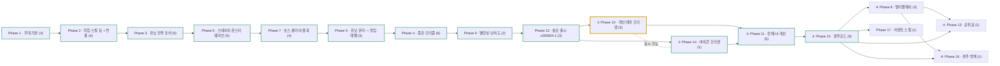

# Roadmap — 메이플 증강 디펜스 (8인 동시 진행 · 도전/경주 모드 · 직업 유닛 레벨 육성 · 증강 랜덤 · 구역 웨이브)

> 2026-09-09 컨셉 전환: **랜덤 디펜스 → 증강 디펜스**. 유닛 획득이 랜덤 뽑기에서 **영입 + 레벨 육성**으로 바뀌고, 랜덤성은 **증강**으로 이동. 무대·트랙·카메라(Phase 1)는 그대로 유지.
> 2026-09-20 재정리: 로드맵 밖에서 선행한 작업(직업 표·외형·연출·전투 코어)을 done 페이즈로 편입.
> **2026-09-24 재정리(사용자 "증강/밸런스쪽 다 끝났고, 이제 아이콘·테마·이용자 목록 UI·매칭만 손보면 된다")**: 한 판(스테이지·웨이브·보스·결과)·영입·증강·밸런스(티어 재설계·난이도 6단계)를 done 처리. 남은 일 = **매칭·방 + 순위(검은 마법사 4페이즈 클리어 횟수)** · **아이콘·테마·플레이어 목록** · **디자인 인계(ChatGPT)**. 근거 report: `.beaver/output/report/rts-stage/stage-wave-boss-report.md`, 커밋 a75a69f.
> **2026-09-24 출시 방향(사용자 "일단은 솔로 모드로 출시하고, 멀티로 업데이트")**: Phase 12 솔로 출시(월드 출시 설정 '최대 인원 1' = 접속자마다 따로 떨어진 월드 인스턴스 — 격리용 코드 불필요)를 먼저 하고, Phase 8은 **멀티 업데이트**로 뒤에 붙인다.
> **v260924-1 (2026-09-24) 솔로 출시** — 게임 버전 = `v` + YYMMDD + `-` + 그날 커밋 순번(사용자 "이제부터 버전에 날짜 + 커밋 횟수가 붙어, 이게 게임 버전"). 출시 노트의 '개발 예정 로드맵' 1~5 = Phase 8 · 13 · 10 · 14 · 11.
> **2026-09-25 순서 변경(사용자)**: ① 개인 테마 프리셋(Phase 10) + 아이콘 프리셋(Phase 14) 동시 → ② 전체 UI 개선(Phase 11) → ③ 멀티플레이(Phase 8) → ④ 순위표(Phase 13). 현재 버전 **v260926-7**.
> **2026-09-28 재정리(사용자)**: 아이콘(Phase 14)·전체 UI(Phase 11) 완료, 배속(#48)·직업별 외형(#39) 완료, 다크모드(#54)·모바일 대응(#55) 기록. **멀티플레이 전에 경주모드(Phase 15)** — 지금 판은 **도전모드**가 된다. 순위는 **난이도별 도전모드 최대 클리어 라운드 + 최대 처치 보스**로 바꾸고 경주모드는 순위 없음. 아이콘은 도전모드에서만 획득, 자쿰 테마는 계속 무료. 순서 = ③ 경주모드 → ④ 멀티플레이 → ⑤ 순위표 → ⑥ 경주 방해. 현재 버전 **v260928-4**.
> 문서 원본은 `.info/`(gitignored, 로컬 전용): character.md(직업·스킬·프리즘) · skill.md · balance-detail.md · damage.md · weapon.md · augmentation.md · attack.md · monster-wave.md · monster.md · level.md · tier.md.
> **진행 방식(2026-09-13 사용자 지시)**: ① 로드맵·spec·plan은 코드 없이 **방향·동작 설명**으로. ② **페이즈 완료 = 사용자가 만족할 때까지 수정·검증을 반복하는 루프**(사용자 확인이 있을 때만 done). ③ 커밋·푸시는 매번 명시 승인. 상세: `.beaver/memory/workflow.md`
> 이전 트랙: pivot-luck-defense · wall-survival(superseded) — 2026-09-28 저장소 정리로 삭제했다(git 이력 2817953 이전 커밋에 남음)

## Direction
최대 8인이 한 방에서 **같은 시간표로 같은 스테이지(132개)를 함께 진행**하되, 각자 자기 구역에서 자기 유닛으로 막는다. 모드는 둘(2026-09-28 사용자): **도전모드**(지금 판 — 승패 없이 결과는 각자 검은 마법사 4페이즈를 깼느냐, 중간에 죽었느냐) · **경주모드**(탈락·시간 제한 없이 라운드 몹을 다 잡아야 다음 라운드, 검은 마법사 4페이즈를 **가장 빨리** 깬 사람이 승리 — 다른 사람 방해 기능 예정). 자기 구역의 그리드 트랙(16×13) 발판에 직업 유닛을 세우고, 경로를 따라 도는 몹 웨이브를 막는다. 유닛은 **라운드마다 열리는 칸에 무료로 영입(Lv1)하고 메소로 레벨(1~50)을 올린다**(동일 직업 중복 불가, 슬롯 6). 직업은 모험가 10 + 프리즘으로 해금되는 **영웅 팬텀** = 11, **1티어(히어로·나이트로드·썬콜·보우마스터) 1기가 반드시 필요**하고 2티어·서포터(비숍·팔라딘)로 받친다. (도전모드) 처리하지 못한 몹이 **필드에 110마리**가 되거나 **보스를 60초 안에 못 잡으면** 내 유닛 전멸 + 비석과 함께 개인 탈락. 판을 가르는 랜덤은 **증강**(라운드 지급 3택1 + 메소로 사는 증강 뽑기, 프리즘은 판당 뽑기 최대 2개·천장). 메소는 **몹을 잡을 때만**(총 768,000 — 경주모드는 30초마다 자동 입금이 더해진다, 2026-09-28). 난이도는 **6단계**(극악 곡선 × 매우쉬움 20 · 쉬움 30 · 보통 40 · 어려움 60 · 매우어려움 80 · 극악 100% — 2026-09-28, 경주모드는 어려움 고정) — 극악은 검은 마법사 클리어 약 3~4%의 도전 과제. **순위 = 난이도별 도전모드 최대 클리어 라운드 + 최대 처치 보스, 경주모드는 순위 없음**(2026-09-28 사용자 — 09-24 '어려움 이상 검은 마법사 4페이즈 클리어 횟수' 기준 폐기). **v260924-1로 솔로 모드 출시**(월드 인스턴스당 1명), 이후 업데이트 순서 = **개인 테마·아이콘 프리셋 → 전체 UI 개선(완료) → 경주모드 → 멀티플레이 → 순위표 → 경주 방해**(2026-09-28 사용자 — 09-25 순서에 경주모드를 멀티 앞에 끼움). 화면 디자인은 **ChatGPT에 인계**한다(`docs/ui-screens.md`, `AGENT.md`). (방향은 느슨하게 유지 — 언제든 바뀔 수 있음)

### 용어 (2026-09-09 확정)
- **스테이지(라운드)** = 진행의 최소 단위. 몬스터 20초 · 보스 60초 · 쉬는 30초.
- **계층** = 월드지역 > 지역 > 맵 > 젠 몬스터. 스테이지는 맵 단위.
- 한 판 = **방 전체가 같은 스테이지 순서를 시간순으로 함께 진행**(도전모드 — 경주모드는 각자 다 잡으면 넘어감). 마지막은 검은 마법사 **3연전(2~4페이즈)**. 스테이지 번호·타이머는 방 전역, 막는 건 각자.
- **도전모드** = 지금 판(시간 제한·탈락 있음, 순위 기록). **경주모드** = 탈락·시간 제한 없음, 라운드 몹 전멸 시 다음 라운드, 검은 마법사 4페이즈 최단 클리어가 승리, 순위 없음(2026-09-28).

## 한눈에 보는 흐름

```mermaid
flowchart LR
  P1["Phase 1 · 무대 기반 (4)"]:::done --> P2["Phase 2 · 직업·스킬 표 + 연출 (4)"]:::done
  P2 --> P3["Phase 3 · 유닛 전투 코어 (5)"]:::done
  P3 --> P6["Phase 6 · 스테이지·몬스터 웨이브 (5)"]:::done
  P6 --> P7["Phase 7 · 보스·클리어·결과 (4)"]:::done
  P7 --> P5["Phase 5 · 유닛 관리 — 영입·레벨 (3)"]:::done
  P5 --> P4["Phase 4 · 증강·프리즘 (6)"]:::done
  P4 --> P9["Phase 9 · 밸런싱·난이도 (2)"]:::done
  P9 --> P12["Phase 12 · 솔로 출시 v260924-1 (3)"]:::done
  P12 --> P10["① Phase 10 · 개인 테마 프리셋 (3)"]:::inprogress
  P12 --> P14["① Phase 14 · 아이콘 프리셋 (1)"]:::done
  P10 -. 동시 가능 .- P14
  P10 --> P11["② Phase 11 · 전체 UI 개선 (5)"]:::done
  P14 --> P11
  P11 --> P15["③ Phase 15 · 경주모드 (6)"]:::done
  P15 --> P8["④ Phase 8 · 멀티플레이 (3)"]:::todo
  P8 --> P13["⑤ Phase 13 · 순위표 (1)"]:::todo
  P15 --> P13
  P8 --> P16["⑥ Phase 16 · 경주 방해 (1)"]:::todo
  P15 --> P16
  P15 --> P17["Phase 17 · 어센트 스킬 (1)"]:::todo
  classDef done stroke:#3fa46f,stroke-width:2px
  classDef inprogress stroke:#d9a300,stroke-width:3px
  classDef todo stroke:#8a949c,stroke-width:1px,stroke-dasharray:4 3
```

- Phase 1 — 무대 기반 · 유닛 4개 · 의존: — · 푼다: Phase 2 · 파일 집합: RtsMap, RtsConfigLogic, RtsHudLogic, RtsCameraAnchorComponent, RtsZoneLogic, RtsThemeLogic · **done**
- Phase 2 — 직업·스킬 표 + 연출 · 유닛 4개 · 의존: Phase 1 · 푼다: Phase 3 · 파일 집합: RtsJobTableLogic, RtsSkillFxLogic, RtsUnitBuffLogic · **done**
- Phase 3 — 유닛 전투 코어 · 유닛 5개 · 의존: Phase 2 · 푼다: Phase 6 · 파일 집합: RtsUnitLogic, RtsUnitComponent, RtsUnitSelectLogic, RtsUnitPopupLogic, RtsUnitAttackComponent, RtsCombatLogic, RtsMonsterComponent, RtsTrackWalkerComponent · **done**
- Phase 6 — 스테이지·몬스터 웨이브 · 유닛 5개 · 의존: Phase 3 · 푼다: Phase 7 · 파일 집합: RtsStageTableLogic, RtsStageLogic, RtsWaveLogic, RtsMonsterComponent, RtsTrackWalkerComponent · **done**(2026-09-24)
- Phase 7 — 보스·클리어·결과 · 유닛 4개 · 의존: Phase 6 · 푼다: Phase 5 · 파일 집합: RtsBossLogic, RtsRunResultLogic, RtsStageLogic, RtsPopupLogic(결과) · **done**(2026-09-24)
- Phase 5 — 유닛 관리(영입·레벨) · 유닛 3개(1 dropped) · 의존: Phase 7 · 푼다: Phase 4 · 파일 집합: RtsUnitLogic, RtsPopupLogic(영입), RtsUnitPopupLogic(레벨업) · **done**(2026-09-24)
- Phase 4 — 증강·프리즘 · 유닛 6개 · 의존: Phase 5 · 푼다: Phase 9 · 파일 집합: RtsAugmentTableLogic, RtsAugmentLogic, RtsJobTableLogic, RtsPopupLogic(3택1·도감), RtsHudLogic(뽑기) · **done**(2026-09-24)
- Phase 9 — 밸런싱·난이도 · 유닛 2개 · 의존: Phase 4 · 푼다: Phase 12 · 파일 집합: RtsDifficultyLogic, RtsJobTableLogic, RtsCombatLogic, tools/clear-sim.py · **done**(2026-09-24)
- Phase 12 — 솔로 출시 · 유닛 3개 · 의존: Phase 9 · 푼다: Phase 8, 10, 14 · 파일 집합: RtsRunResultLogic, RtsPopupLogic, RtsHudLogic, RtsStageLogic · **done**(2026-09-24, **v260924-1**)
- ① Phase 10 — 유저 개인 테마(트랙+배경) 프리셋 · 유닛 3개(2 done — 기록) · 의존: Phase 12 · 푼다: Phase 11 · 파일 집합: RtsThemeLogic(프리셋·구역별 적용), RtsZoneLogic(구역 시각화), RtsProfileLogic(선택·보유 저장), RtsPopupLogic(프로필 설정) · in-progress(#38 사용자 확인 대기)
- ① Phase 14 — 유저 아이콘 프리셋 · 유닛 1개 · 의존: Phase 12 · 푼다: Phase 11 · 파일 집합: RtsProfileLogic(컬렉션·선택·저장·처치 훅), RtsMonsterComponent(처치 훅), RtsPopupLogic(아이콘 창) · **done**(2026-09-28 사용자 확인)
- ② Phase 11 — 전체적인 UI 개선 · 유닛 5개 · 의존: Phase 10, 14 · 푼다: Phase 15 · 파일 집합: RtsHudLogic(좌측 유저 카드·HUD), RtsPopupLogic·RtsUnitPopupLogic·RtsDifficultyLogic·RtsMonsterInfoLogic(Client 메서드), UI/RtsUiLayoutLogic, `docs/ui-screens.md`, `AGENT.md` · **done**(2026-09-28 사용자 "UI 완료")
- ③ Phase 15 — 경주모드 · 유닛 6개 · 의존: Phase 12(순서상 Phase 11 뒤, 2026-09-28 사용자) · 푼다: Phase 8, 13, 16, 17 · 파일 집합: RtsStageLogic(모드·라운드 전멸 진행·자동 입금), RtsWaveLogic(라운드 전멸 판정·필드 110 해제·남은 수), RtsBossLogic(60초 해제·남은 보스), RtsRunResultLogic(탈락 없음·경주 결과·기록 교체), RtsProfileLogic(아이콘 도전모드만), RtsStageTableLogic(입금액), RtsHudLogic·RtsPopupLogic·UI/RtsUiLayoutLogic(모드 선택·결과·진행 현황·입금 글) · **done**(2026-09-28, v260928-6)
- ④ Phase 8 — 멀티플레이(대기방·매칭·방 생성/참가) · 유닛 3개 · 의존: Phase 11, 15 · 푼다: Phase 13, 16 · 파일 집합: RtsRoomLogic(신규 — 대기방·매칭·방), RtsBootstrapLogic, RtsStageLogic(방 인원·레디·모드), RtsPopupLogic(대기방 화면) · todo
- ⑤ Phase 13 — 순위표 · 유닛 1개 · 의존: Phase 8(대기방에 붙음), 15(#52 기록 기준) · 푼다: — · 파일 집합: RtsRunResultLogic(순위 조회), RtsLeaderboardLogic(신규 — 대기방 순위표), RtsPopupLogic(순위 창) · todo
- ⑥ Phase 16 — 경주 방해(이름 미정) · 유닛 1개 · 의존: Phase 8, 15 · 푼다: — · 파일 집합: 방해 로직(신규), RtsWaveLogic·RtsBossLogic(효과 적용), RtsHudLogic·RtsPopupLogic(방해 버튼·알림) · todo
- Phase 17 — 어센트 스킬(도전·경주 공통, 순서 미정) · 유닛 1개 · 의존: Phase 15(경주 자동 입금이 비용 기준) · 푼다: — · 파일 집합: 어센트 스킬 로직(신규 — 메소 비용·판당 횟수), RtsWaveLogic·RtsBossLogic(필드 몬스터 체력 깎기), RtsHudLogic·RtsPopupLogic(스킬 버튼·알림) · todo

동시 가능: 없음 — Phase 13·16·17은 모두 RtsPopupLogic·RtsHudLogic을 같이 건드려 순서대로. Phase 17은 멀티(Phase 8)가 필요 없어 Phase 15 뒤 언제든 할 수 있다(순서는 사용자 결정). Phase 10은 사용자 확인만 남아 Phase 15와 겹치지 않는다.

지금: **v260928-6** · 진행 중: Phase 10(테마 — 사용자 확인 대기) · Next up: **④ Phase 8 멀티플레이**

### 출시 노트 v260924-1 — 개발 예정 로드맵 (사용자 원문 — 진행 순서는 2026-09-25 3·4 → 5 → 1 → 2, 2026-09-28 5 뒤에 경주모드(Phase 15)를 끼우고 방해(Phase 16)를 맨 뒤에 더함)
1. 멀티플레이(매칭/방 생성 및 참가) → Phase 8
2. 순위표 (어려움/매우어려움/극악 난이도의 검은마법사 클리어 횟수) → Phase 13 (**2026-09-28 기준 교체: 난이도별 도전모드 최대 클리어 라운드 + 최대 처치 보스, 경주모드 순위 없음**) (게임 안 '순위' 버튼·결과 창 순위 줄은 2026-09-25 사용자 요청으로 제거 — 순위는 대기방에서만)
3. 유저 개인 테마(트랙+배경) 프리셋 기능 → Phase 10
4. 유저 아이콘 프리셋 기능 → Phase 14
5. 전체적인 UI 개선 → Phase 11

## 지금 할 일
멀티플레이(Phase 8)를 네 단계로 만든다(규칙은 #31·#59 '정함', `.info/lobby.md`).
- [ ] ① 로비(새 정적 맵) · 방 목록/만들기/대기실(준비·시작·강퇴·채팅) · 혼자 하기 — RtsMap을 인스턴스 맵으로
- [ ] ② 빠른 참가(빈자리 있는 공개 방에 바로 — 2026-09-29 매칭 삭제 대신) · 방 채팅이 게임 중에도 이어짐 · 방 게임 다시하기 없음
- [ ] ③ 경주 유저별 라운드(#32 — 여럿이 각자 속도로)
- [ ] ④ 채널 넘나들기(#59 — 다른 인스턴스 목록·이동, 출시 뒤 실측) → 단계마다 확인, ok → 커밋

## Scope & Actors
- **플레이어(1~8)** — 자기 구역에서 영입·배치·레벨업, 증강 선택·뽑기(전부 팝업). F1~F8·플레이어 목록 클릭으로 다른 구역 관전. **관전(타 구역 보기)은 읽기 전용** — 상세보기만, 조작은 전부 비활성(서버도 소유자 검증). 탈락 후엔 관전을 계속하거나 방을 나간다.
- **방(지금은 정적 방 1개)** — 입장 → 난이도 선택(각자) · 모드 선택(도전/경주 — Phase 15, 방 하나 = 모드 하나) → 카운트다운 15초('바로 시작'으로 앞당김) → 진행 → 결과. 다시 하기 = 찬반 투표(과반·20초). 매칭·방 만들기는 Phase 8.
- **시스템(서버)** — 방 전역: 스테이지 타이머·전환. 유저별: 웨이브 스폰·순환, 누적/탈락, 메소, 증강 지급·뽑기, 보스, 클리어/탈락, 기록.
- **커스터마이즈 축** — 난이도(6단계, 유저별), 모드(도전/경주, 방 단위), 방 인원(1~8), 배속(1·2배), 테마(무료 프리셋 — 자쿰 액션 포함)·비석·아이콘(도전모드 처치 컬렉션), 화면 라이트/다크. 직업 외형은 11직업 전용 원화(월드 아바타 스킨 삭제).

## Non-Goals / External Boundaries
- 자유 카메라(엣지/방향키 스크롤) **금지** — F1~F8 + 플레이어 목록 클릭 스냅만.
- 길찾기 없음 — 몹은 트랙 파라미터 `t`를 따라 등속 순환.
- **PvP 전투 없음** — 경쟁은 경주모드 승리(+방해, Phase 16)와 도전모드 순위표.
- **직업 = 모험가 10(4차) + 영웅 팬텀(프리즘 해금)** — 해적 제외, 듀얼블레이더는 섀도어 프리즘으로만, 전직 없음.
- **유닛 랜덤 뽑기 없음**, **상성 체계 없음**, 전장의 안개 없음. 모바일은 가로 화면·태블릿·폴더블 대응까지 완료(#55).
- **화면 디자인(색·배치·아트 톤)은 ChatGPT가 이어받는다**(Phase 11) — 게임 규칙·서버 로직은 이 트랙에서.

## Phases & Units

### Phase 1 — 무대 기반 · depends: — · **done**
| # | Unit | Goal | Key decision | Depends | Status |
|---|------|------|--------------|---------|--------|
| 1 | 탑다운 맵·타일 기반 | RectTile 탑다운 + 공식 헤네시스 바닥 타일 | — | — | done |
| 2 | HUD v2 | 좌상단 정보 카드, 좌측 플레이어 목록, 우측 유닛 슬롯 6, 좌하단 증강 버튼, 팝업 공통 셸 | — | 1 | done |
| 3 | 구역 카메라(F1~F8) | 구역 시점 전환 전용 카메라 | — | 1, 2 | done |
| 4 | 구역 시스템 | 8구역·그리드 트랙 16×13·발판 86칸·테마 프리셋(`RtsThemeLogic`) | — | 3 | done |

> 근거: `.beaver/output/report/rts-base/*-report.md`

### Phase 2 — 직업·스킬 표 + 스킬 연출 · depends: Phase 1 · **done**
| # | Unit | Goal | Key decision | Depends | Status |
|---|------|------|--------------|---------|--------|
| 5 | 직업 테이블 | 11직업 레벨 1~50 능력치·스킬·공격속도·무기 난수·데미지 8단계·레벨업 비용 | — | — | done |
| 6 | 11직업 외형·스킨 | MSW 아바타 세트, 스킨 = 기본 / 월드 아바타(상품 `QK03ZI15E`) | — | 5 | done |
| 7 | 스킬 연출 시스템 + 11직업 액티브 연출 | `RtsSkillFxLogic` — 모션·원작 클립·방향 플래그·사운드 | — | 5 | done |
| 8 | 파티 버프 | 샤프아이즈·프레이·조커 등 발 아래 아이콘 + 팝업 버프 탭 | — | 5 | done |

### Phase 3 — 유닛 전투 코어 · depends: Phase 2 · **done**
| # | Unit | Goal | Key decision | Depends | Status |
|---|------|------|--------------|---------|--------|
| 9 | 유닛 엔티티·배치·이동 | 발판 1기씩, 위치 이동(3분 쿨, 서버 검증) | — | 4, 5 | done |
| 10 | 자동 공격·타겟팅 | 유닛별 루프, 체비셰프 사거리, 메인 대상 고정, 광역·지대 예외 | — | 9 | done |
| 11 | 데미지 계산·표시 | 엔진 Attack/Hit + `RtsUnitAttackComponent`, 기본 데미지 스킨 | — | 10 | done |
| 12 | 유닛 클릭 메뉴·상세 팝업 | 캐릭터 메뉴·상세 팝업(스킬·증강·버프 탭, 스킬 잠금, 레벨업) | — | 9 | done |
| 13 | 몬스터 개체 + 시험대 | `RtsMonsterComponent`·트랙 순환·빙결, 개발모드(테스트 모드) | — | 10 | done |

### Phase 6 — 스테이지·몬스터 웨이브 · depends: Phase 3 · **done**(2026-09-24, report `rts-stage/stage-wave-boss-report.md`)
| # | Unit | Goal | Key decision | Depends | Status |
|---|------|------|--------------|---------|--------|
| 22 | 스테이지·몬스터 편성 테이블 + RUID 매칭 | 132 스테이지 `RtsStageTableLogic`(`tools/gen-stage-table.py` 생성) | — | — | done |
| 23 | 스테이지 진행·타이머(방 전역) | 카운트다운 15초 + '바로 시작', 몬스터 20 / 보스 60 / 쉬는 30초, 스테이지별 BGM | — | 22 | done |
| 24 | 몹 스폰·트랙 순환(구역별) | 구역마다 초당 2마리, 체력 × 난이도 | — | 4, 23 | done |
| 25 | 처치·드랍·정리 | 사망 클립·사망음, 드랍 100%(총 768,000) | — | 24 | done |
| 26 | 누적·탈락 판정 | 필드 110 → 전멸 + 비석 + 관전/나가기 | — | 25 | done |

### Phase 7 — 보스·클리어·결과 · depends: Phase 6 · **done**(2026-09-24)
| # | Unit | Goal | Key decision | Depends | Status |
|---|------|------|--------------|---------|--------|
| 27 | 보스 개체·보스 스테이지 | 60초, 보스 영역(4×5 고정·배치 불가), 다중 보스·검은 마법사 3연전 | — | 22, 23 | done |
| 28 | 보스 등장·타격 | 일반 몹 보관·복귀, 등장 전 초읽기, 보스전 사거리 16 | — | 9, 27 | done |
| 29 | 클리어·탈락 판정(유저별) | 검은 마법사 4페이즈 격파 = 클리어 | — | 26, 28 | done |
| 30 | 결과 화면·기록 | 결과 팝업(도달 라운드·처치·보스 HP%) + 나가기·다시 하기(찬반 투표). 기록은 난이도별 저장(테스트 모드 제외) — **순위 기준은 Phase 8 #44로 교체** | — | 29 | done |

### Phase 5 — 유닛 관리(영입·레벨) · depends: Phase 7 · **done**(2026-09-24)
| # | Unit | Goal | Key decision | Depends | Status |
|---|------|------|--------------|---------|--------|
| 19 | 영입가·레벨업가 표 | 영입가 5단계 | — | — | dropped(2026-09-23 — 영입은 무료 Lv1, 칸이 라운드 1·5·자쿰·혼테일·핑크빈·시그너스에서 열림) |
| 20 | 영입 팝업 | 직업군 탭·동일 직업 불가·상한 6, 직업 선택 → 빈 발판 클릭 배치(ESC 취소), 진행 중에만 영입 | — | 9 | done |
| 21 | 레벨 구매 + 슬롯 | 레벨업 가격·50 상한·메소 부족 비활성, 우측 슬롯 6 + 영입 버튼(가능할 때만) | — | 12 | done |

### Phase 4 — 증강·프리즘 · depends: Phase 5 · **done**(2026-09-24)
| # | Unit | Goal | Key decision | Depends | Status |
|---|------|------|--------------|---------|--------|
| 14 | 증강 테이블 | `RtsAugmentTableLogic` 브·실·골·프리즘 | — | — | done |
| 15 | 지급·결정(서버) | 라운드 지급 3택1, 대상 지정 | — | 14 | done |
| 16 | 효과 적용 + 프리즘 11종 | 합연산 적용 + 프리즘 스킬·연출, 티어 배율(1티어 프리즘 시 ×1→×3, 2티어 약점 ×2, 팬텀 ×1.75) | — | 7, 8, 15 | done |
| 17 | 증강 팝업 | 3택1·보유 목록·증강 도감(등급 탭·프리즘 직업 칩·펼치기) | — | 15 | done |
| 18 | 증강 밸런스 재계산 | 티어 재설계로 대체(`tools/balance-calc.py`·`.info/tier.md`) | — | 14 | done |
| 43 | 증강 구매 | 뽑기 3,000 + 40/회, 브 75.5·실 15·골 4.5·프리즘 5% + 천장 +2%p, 판당 프리즘 최대 2 | — | 15, 17 | done |

### Phase 9 — 밸런싱·난이도 · depends: Phase 4 · **done**(2026-09-24)
| # | Unit | Goal | Key decision | Depends | Status |
|---|------|------|--------------|---------|--------|
| 33 | 난이도 스케일 | 6단계(0.2·0.4·0.6·0.7·0.8·1.0 × 극악 곡선), 유저별 선택, 대기·카운트다운 난이도 막대 | — | — | done |
| 34 | 테이블 튜닝 패스 | 티어 재설계 + 보스 체력 재보정, 한 판 시뮬레이터(`tools/clear-sim.py`)로 극악 클리어 약 3.5% | — | 33 | done |

### Phase 12 — 솔로 출시 (혼자 하는 버전으로 먼저 공개) · depends: Phase 9 · **done**(2026-09-24, v260924-1 — 사용자 "이대로 출시")
> 격리는 출시 설정으로: Maker 월드 출시의 **최대 인원 = 1**(월드 인스턴스당 인원, 1~100) → 접속자마다 따로 떨어진 월드 인스턴스가 생긴다. 순위 저장소(DataStorage)는 인스턴스가 달라도 월드 전체가 공유.

| # | Unit | Goal | Key decision | Depends | Status |
|---|------|------|--------------|---------|--------|
| 44 (신규, 2026-09-24) | 순위 기준 교체 | **어려움·매우어려움·극악 난이도별 탭 3개, 각 탭 = 그 난이도에서 검은 마법사 4페이즈를 깬 횟수 순**(옛 최종 메소·최대 라운드 기준 폐기). 클리어마다 서버가 횟수 +1(테스트 모드·보통 이하 제외), 결과 창에 순위·횟수, 왼쪽 아래 '순위' 창 — **2026-09-25 게임 안 표시는 제거**(사용자 "지금 저기서 보일 게 아니야"), 기록 저장만 유지 | 동점 = 그 횟수에 먼저 도달한 사람이 위 | 30 | done(2026-09-24 a9dcef9) — 기준은 2026-09-28 다시 교체 → Phase 15 #52 |
| 46 (신규, 2026-09-24) | 솔로 전용 정리 | 방에 혼자면 결과 창 [닫기][다시 하기]·우측 '다시 하기'·위쪽 다시 하기 확인 없이 즉시·표 수 숨김(관전·F1~F8·목록은 그대로) | — | 44 | done(2026-09-24 a9dcef9) |
| 47 (신규, 2026-09-24) | 출시 점검 | Maker 빌드·Play, 테스트 모드 꺼짐, 월드 아바타 영구 이용권 전환(b396149), 출시 설정 최대 인원 1 — 월드 업로드·공개는 사용자가 Maker에서 | — | 44, 46 | done(2026-09-24 사용자 "이대로 출시" — v260924-1) |

### ① Phase 10 — 유저 개인 테마(트랙+배경) 프리셋 · depends: Phase 12 · 출시 노트 3 · Phase 14와 동시
| # | Unit | Goal | Key decision | Depends | Status |
|---|------|------|--------------|---------|--------|
| 35 | 유닛 비주얼 | 11직업 아바타 세트 | — | — | done(Phase 2 #6 — 기록) |
| 37 | 스테이지별 BGM·보스 비주얼 | 라운드별 BGM(`RtsStageLogic.RefreshBgm`) + 보스 17종 그림 | — | 22, 27 | done(2026-09-23 — 기록) |
| 38 | 개인 테마 프리셋 | 유저마다 자기 구역의 **트랙 + 배경** 테마를 고른다 — 헤네시스 외 시간의 신전·소멸의 여로·레헬른 등 프리셋(트랙·타일·장식), 선택은 계정 저장 | 유료 여부·가격 · 테마 목록 · 적용 범위(내 구역만) | — | in-progress(2026-09-25 plan `rts-custom/theme-icon-preset-plan.md` — 헤네시스·엘리니아·페리온·커닝시티·리스항구 5종 무료, 뼈대 + 임시 모양, 디자인은 ChatGPT) · build 완료 — report `rts-custom/theme-icon-preset-report.md` · 자쿰 액션 테마 추가(d54d180), **테마는 전부 과금 없이 계속 무료**(2026-09-28 사용자) · 완료는 사용자 확인 때 |

### ① Phase 14 — 유저 아이콘 프리셋 · depends: Phase 12 · 출시 노트 4 · **done**(2026-09-28 사용자 확인)
| # | Unit | Goal | Key decision | Depends | Status |
|---|------|------|--------------|---------|--------|
| 40 | 아이콘 프리셋·컬렉션 | 유저 아이콘 = 몬스터 얼굴, 기본 초록달팽이. 처치 시 **일반 1% · 보스 5%** 획득(중복 무효) → 계정 DataStorage 컬렉션, 컬렉션 화면(격자·미획득 실루엣)에서 골라 내 아이콘으로 | 획득 판정 주체(막타 vs 구역 주인) · 아이콘 자산(몬스터 1프레임 vs 얼굴 자산) | 22, 27 | done(2026-09-28 사용자 "아이콘 완료" — 획득 = 매우어려움 1% · 극악 2%(처치 시, 보스 포함, 구역 주인), 획득 일시 저장, 2dc2cbe · report `rts-custom/theme-icon-preset-report.md`). 도전모드 한정 획득은 Phase 15 #52 |

### ② Phase 11 — 전체적인 UI 개선 · depends: Phase 10, 14 · 출시 노트 5 · **done**(2026-09-28 사용자 "UI 완료")
| # | Unit | Goal | Key decision | Depends | Status |
|---|------|------|--------------|---------|--------|
| 45 (신규, 2026-09-24) | 화면 UI 요소 명세 | 모든 화면 요소와 디자인 작업 규칙을 `docs/ui-screens.md`로 — ChatGPT가 이것만 보고 이어받게 | — | — | done(2026-09-24 bcd3498, 이후 UI 바뀔 때마다 갱신) |
| 41 | 좌측 플레이어 목록 카드 | 카드 = 원형 아이콘(#40) + 테마 이름(#38) + 닉네임 + **내 카드에만 수정 버튼**(아이콘·테마 선택 팝업), 카드 배경 = 그 유저 테마, 8명 세로 배치·관전 클릭 유지(스케치 `.info/artifacts/player-slot-sketch-260922.png`) | 카드 크기 · 테마 카드용 썸네일 | 38, 40 | done(2026-09-28 사용자 "UI 완료" — 배경 = 테마 썸네일, 내 카드 초록 테두리 + [수정], 백색 물결 UI d54d180 · report `rts-custom/theme-icon-preset-report.md`·`rts-ui/ui-renewal-report.md`) |
| 36 | 화면 디자인 패스 | 프레임 톤·색 토큰·아이콘 아트·레이아웃 다듬기(ChatGPT 담당 가능, `AGENT.md`·`docs/ui-screens.md` 규칙 준수) | 사용자 최종 시각 확인 | 45 | done(2026-09-26 사용자 확인·커밋 승인 — 증강 개별 목록·수령, HUD·몬스터 상태창까지 반영, da49e06) |
| 54 (신규, 기록) | 다크모드 | 기본 라이트 + 우측 하단 라이트·다크 스위치, 계정별 저장(`RtsProfileLogic` uiMode)·입장 때 복원, 공용 `SetUiColor`로 제자리 갱신 | — | 36 | done(2026-09-27 fddf928 — 2026-09-28 사용자 "추가만 해둬") |
| 55 (신규, 기록) | 모바일 대응 | 가로 화면 여백·버튼 크기·팝업 배율·터치 판정(fddf928), 반응형(487f3a1), 태블릿·폴더블 겹침 수정 — 좁은 화면 배율·버튼·패널을 휴대폰 몫으로(52ba2c0) | — | 36 | done(2026-09-28 사용자 "모바일 최적화 되었음") |

### ③ Phase 15 — 경주모드 · depends: Phase 12(순서상 Phase 11 뒤) · 멀티플레이 전에(2026-09-28 사용자)
> 지금 판 = **도전모드**(규칙 그대로). 경주모드는 같은 132 스테이지·난이도·영입·증강을 쓰되 **시계 대신 처치로 넘어간다**. 솔로(방 1명)에서 먼저 되게 하고, 여럿이 겨루는 판은 Phase 8 방·매칭에서 연다. 라운드 진행은 **지금 방 단위**(솔로 = 내 진행) — 여럿이 각자 속도로 달리는 유저별 라운드는 Phase 8 #32(2026-09-28 사용자 권장안 선택). 규칙 원본 = `.info/mode.md`(2026-09-28 memo.md에서 옮김).

| # | Unit | Goal | Key decision | Depends | Status |
|---|------|------|--------------|---------|--------|
| 49 | 모드 선택 | 판 시작 전에 **도전 / 경주** 선택. 방 하나 = 모드 하나 | 정함: 난이도 막대 둘째 줄 [도전 · 경주], 기본 도전·다음 판 유지, 대기·카운트다운·끝남에서만(`RtsStageLogic.RequestSetMode`). 여럿이면 지금은 마지막으로 누른 사람 — 방장은 Phase 8 | 33 | done(v260928-6) |
| 50 | 경주 진행 규칙 | **탈락 없음**(필드 110·보스 60초 제한 해제) · **시간 제한 없음** — 그 라운드 몹을 다 잡아야 다음 라운드 몹이 나온다(1라운드 전멸 → 2라운드 리젠 → …), 보스도 잡아야 넘어감. 라운드 진행은 방 단위(유저별은 Phase 8 #32) | 정함: 40마리 그대로 · 보스 준비 5초·128 쉬는 30초 유지 · 일시정지·2배속 허용 · 좌상단 시계 = 어느 라운드든 흐른 시간만 · 모드 칸에 설명 두 줄 · **난이도 어려움 고정**(다른 칸 잠김 — "루즈하지 않게"). (같은 날 '20초마다 다음 라운드'안은 되돌림) | 49, 23, 27 | done(v260928-6) |
| 51 | 경주 결과 | 검은 마법사 4페이즈 처치까지 걸린 시간 + **등수**(방에서 잡은 순서, 솔로는 1등 — 2026-09-28 사용자 "경주모드는 등수도 보이도록")를 결과 창에. 경주 판은 기록·순위 없음 | 정함: 시간 = 게임 시계(일시정지 빠짐) | 50, 30 | done(v260928-6) |
| 52 | 도전모드 전용 기록·획득 | 순위 기록을 **난이도별 도전모드 최대 클리어 라운드 + 최대 처치 보스**로 교체(#44 클리어 횟수 기준 폐기). **아이콘 획득도 도전모드 판만**(경주 판은 처치해도 획득 없음, 2026-09-28 사용자) | 정함: 6단계 전부 · 라운드 높은 순, 같으면 먼저 도달 · 최대 처치 보스 = 그 라운드까지 잡은 마지막 보스 · 저장소 `RtsBestRound_D1~6`, 옛 `RtsBm4Clear` 안 씀 | 44, 40, 49 | done(v260928-6) |
| 56 (신규) | 진행 현황 줄 | **두 모드 모두** 방 안 모든 사람의 라운드 + 남은 몬스터 수를 보인다(2026-09-28 사용자) | 정함: A안 항상 보임 — 좌측 유저 목록 버튼 아래 사람마다 한 줄 "nR · 남은 n"(필드 + 아직 안 나온 수)·"보스 · 남은 n"·대기·탈락·완주 n등/클리어, 경주 = 앞선 순, 도전 = 구역 순 | 49, 50 | done(v260928-6) |
| 57 (신규) | 경주 자동 입금 | 경주모드에서 주기적으로 **유의미한** 메소를 받는다 — 나중에 어센트 스킬(Phase 17)·방해(Phase 16) 비용으로 쓴다(2026-09-28 사용자) | 정함: M1 자동 입금 · 게임 시계 30초마다 · **라운드 메소의 25%**(300 → 1,000 → 2,100, 스페셜 라운드는 그만큼 큼) · 메소 줄 오른쪽 "수금 m:ss"/"+n 입금". 경주 유닛 이동 쿨 10초안은 취소 | 50 | done(v260928-6) |

### ④ Phase 8 — 멀티플레이(대기방·매칭·방 생성/참가) · depends: Phase 11, 15 · 출시 노트 1
| # | Unit | Goal | Key decision | Depends | Status |
|---|------|------|--------------|---------|--------|
| 31 | 대기방·매칭·방 | **대기방 → 솔로 / 매칭 / 방 만들기 / 방 목록**(2026-09-24 사용자). 2026-09-25 메모: 방은 인스턴스 룸(RoomService — 월드 최대 인원만 올리면 빈자리에 남이 낀다), 매칭·방 판은 `RtsStageLogic.SoloMode = false`(일시정지 = 솔로 모드 전용): ① 솔로 = 바로 시작 ② 방 만들기 = 방 제목 + 비밀번호(선택 — 넣으면 비공개 방) → 만든 뒤 대기자 확인 → **모두 레디하면 방장이 시작** ③ 방 목록 = 목록에서 골라 입장, 비공개 방은 비밀번호 입력, **방 제목 검색** ④ 매칭 = 랜덤 유저끼리 묶어 바로 시작. 게임은 인스턴스 방(1~8인)에서, 결과 창 '나가기' = 대기방으로. 출시 설정 최대 인원을 다시 늘린다. 방 만들기·매칭에서 **모드(도전/경주 — Phase 15)**·배속(#48)을 고른다(2026-09-28) | **정함(2026-09-28 사용자 — 카트라이더 매칭 느낌)**: 로비 = 새 정적 맵, 게임 = 방마다 인스턴스 룸(RtsMap을 인스턴스 맵으로) · 빠른 매칭 = **경주모드만**, 최대 4명 랜덤, **30초** 안에 4명이 안 되면 2~3명으로 시작, 같은 인스턴스 먼저 → 부족하면 전체 인스턴스(#59) · 방 = **최대 4명**, 목록 [새로고침], 게임 중엔 못 들어감(끝나면 가능), 방 만들기 → 대기실 → 시작 · 대기실 = **준비·시작(전원 준비해야 방장 시작)·강퇴(방장)·채팅** · 방장이 나가면 다음 사람이 이어받음 · 게임 끝 = 결과 창 [닫기] → 방 대기실(매칭 판은 같이 한 사람들로 자동 방) · 도중 나가기 = 방에서도 빠져 로비로 · 배속 = 게임 안 스위치 그대로(전원 2배속이면 2배) · 화면 = 지금 HUD·팝업 스타일로 먼저 | — | todo |
| 59 (신규) | 채널(인스턴스) 넘나들기 | 다른 월드 인스턴스 목록(인원)을 채널처럼 보여 주고 옮겨 가기 + **빠른 매칭이 같은 인스턴스에 사람이 부족하면 전체 인스턴스 대기자까지 묶기**(2026-09-28 사용자). 인스턴스 사이 공유 대기열(WorldInstanceSharedMemory) → 게임 장소 인스턴스로 워프(TeleportService — warpData로 매칭 id 전달) | 정함: 같은 인스턴스 먼저 → 부족하면 전체. 제약: 워프·인스턴스 목록은 **공개 출시 월드에서만**(Maker 시험 불가 — 출시 뒤 실측), 공유 메모리·인스턴스 간 이벤트 월드 전체 분당 1,000회, 대상 인스턴스가 가득·은퇴 중이면 실패 → 대기열로 되돌림. 인스턴스 최대 인원 = 출시 설정(1~100, 사용자) | 31 | todo |
| 32 | 멀티 동기화·권위 재점검 | 8구역 동시 웨이브·연출 부하, 방 전역/유저별 상태 분리, 서버 권위 전수 점검, 9번째 입장 처리, 여럿일 때 투표·관전 흐름. **경주모드 유저별 라운드**(각자 자기 속도 — 지금 `RtsStageLogic.StageNo` 방 하나를 7파일 24곳이 읽음, 2026-09-28 Phase 15에서 넘겨받음) | — | 31, 50 | todo |

### ⑤ Phase 13 — 순위표 · depends: Phase 8, 15 · 출시 노트 2
| # | Unit | Goal | Key decision | Depends | Status |
|---|------|------|--------------|---------|--------|
| 42 | 순위표(대기방) | 대기방에 **난이도별 도전모드 순위표**(2026-09-28 사용자 — 기준 = 최대 클리어 라운드 + 최대 처치 보스, #52 기록). **경주모드는 순위 없음**. Top 10(스크롤 100위), 내 순위 하단 고정, 칸 = 아이콘(#40)·닉네임·최대 클리어 라운드·최대 처치 보스. 게임 안 순위 표시는 2026-09-25 제거 — 순위 창 코드(RtsPopupLogic.BuildRank)를 대기방에서 다시 씀 | 시즌(무한 vs 월간 리셋) | 52, 31 | todo |

### ⑥ Phase 16 — 경주 방해 · depends: Phase 8, 15 · 2026-09-28 사용자 "경주모드일 때 다른 사람을 방해하는 기능도 추가 예정"
| # | Unit | Goal | Key decision | Depends | Status |
|---|------|------|--------------|---------|--------|
| 53 | 방해 기능 | **경주모드 한정**. 같은 방 사람에게 방해 카드 사용 — 회복지대 · 자석 · 가속 · 포탈 · 트레이드 · 마취약 · 빙판 7종(규칙 원본 `.info/item.md` '방해' 절, 2026-09-29 확정) | 정함: 한 판 유저당 10장(몬스터 라운드 10곳 등간격 무작위 지급 · 판 끝나면 소멸) · 대상 = 진행 현황 줄 유저 → 그 구역 보기에서 칸·유닛 클릭 · 방 채팅 알림 · 트레이드는 증강째 · 가속 +200% 30초 · 회복지대 15초 · 빙판 60초. 남은 것: 지급 라운드 확정 · 포탈 지속 · 카드 UI 자리 · 연출. 순서 = 회복지대·가속·자석·빙판 → 마취약 → 포탈 → 트레이드 | 50, 57, 31 | todo(규칙 확정) |

### Phase 17 — 어센트 스킬 · depends: Phase 15 · 2026-09-28 사용자 "어센트 스킬 = 몬스터 체력을 전체 깎는 스킬, 도전모드에도 추가"
> 순서 미정 — 멀티가 필요 없어 경주모드(Phase 15) 뒤 언제든. 방해(Phase 16)와 별개.

| # | Unit | Goal | Key decision | Depends | Status |
|---|------|------|--------------|---------|--------|
| 58 (신규) | 어센트 스킬 | 메소를 내고 쓰면 **내 필드 몬스터 체력을 전체 깎는** 스킬. **도전모드·경주모드 둘 다**. 경주는 판당 3회까지(2026-09-28 사용자 — 처음 '메소로 남 방해·내 라인 정리, 판당 3회'에서 방해는 Phase 16으로 분리) | 깎는 양(% vs 고정 · 보스 포함?) · 비용(경주 = 자동 입금 몇 회분, 도전 = 처치 메소만이라 따로) · 판당 횟수(도전도 3회?) · 쿨타임 · 버튼 자리 · 연출 | 57, 50 | todo |

### 후순위 (출시 노트 밖)
| # | Unit | Goal | Status |
|---|------|------|--------|
| 39 | 직업별 아바타 프리셋 | 직업마다 원하는 아바타(코디 + 직업 무기)를 프리셋으로 저장·선택 — 월드 아바타 **영구 이용권 전환은 2026-09-24 완료**(b396149, 상점 상품은 아이템 유지) | done(2026-09-28 사용자 "이미 완료" — 11직업 전용 원화·대기/공격 모션·흉상으로 대체 fddf928, 월드 아바타 스킨·이용권 삭제 09-25, 아바타 대체 외형 코드 삭제 52ba2c0) |
| 48 (신규, 2026-09-24) | 배속 모드(2배) | **모든 속도 2배**, **방 단위**(방 만들기에서 선택, **매칭도 배속을 골라서** 같은 배속끼리 — 사용자 "진짜 나중에"). 구현 메모: 서버 판정 시각(`ServerElapsedSeconds` ~30곳)을 배속으로 흐르는 게임 시계 하나로 모으고, 타이머 지연(~80곳, 대부분 스킬 연출)은 배속으로 나누며, 클라는 `_UtilLogic:SetClientTimeScale(2)`(클라 전용 — 애니·연출, 타이머에도 먹는지는 Maker 실측 필요). 정할 것: 순위 합산/분리 · 배속 단계(2배만?) | done(2026-09-27 ad640f0 v260927-3 — 우측 하단 1·2배속 스위치, 게임 시계에 배속 반영, 여럿이면 전원이 고를 때 적용 · 2026-09-28 사용자 완료 처리). 방 만들기·매칭에서 고르기는 Phase 8 #31 |

### Dropped (기록용)
| # | Unit | 사유 |
|---|------|------|
| 19 | 영입가·레벨업가 표 | dropped(2026-09-23 — 영입 무료, 라운드로 칸 개방) |
| 옛 5 | 내성·약점 테이블 | dropped(2026-09-14 — 상성 체계 없음) |
| 옛 35 | 지역별 풍경 전환 | dropped(2026-09-14 — 테마 프리셋으로) |
| — | 뽑기 시스템 · 조합/합성 · 밭 경제 | dropped(2026-08~09) |

**Progress**: 51/58 units done (12/17 phases) — 현재 버전 **v260928-6**(솔로 출시 v260924-1 뒤 패치)
**Next up**: **④ Phase 8 멀티플레이** — 경주모드(Phase 15) 완료(v260928-6). 사용자 순서 ③ 경주모드 → ④ 멀티 → ⑤ 순위표 → ⑥ 경주 방해. 순위표(Phase 13)는 대기방에, 방해(Phase 16)는 여럿이 있어야 해서 멀티가 먼저. 시작 전 정할 것은 `## 지금 할 일`. 대안: Phase 17 어센트 스킬(멀티 없이 바로 가능 — 순서는 사용자 결정). Phase 10(테마)은 사용자 확인만 남음.

## Cross-Cutting Rules
- **도전모드: 스테이지는 방 전역, 나머지는 유저(구역) 단위** — 스테이지 번호·타이머·전환은 방에 하나. 누적·메소·유닛·증강·보스·난이도·클리어/탈락은 유저별. **경주모드: 라운드 진행도 유저별**(각자 라운드 몹을 다 잡으면 자기 다음 라운드 — Phase 15에서는 방 단위로 먼저, 유저별은 Phase 8 #32).
- **모든 판정은 서버** — 메소, 증강 지급·뽑기, 몹 스폰·누적, 탈락, 클리어, 기록·순위는 `@ExecSpace("Server")`. 조작 RPC는 `senderUserId`로 소유자 검증. 클라는 입력·표시·연출만.
- **수치는 테이블 일원화** — 직업 = `RtsJobTableLogic`, 증강 = `RtsAugmentTableLogic`, 스테이지·몹 = `RtsStageTableLogic`(생성기), 난이도 = `RtsDifficultyLogic`. 코드에 스탯·가격·확률 하드코딩 금지.
- **문서 형제 동기** — `.info/` character·skill·balance-detail·damage·augmentation·tier 문서는 한쪽이 바뀌면 같이 갱신.
- **메소는 처치에서만**, 드랍 100%. 예외: 경주모드 30초 자동 입금(#57, 2026-09-28).
- **구역 좌표는 `RtsZoneLogic` 경유**, 유닛 열거는 `RtsUnitLogic.ListZoneUnits`.
- **HUD 갱신은 `RtsHudLogic` API 경유**, **특수 행동은 팝업**(`RtsPopupLogic` 셸), 새 버튼은 `SpawnClick`(클릭음 자동), 팝업엔 내부 설계 수치 노출 금지.
- **계정 저장(아이콘·테마·순위)은 서버 DataStorage** — 테스트 모드 판은 저장하지 않는다. **순위 기록·아이콘 획득은 도전모드 판만**(2026-09-28).
- **UI 디자인 변경은 Client 메서드 안에서** — 서버 메서드·RPC 서명은 건드리지 않는다(인계 규칙은 `docs/ui-screens.md`).

## Open Decisions (roadmap-level)
- [x] **순위 표 형태** — ~~어려움·매우어려움·극악 탭 3개, 검은 마법사 4페이즈 클리어 횟수 순(2026-09-24)~~ → **2026-09-28 교체: 난이도별 도전모드, 최대 클리어 라운드 + 최대 처치 보스, 경주모드 순위 없음**. 남은 것: 난이도 범위·정렬·동점·기존 기록 처리 (Phase 15 #52 전)
- [x] **경주모드 규칙 빈칸** — 난이도 막대 둘째 줄에서 고름 · 쉬는 30초·보스 준비 5초 유지 · 일시정지·2배속 허용 · 걸린 시간 = 게임 시계 · 라운드 몹 40 그대로 (2026-09-28, Phase 15 #49~#51)
- [ ] **어센트 스킬 내용** — 내 필드 몬스터 체력 전체 깎기, 도전·경주 공통, 경주 판당 3회(2026-09-28 사용자). 남은 것: 깎는 양·보스 포함·비용(도전모드 비용 기준)·도전 횟수·쿨·버튼 (Phase 17 #58 전)
- [ ] **경주 방해 내용** — 어센트와 다른 기능·다른 이름(2026-09-28 사용자). 남은 것: 이름·종류·비용·쿨·대상·막는 법 (Phase 16 #53 전)
- [x] **출시 순서** — 솔로 먼저(월드 인스턴스당 최대 인원 1), 멀티는 업데이트(2026-09-24 사용자)
- [x] **대기방 구조** — 솔로(바로 시작) / 매칭(랜덤 유저 → 바로 시작) / 방 만들기(제목·선택 비밀번호 → 대기자 확인 → 전원 레디 → 방장 시작) / 방 목록(골라 입장·비공개는 비밀번호·제목 검색)(2026-09-24 사용자). 남은 것: 매칭 인원·대기 시간 상한, 진행 중 입장. (Phase 8 #31 전)
- [ ] **순위 시즌** — 무한 누적 vs 월간 리셋. (Phase 13 #42 전)
- [x] **아이콘 획득** — 구역 주인 기준, 매우어려움 1%·극악 2%, 몬스터 걷기 1프레임 초상(2026-09-26) · 도전모드 판만(2026-09-28). **테마** — 과금 없이 전부 무료, 자쿰 액션 포함(2026-09-28 사용자 "과금 없이 쭉")
- [x] **디자인 인계** — 일반 UI는 ChatGPT가 이미지·`docs/design/<주제>.md` 가이드, Claude가 연결·코드·Maker 확인. 캐릭터 원화·모션은 `docs/unit-art.md`(CLAUDE.md)
- [x] 탈락 = 필드 110 또는 보스 60초 미처치 · 132 스테이지 · 쉬는 30초 · 영입 무료(라운드로 칸) · 증강 라운드 지급 3택1 + 뽑기(3,000 + 40, 프리즘 5% + 천장 2%p, 판당 2) · 티어 재설계(1티어 1기 필수) · 난이도 6단계 · 보스 최종 데미지 없음(전부 스킬 데미지) — 2026-09-23~24 확정

## Notes / Risks
- **출시 뒤 확인(v260924-1)**: 효과음, 증강 도감 펼치기, 몬스터 초상 정중앙, 클리어 결과 창 순위 줄은 실제 플레이로 계속 확인. 여러 명 투표 패널은 멀티 업데이트(Phase 8)에서.
- **밸런스 잔여 위험**: 쉬운 난이도의 루시드 벽(1티어가 프리즘 없이 루시드에 도달하는 판), 후반 일반 몹 체력 ×10~30 체감 — 플레이로 보고 필요하면 `tools/clear-sim.py` 재보정.
- **경주모드의 유저별 라운드**: 지금 라운드 번호 `RtsStageLogic.StageNo`는 방 전역 하나이고 7개 파일 24곳(보스·HUD·결과·팝업·유닛·UI 배치)이 읽는다 — 경주모드에서 유저별로 나눌 때 이 읽는 곳을 한 번에 '그 유저의 라운드'로 바꿔야 도전모드가 안 깨진다.
- **순위 기록 전환**: 지금 쌓이는 `RtsBm4Clear_D4~6`(클리어 횟수)는 새 기준(#52)과 값이 다르다 — 새 저장소 이름으로 새로 쌓을지, 옛 기록을 버릴지 #52에서 정한다.
- **솔로 출시의 한계**: 최대 인원 1이면 같은 월드 인스턴스에 둘이 들어올 수 없다 — 친구와 같이 하기는 멀티 업데이트(Phase 8)에서.
- **리더보드는 ReleaseOnly** — Maker 테스트는 로컬 SortableDataStorage 대체 경로로(#42).
- **디자인 인계** — ChatGPT는 `AGENT.md` → `.beaver/memory/` → `CLAUDE.md` → `docs/ui-screens.md` 순서로 읽는다. `.info/`는 로컬 전용이라 다른 기기에선 없을 수 있다.
- **엔진 관례**는 `docs/msw-engine.md`(2026-09-24 메모리에서 이관).
